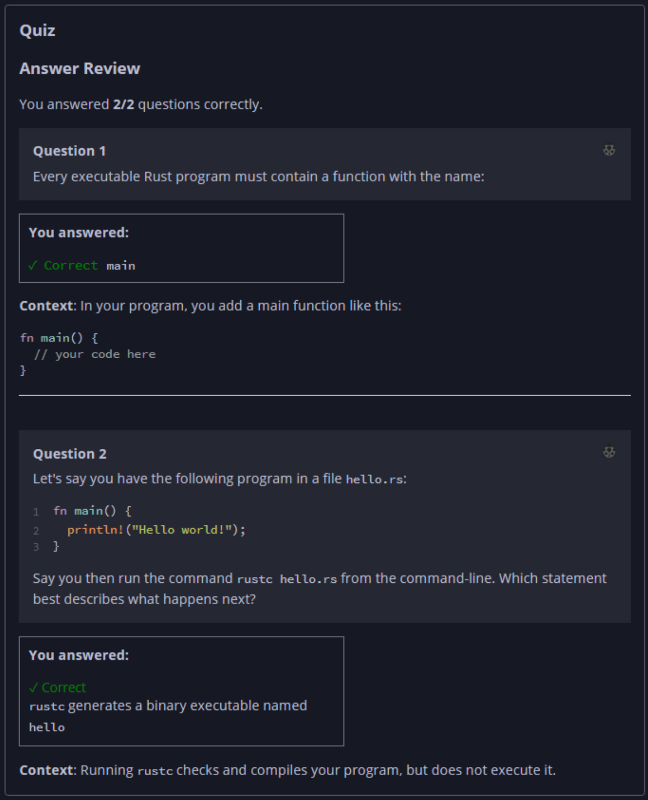

## Quiz - Chapter 1.2 ##

> ---
> **Question 1**<br>
> Every executable Rust program must contain a function with 
> the name:
>
>> Response<br>
>> [ ```main``` ]
> 
> ---
> 
> **Question 2**<br>
> Let's say you have the following program in a file
> ```hello.rs```:
>
> ```rust
> fn main() {
>     println!("Hello world!");
> }
> ```
>
> Say you then run the command ```rustc hello.rs``` from the 
> command-line. Which statement best describes what happens 
> next?
>
> > Response<br>
> > ⊚ ```rustc``` executes the program and prints out
> > ```Hello world!```<br>
> > ⊚ ```rustc``` will print an error because this is an 
> > invalid program<br>
> > ⦿ ```rustc``` generates a binary executable named 
> > ```hello```<br>
> > ⊚ ```rustc``` reformats ```hello.rs``` according to the 
> > Rust style guide
> ---


