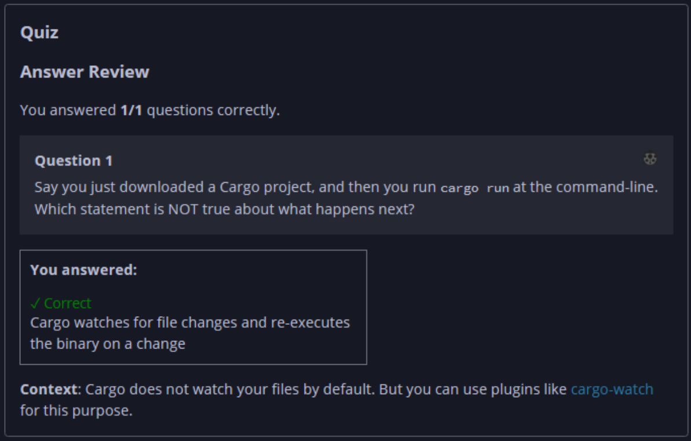

## Quiz - Chapter 1.3 ##

> ---
> **Question 1**<br>
> Say you just downloaded a Cargo project, and then you run 
> ```cargo run``` at the command-line. Which statement is NOT 
> true about what happens next?
>
>> Response<br>
> > ( ) Cargo downloads and builds any dependencies of the project<br>
> > ( ) Cargo builds the project into a binary in the 
> > ```target/debug``` directory<br>
> > ( ) Cargo executes the project's binary<br>
> > (•) Cargo watches for file changes and re-executes the 
> > binary on a change
> ---



