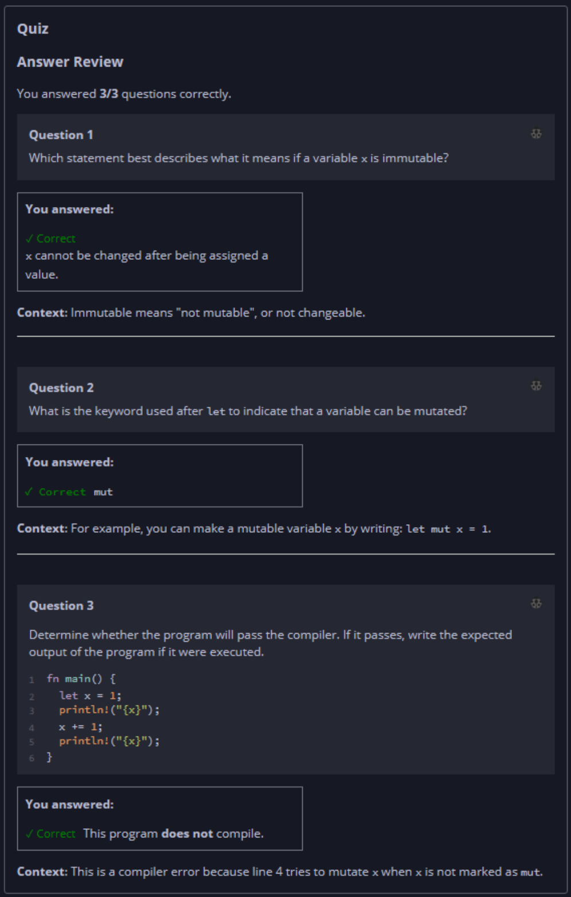

## Quiz - Chapter 3.1 a ##

> ---
> **Question 1**<br>
> Which statement best describes what it means if a 
> variable ```x``` is immutable?
>
>> Response<br>
> > ○ ```x``` is stored in the immutable region of memory.
> > <br>
> > ○ After being defined, ```x``` can be changed at most 
> > once.<br>
> > ○ You cannot create a reference to ```x```.<br>
> > ◉ ```x``` cannot be changed after being assigned a 
> > value.
> 
> ---
> 
> **Question 2**<br>
> What is the keyword used after let to indicate that a 
> variable can be mutated?
>
> > Response<br>
> > [ ```mut``` ]
> 
> ---
> 
> **Question 3**<br>
> Determine whether the program will pass the compiler. If it 
> passes, write the expected output of the program if it were 
> executed.
>
> ```rust
> fn main() {
>     let x = 1;
>     println!("{x}");
>     x += 1;
>     println!("{x}");
> }
> ```
>
> > Response<br>
> > This program:<br>
> > ○ DOES compile<br>
> > ◉ Does NOT compile<br>
> 
> ---


