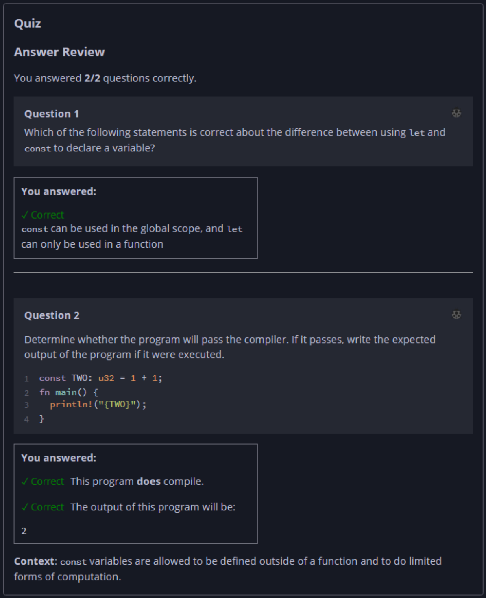

## Quiz - Chapter 3.1 b ##

> ---
> **Question 1**<br>
> Which of the following statements is correct about the 
> difference between using ```let``` and ```const``` to 
> declare a variable?
>
> > Response<br>
> > ⊚ A ```const``` can only be assigned to a literal, not 
> > an expression involving computation<br>
> > ⊚ They are just different syntaxes for declaring 
> > variables with the same semantics<br>
> > ⊚ The compiler will error if a ```const``` variable's 
> > name is not using UPPER_SNAKE_CASE<br>
> > ⦿ ```const``` can be used in the global scope, and 
> > ```let``` can only be used in a function<br>
> 
> ---
> 
> **Question 2**<br>
> Determine whether the program will pass the compiler. If it 
> passes, write the expected output of the program if it were 
> executed.
>
> ```rust
> const TWO: u32 = 1 + 1;
> 
> fn main() {
>     println!("{TWO}");
> }
> ```
>
> > Response<br>
> > This program:<br>
> > ⦿ DOES compile<br>
> > ⊚ Does NOT compile<br>
> >
> > The output of this program will be:<br>
> > [ ```2``` ]
> 
> ---


