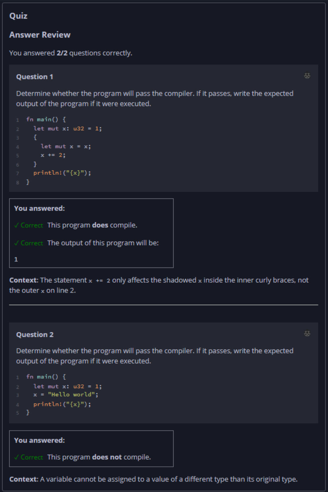

## Quiz - Chapter 3.1 c ##

> ---
> **Question 1**<br>
> Determine whether the program will pass the compiler. If it 
> passes, write the expected output of the program if it were 
> executed.
>
> ```rust
> fn main() {
>     let mut x: u32 = 1;
>     {
>         let mut x = x;
>         x += 2;
>     }
>     println!("{x}");
> }
> ```
>
> > Response<br>
> > This program:<br>
> > ◉ DOES compile<br>
> > ○ Does NOT compile<br>
> >
> > The output of this program will be:<br>
> > [ ```1``` ]
> 
> ---
> 
> **Question 2**<br>
> Which of the following statements is correct about the 
> difference between using ```let``` and ```const``` to 
> declare a variable?
>
> Determine whether the program will pass the compiler. If it 
> passes, write the expected output of the program if it were 
> executed.
>
> ```rust
> fn main() {
>     let mut x: u32 = 1;
>     x = "Hello world";
>     println!("{x}");
> }
> ```
>
> > Response<br>
> > This program:<br>
> > ○ DOES compile<br>
> > ◉ Does NOT compile<br>
> 
> ---


