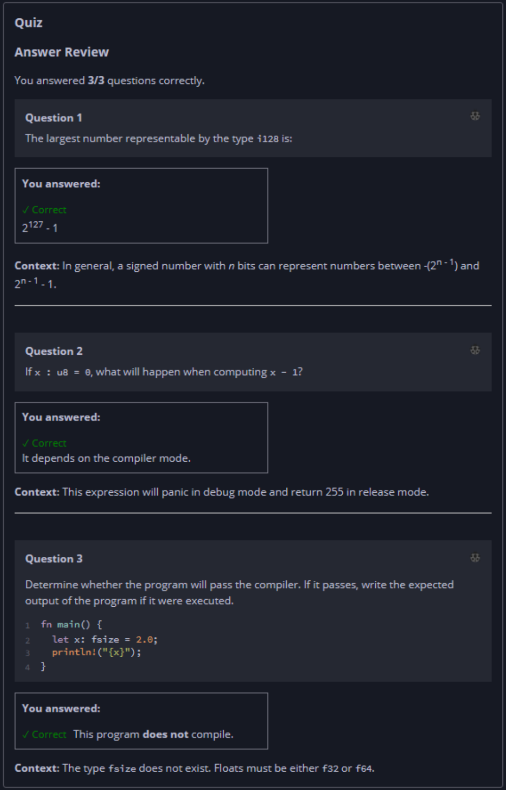

## Quiz - Chapter 3.2 a ##

> ---
> **Question 1**<br>
> The largest number representable by the type ```i128``` is:
>
> > Response<br>
> > ( ) 2<sup>128</sup><br>
> > ( ) 2<sup>128</sup> - 1<br>
> > ( ) 2<sup>127</sup><br>
> > (•) 2<sup>127</sup> - 1<br>
> 
> ---
> 
> **Question 2**<br>
> If x : u8 = 0, what will happen when computing x - 1?
>
> > Response<br>
> > ( ) It will always panic.<br>
> > ( ) It will always return 255.<br>
> > (•) It depends on the compiler mode.<br>
> 
> ---
> 
> **Question 3**<br>
> Determine whether the program will pass the compiler. If it 
> passes, write the expected output of the program if it were 
> executed.
>
> ```rust
> fn main() {
>     let x: fsize = 2.0;
>     println!("{x}");
> }
> ```
>
> > Response<br>
> > This program:<br>
> > ( ) DOES compile<br>
> > (•) Does NOT compile<br>
> 
> ---


