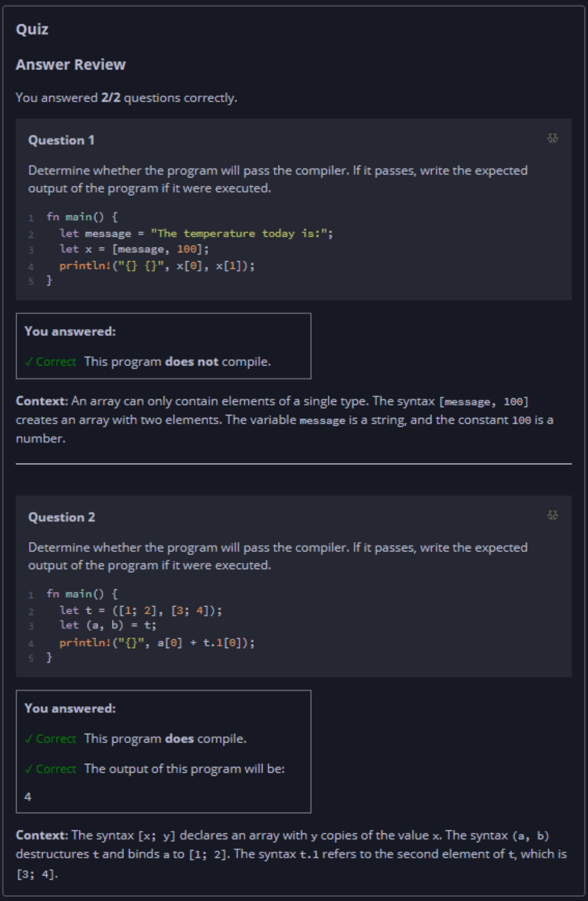

## Quiz - Chapter 3.2 b ##

> ---
> **Question 1**<br>
> Determine whether the program will pass the compiler. If it 
> passes, write the expected output of the program if it were 
> executed.
>
> ```rust
> fn main() {
>     let message = "The temperature today is:";
>     let x = [message, 100];
>     println!("{} {}", x[0], x[1]);
> }
> ```
>
> > Response<br>
> > This program:<br>
> > ○ DOES compile<br>
> > ◉ Does NOT compile<br>
> 
> ---
>
> **Question 2**<br>
> Determine whether the program will pass the compiler. If it 
> passes, write the expected output of the program if it were 
> executed.
>
> ```rust
> fn main() {
>     let t = ([1; 2], [3; 4]);
>     let (a, b) = t;
>     println!("{}", a[0] + t.1[0]);
> }
> ```
>
> > Response<br>
> > This program:<br>
> > ◉ DOES compile<br>
> > ○ Does NOT compile<br>
> >
> > The output of this program will be:<br>
> > [ ```4``` ]
> 
> ---


