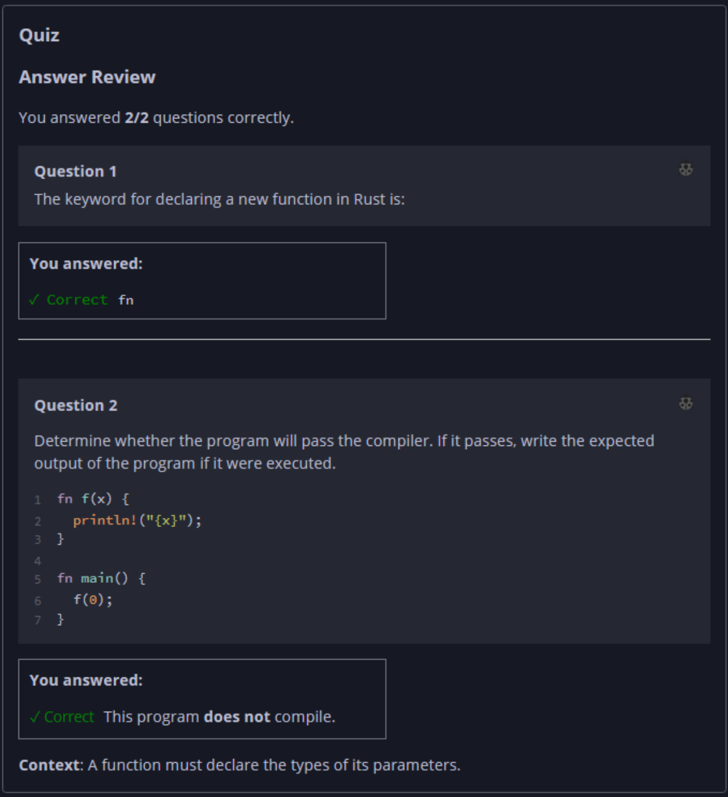

## Quiz - Chapter 3.3 a ##

> ---
> **Question 1**<br>
> The keyword for declaring a new function in Rust is:
>
> > Response<br>
> > [ ```fn``` ]
> 
> ---
>
> **Question 2**<br>
> Determine whether the program will pass the compiler. If it 
> passes, write the expected output of the program if it were 
> executed.
>
> ```rust
> fn f(x) {
>     println!("{x}");
> }
> 
> fn main() {
>     f(0);
> }
> ```
>
> > Response<br>
> > This program:<br>
> > ( ) DOES compile<br>
> > (•) Does NOT compile<br>
> 
> ---


