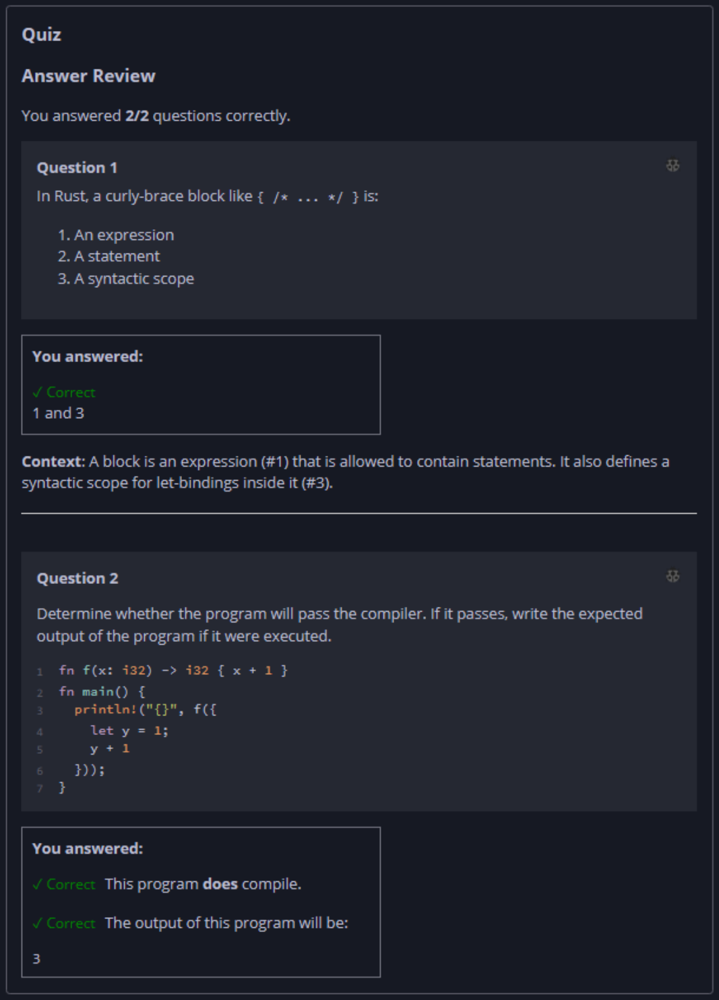

## Quiz - Chapter 3.3 b ##

> ---
> **Question 1**<br>
> In Rust, a curly-brace block like ```{ /* ... */ }``` is:
> 1. An expression
> 2. A statement
> 3. A syntactic scope
> 
> > Response<br>
> > ( ) 2 and 3<br>
> > (•) 1 and 3<br>
> > ( ) 2 only<br>
> > ( ) 1 only<br>
> 
> ---
>
> **Question 2**<br>
> Determine whether the program will pass the compiler. If it 
> passes, write the expected output of the program if it were 
> executed.
>
> ```rust
> fn f(x: i32) -> i32 { x + 1 }
> 
> fn main() {
>     println!("{}", f({
>         let y = 1;
>         y + 1
>     }));
> }
> ```
>
> > Response<br>
> > This program:<br>
> > (•) DOES compile<br>
> > ( ) Does NOT compile<br>
> >
> > The output of this program will be:<br>
> > [ ```3``` ]
> 
> ---


