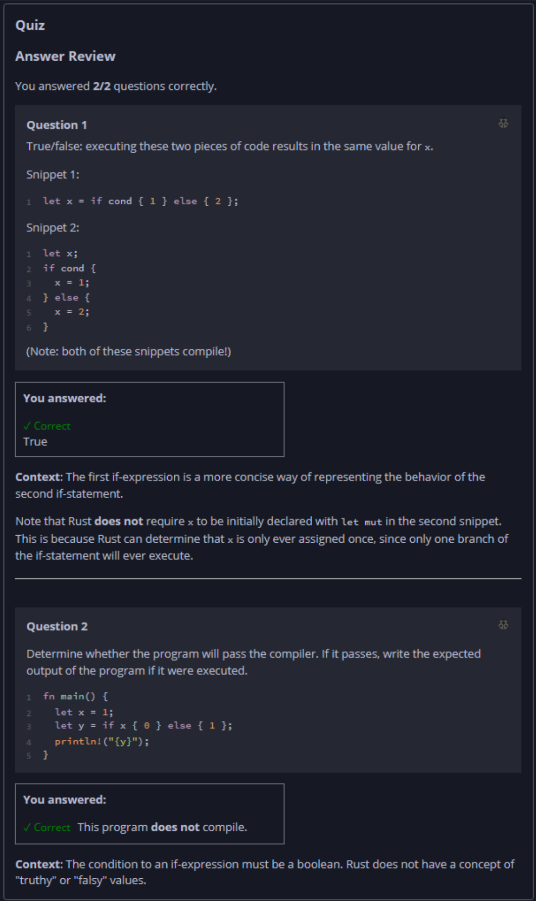

## Quiz - Chapter 3.5 a ##

> ---
> **Question 1**<br>
> True/false: executing these two pieces of code results in 
> the same value for x.
>
> Snippet 1<br>
>
> ```rust
> let x = if cond { 1 } else { 2 };
> ```
>
> Snippet 2<br>
>
> ```rust
> let x;
> 
> if cond {
>     x = 1;
> } else {
>     x = 2;
> }
> ```
>
> (Note: both of these snippets compile!)
> 
> > Response<br>
> > (•) True<br>
> > ( ) False<br>
> 
> ---
>
> **Question 2**<br>
> Determine whether the program will pass the compiler. If it 
> passes, write the expected output of the program if it were 
> executed.
>
> ```rust
> fn main() {
>     let x = 1;
>     let y = if x { 0 } else { 1 };
>     println!("{y}");
> }
> ```
>
> > Response<br>
> > This program:<br>
> > ( ) DOES compile<br>
> > (•) Does NOT compile<br>
> 
> ---


