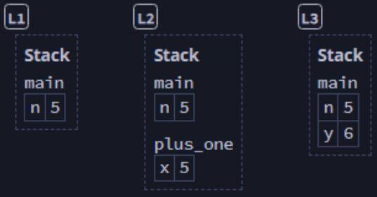

## Memory Safety ##

### Safety is the Absence of Undefined Behavior ###

Consider this safe program:

```rust
fn read(y: bool) {
    if y {
        println!("Condition is true.");
    }
}

fn main() {
    let x = true;
    read(x);
}
```

In x86 assembly, ```main()``` becomes:

```asm
main:
    ; ...
    mov     edi, 1
    call    read
    ; ...
```

... which performs two steps:

* Move the value ```1``` into the ```edi``` register
* Call the ```read``` function, which expects its argument to
  be the value in the ```edi``` register

---

We could make the code unsafe by moving the read to before the
variable is defined, like this:

```rust
// Note: This will not compile!
fn read(y: bool) {
    if y {
        println!("Condition is true.");
    }
}

fn main() {
    read(x); // We're trying to access x before initialization
    let x = true;
}
```

In x86 assembly, ```main()``` now becomes:

```asm
main:
    ; ...
    call    read
    mov     edi, 1      ; nov is after call
    ; ...
```

This has become unsafe. The call to ```read``` is expecting its
argument to be a boolean, but we haven't moved a value into the
```edi``` register yet.

The behavior at this point is ***undefined***. There is no way to
predict what data is stored in the register, so the result of
the ```read``` could be:

* Execution completes without an error, but the results are
  unreliable
* Execution crashes with something like a segmentation fault
* A bad actor has taken advantage of some other buffer
  overflow to insert malicious code into the register, and it is
  now executed.

Rust prevents this by not compiling with unsafe code like this
example.

---

### Advantages of Compile-Time Checking ###

1. The software has improved ***reliability***, because the 
   compiler has already caught any unsafe scenarios.
2. The software has improved ***performance***, because we've
   eliminated the majority of runtime checks.

---

### Ownership as a Discipline for Memory Safety ###

Ownership is used to prevent many different types of undefined
behavior, but the book focuses on operations on memory and on
the use of ownership as a discipline for safely handling
interactions with it.

---

### Variables Live in the Stack ###

Consider this program

```rust
fn main() {
    let n = 5; // [L1]
    let y = plus_one(n); // [L3]
    println!("The value of y is {y}");
}

fn plus_one(x: i32) -> i32 {
    x + 1 // [L2]
}
```

The diagram below visualizes the contents of memory at the
points labeled in the comments.

<!--  -->
<image src="../additional-files/images/diagram0401a.png"
       style="width:300px;" alt="Diagram 4.1a"
       title="Diagram 4.1a">

Variables live in **frames**, which are mappings from variables
to values within a single scope. In this example:

* The frame for ```main()``` at location L1 holds ```n = 5```
* The frame for ```plus_one``` at L2 holds ```x = 5```
* The frame for ```main()``` at L3 holds ```n = 5; y = 6```

The frames are organized into a stack of currently-called 
functions.

After any function returns, Rust deallocates that function's
frame.

The most recently added frame is always the next one to drop.
Hence, this is a stack (LIFO).

---

When an expression reads a variable, the value is copied from its slot in the stack frame.

For example:

```rust
let a = 5; // [L1]
let mut b = a; // [L2]
b += 1; // [L3]
```

<image src="../additional-files/images/diagram0401b.png"
       style="width:260px;" alt="Diagram 4.1b"
       title="Diagram 4.1b">

The value of ```a``` is copied into ```b```, so modifying
```b``` does not change ```a```.

---

### Boxes Live in the Heap ###

This is fine for small values, but you would not want to create copies of large blocks of data.

For example, this code would result in the use of 8MB of memory 
space (at four bytes per integer, and one million integers in
each copy of the array).

```rust
let a = [0; 1_000_000]; // [L1]
let b = a; // [L2]
```

<image src="../additional-files/images/diagram0401c.png"
       style="width:200px;" alt="Diagram 4.1c"
       title="Diagram 4.1c">

---

It's much better to implement Rust's method of storing pointers
to data stored on the heap.

Because the heap is not tied to a particular stack frame, the
stack can contain small pieces of memory that just point to the
location on the heap where the data is stored.

In Rust, the construct to store on the heap is a ```Box```.

```rust
let a = Box::new([0; 1_000_000]); // [L1]
let b = a; // L2
```

<image src="../additional-files/images/diagram0401d.png"
       style="width:280px;" alt="Diagram 4.1d"
       title="Diagram 4.1d">

This way:

1. There is only a single array stored at a time
2. When ```b``` takes *ownership* of the value stored on the 
   heap, ```a``` can no longer access it.

---

### Rust Does Not Permit Manual Memory Management ###

Manual memory management (like you find in C) can easily lead
to undefined behavior.

Note: The following code is imaginary. Rst does ***not*** expose a ```free()``` method.

```rust
let b - Box::new([0; 100]); // [L1]
// If this function existed, it would deallocate the memory
//   used by b's value on the heap
free(b); // [L2]
assert!(b[0] == 0); // [L3]
```

<image src="../additional-files/images/diagram0401e.png"
       style="width:280px;" alt="Diagram 4.1e"
       title="Diagram 4.1e">

This program would be **unsafe** because it permits a
condition where an attempt could be made to access
previously freed memory.

By preventing this kind of manual memory management, Rust
eliminates a whole class of errors of this type.

---

### The Box's Owner Manages Deallocation ###

Instead, in Rust the memory is freed when its owner goes out of scope. In other words:

**Box Deallocation Principle**

If a variable owns a box, when Rust deallocates the variable's
frame, then Rust also deallocates the box's heap memory.

### Collections Use Boxes ###

Consider this example:

```rust
fn main() {
    let first = String::from("Ferris"); // [L1]
    let full = add_suffix(first); // [L4]
    println!("{full}");
}

fn add_suffix(mut name: String) -> String {
    name.push_str(" Jr."); // [L2] before | [L3] after
    name
}
```

<image src="../additional-files/images/diagram0401f.png"
       style="width:480px;" alt="Diagram 4.1f"
       title="Diagram 4.1f">

1. At L1, "Ferris" is allocated on the heap and owned by
   ```first```
2. At L2, ownership of the string is moved from ```first```
   in ```main()``` to ```name``` in ```add_suffix()```
3. At L3, the string's heap allocation is resized, which:
    * Creates a larger allocation
    * Writes "Ferris Jr." into the new allocation
    * Frees the original heap memory
        * This means that ```first``` points to deallocated
          memory
        * This is not a problem, because ```first``` no longer
          owns the data on the heap.
4. At L4, the ```add_suffix``` frame is gone, but since
   ```name``` was returned to ```full``` in ```main()```, the
   heap data is not deallocated.
5. When the ```main()``` function ends, the string on the heap
   will be deallocated along with the frame for ```main()```

---
