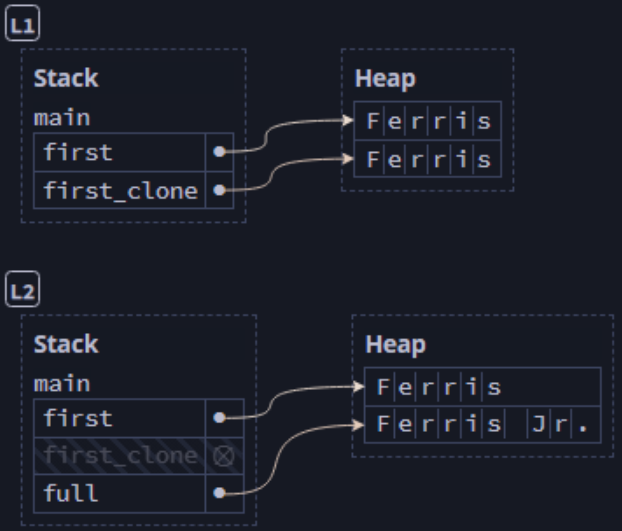

## Variable and Data Interactions with Clone ##

The ```clone``` method in Rust provides a means of copying the data (on the
heap), not just the reference,

```rust
let s1 = String::from("hello"); // binds reference to the string to s1
let s2 = s1.clone(); // binds reference to a new string to s2

// Because the string itself has been copied, both s1 and s2 are valid
//   ... so this works fine
println!("{s1} {s2}");
```

Cloning is costly in memory (and even in CPU cycles), so we should be certain
it's necessary before cloning.

---

### Cloning Avoids Moves ###

The problem we introduced in the previous section (accessing a
variable after its data has been moved) can be avoided by 
cloning.

```rust
fn main() {
    let first = String::from("Ferris");
    let first_clone = first.clone(); // [L1]
    let full = add_suffix(first_clone); // [L2]
    // This will work now
    println!("{full} was originally {first}");
}

fn add_suffix(mut name: String) -> String {
    name.push_str(" Jr.");
    name
}
```


<br><sup><sup>[Diagram from Brown University](https://rust-book.cs.brown.edu)</sup></sup>

Here, we have still moved a variable, but the moved (therefore
inaccessible) variable is ```first_clone```, so we can still
access ```first```.

Note: The ```.clone()``` method deep-copied the data from
```first``` as opposed to a shallow copy of the pointer only.

---
