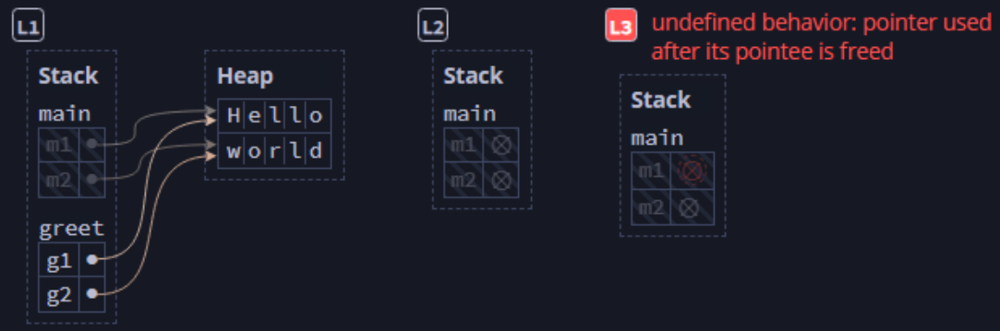
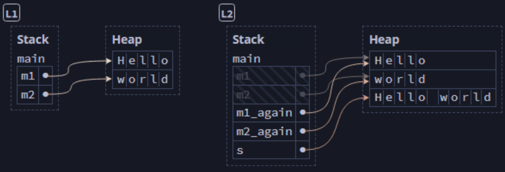
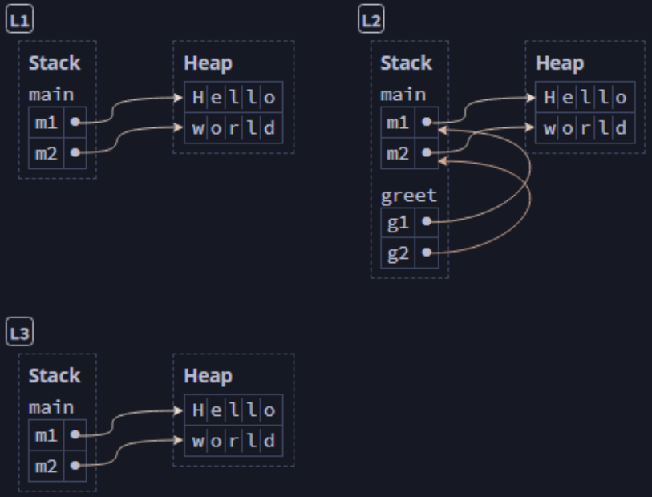
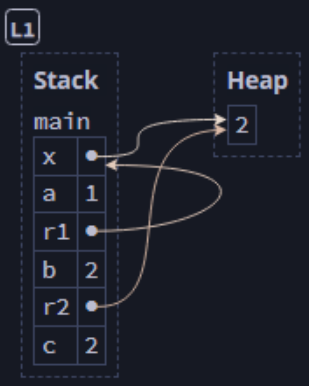

## References ands Borrowing ##

The real answer to the problem of passing a variable without transferring
ownership is to use references.

### Definition ###

**Reference**:

* The reference is a pointer to the pointer held by the original
  variable.
* Syntax:
    * Indicated by an ampersand [```&```]
    * ```&variable_name``` for an argument being passed to a function
    * ```&data_type``` for a parameter being received by a function
* A reference is a like a pointer because
    * It contains the address where a value owned by another variable is 
      located on the heap.
* A reference differs from a pointer because:
    * It is guaranteed to contain a value for the life of the reference

Note: An asterisk [```*```] can be used as the dereference operator
(```*param_name```, e.g.)

---

### Move-Only APIs Are Inconvenient ###

Although ownership, boxes, and moves provide great memory
safety, a move-only API makes reuse of a variable inconvenient.

Consider this example:

```rust
// Note: This code will not compile
fn main() {
    let m1 = String::from("Hello");
    let m2 = String::from("world");
    greet(m1, m2); // [L2]
    let s = format!("{} {}!", m1, m2); // [L3] Error!
}

fn greet(g1: String, g2: String) {
    println!("{g1}, {g2}!"); // [L1]
}
```


<br><sup><sup>[Diagram from Brown University](https://rust-book.cs.brown.edu)</sup></sup>

Because we've moved ```m1``` and ```m2```, by our movement
rules, we can no longer access them.

---

We could make the function *return* the values like this:

```rust
fn main() {
    let m1 = String::from("Hello");
    let m2 = String::from("world"); // [L1]
    let (m1_again, m2_again) = greet(m1, m2);
    let s = format!("{} {}!", m1_again, m2_again); // [L2]
}

fn greet(g1: String, g2: String) -> (String, String) {
    println!("{g1}, {g2}!");
    (g1, g2)
}
```


<br><sup><sup>[Diagram from Brown University](https://rust-book.cs.brown.edu)</sup></sup>

Now, this works, but we're doing a lot of unnecessary moving
around of our data, especially sing the ```greet()```
function only reads them.

---

### References Are Non-Owning Pointers ###

Rust allows us to use *references*, which are pointers that do
not transfer ownership.

```rust
fn main() {
    let m1 = String::from("Hello");
    let m2 = String::from("world"); // [L1]
    // Note the ampersands - we're passing references
    greet(&m1, &m2); // [L3]
    let s = format!("{} {}!", m1, m2); // [L2]
}

// Note the ampersands - we're receiving references
fn greet(g1: &String, g2: &String) {
    println!("{g1}, {g2}!");
}
```


<br><sup><sup>[Diagram from Brown University](https://rust-book.cs.brown.edu)</sup></sup>

By using references, we're never moving ```m1``` and ```m2```
at all. Instead, the ```greet()``` function receives pointers
(references) and can use the data without owning it.

In Rust terms, the function *borrows* the variables, but they
remain valid (owned) in ```main()```'s stack frame.

---

### Passing a Reference to a Function ###

Rewriting the code where we returned multiple values as an ownership
workaround, we can pass the string by reference instead.

```rust
fn main() {
    let s1 = String::from("hello"); // s1 comes into scope
    // Passing the reference pointer (&s) does not transfer ownership
    let len = calculate_length(&s);
    println!("Length of '{s1}' is {len} characters."); // s1 is still valid
} // s1 goes out of scope and is dropped, because it is still valid

// Accepting a reference (&String) does not take ownership
fn calculate_length(s: &String) -> usize {
    s.len()
} // s goes out of scope but nothing is dropped here,
  //   because the function does not own s
```

In the example above...

**s** is bound to a variable like this, stored on the stack:
|name|value|explanation|
|-|-|-|
|```ptr```|address|stack memory location where the **s1** pointer is stored|
|||

**s1** remains bound to a value like this, stored on the stack:

|name|value|explanation|
|-|-|-|
|```ptr```|address|heap memory location of index 0 in the string value|
|```len```|5|length (in bytes) of the string value|
|```capacity```|5|maximum length (in bytes) that can be stored in the string|
||||

The pointer ```ptr``` points to the memory location (on the heap) where the string is stored as a collection of characters (like this).

|loc|index|value|
|-|-|-|
|```ptr```|0|h|
|```ptr + 1```|1|e|
|```ptr + 2```|2|l|
|```ptr + 3```|3|l|
|```ptr + 4```|4|o|
||||

This "pointer to a pointer" concept (called *borrowing*) enables working
with a value without taking ownership.

---

### Dereferencing a Pointer Accesses its Data ###

We now understand the ampersand ```&``` as the reference
operator. The asterisk ```*``` acts as the dereference
operator.

Consider the following:

```rust
let mut x: Box<i32> = Box::new(1);
let a: i32 = *x; // *x reads the heap value, so a = 1
*x += 1; // *x modifies the heap value, so x points to 2

let r1: &Box<i32> = &x; // r1 points to x on the stack
let b: i32 = **r1; // **r1 reads the heap value, so b = 2

let r2: &i32 = &*x; // r2 points to the heap value
let c: i32 = *r2; // [L1] *r2 reads the heap value, so c = 2

println!("{} {} {}", a, b, c); // -> 1 2 2
```


<br><sup><sup>[Diagram from Brown University](https://rust-book.cs.brown.edu)</sup></sup>

---

### Implicit Dereferencing ###

Rust is usually able to dereference implicitly, based on the
context in which a reference is accessed, so it's usually
not necessary to use the dereference operator.

```rust
let x: Box<i32> = Box::new(-1);
let x_abs1 = i32::abs(*x);  // explicit dereference
let x_abs2 = x.abs();       // implicit dereference
assert_eq!(x_abs1, x_abs2);

let r: &Box<i32> = &x;
let r_abs1 = i32::abs(**r); // explicit dereference (x2)
let r_abs2 = r.abs();       // implicit dereference (x2)
assert_eq!(r_abs1, r_abs2);

let s = String::from("Hello");
let s_len1 = str::len(&s);  // explicit dereference
let s_len2 = s.len();       // implicit dereference
assert_eq!(s_len1, s_len2);
```

---

### Modifying a Borrowed Value ###

When we try to modify a value borrowed by a function, it results in an
error, because the borrowed value is not owned by the function.

So this code would fail..

```rust
fn main() {
    let s1 = String::from("hello");
    change(&s1);
    println!("{s1}");
}

fn change(s: &String) -> usize {
    // Error: `s` is a `&` reference, so the data it refers to cannot be
    //   borrowed as mutable
    s.push_str(", world");
}
```

But, just like we can make a variable mutable, we can also create a
mutable reference.

```rust
fn main() {
    // To allow changes in a borrowing function, we...
    let mut s1 = String::from("hello"); // 1. Make the variable mutable
    change(&mut s1); // 2. Declare the reference as mutable
    println!("{s1}");
}

// 3. Mark the parameter as mutable
fn change(s: &mut String) -> usize {
    // Now, this will work
    s.push_str(", world");
}
```

However, when you have a mutable reference, *you cannot have any other
references* to the original variable.

So this would produce an error...

```rust
let mut s = String::from("hello");

let ref1 = &mut s; // This is OK
let ref2 = &mut s; // This is an error (second mutable reference)
```

This is to prevent the scenario called a *data race*, which is like a
*race condition* and occurs when:

* Two or more pointers access the same data at the same time
* At least one of the pointers is used to modify (write) the data
* No mechanism is used to synchronize the data

Many other languages allow mutation anywhere, but that does not prevent
data races.

Rust, by contrast, will not compile if a data race exists.

---

### Avoiding Data Races ###

You can create multiple mutable references as long as they do not exist
simultaneously.

```rust
let mut s = String::from("hello");

{
    let ref1 = &mut s; // Mutable reference
} // ref1 goes out of scope here

let ref2 = &mut s; // This is fine, because ref1 is already invalid
```

You cannot create a mutable reference when another reference exists,
even if the other reference is not mutable.

```rust
let mut s = String::from("hello");

let ref1 = &s;     // no problem
let ref2 = &s;     // no problem
let ref3 = &mut s; // PROBLEM - This will produce an error

println!("{ref1}, {ref2}, {ref3}");
```

References go out of scope the last time they are used in the code, so
this revision of the above will compile and run.

```rust
let mut s = String::from("hello");

let ref1 = &s; 
let ref2 = &s;
println!("{ref1}, {ref2}"); // Last use of ref1 and ref2

let ref3 = &mut s; // This is OK, because ref1 and ref2 are no longer used
println!("{ref3}");
```

---

### Rust Avoids Simultaneous Aliasing and Mutation ###


---

### Dangling References ###

In many languages with pointers, it is possible to create a reference to a 
location in memory that has already been freed.

This is known as a *dangling reference*.

Rust prevents this by compiling only if all references to a piece of data
go out of scope before the data itself.

This will not compile:

```rust
fn main() {
    let ref_to_nothing = dangle();
}

fm dangle() -> &String {
    let s = String::from("hello");
    &s
} // s goes out of scope here (dropped), to the reference would be dangling.
// Error: missing lifetime specifier
```

---

### Rules of References ###

* At any time, a variable can have either:
    * One mutable reference<br>or
    * Any number of immutable references
* References must always be valid

---

