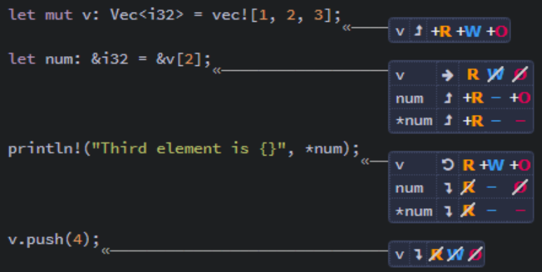
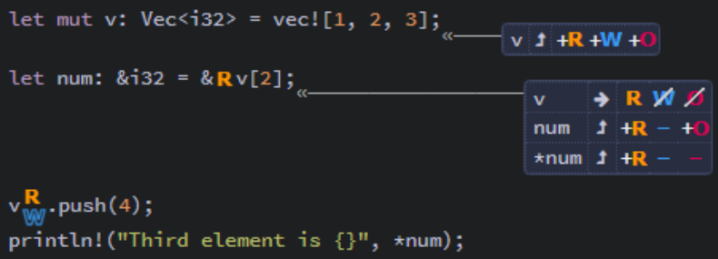
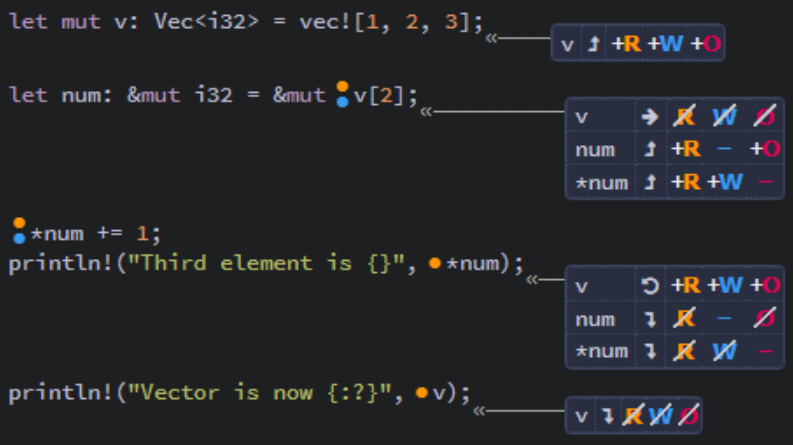
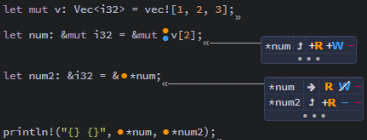
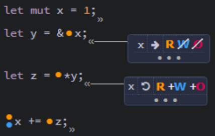
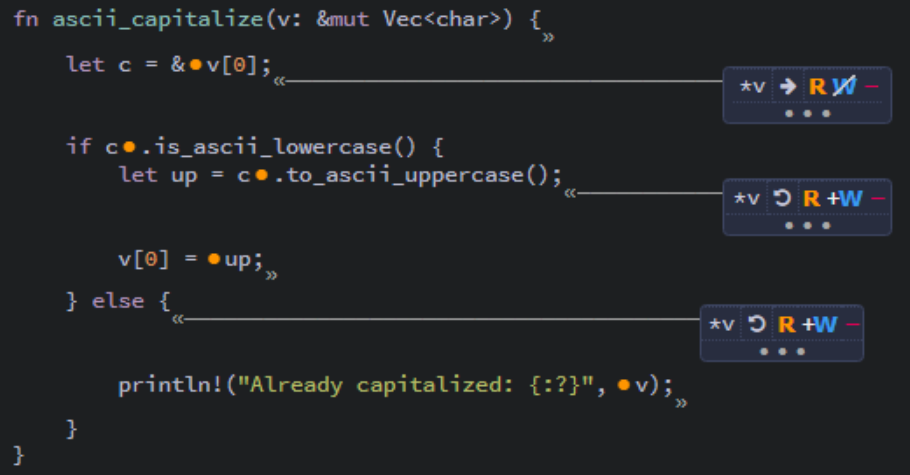
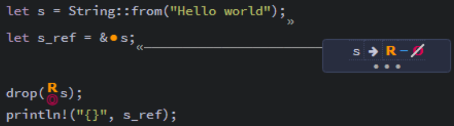
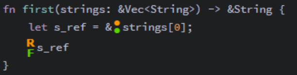
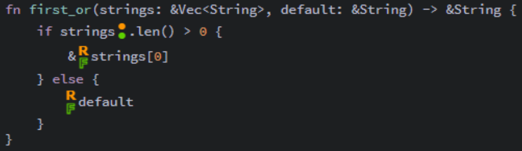

## Memory Safety and the Borrow Checker ##

We know that data can be aliased or mutated but not both at
the same time.

For boxes, this is simple. They cannot be aliased. Data can 
only be accessed through the owner.

However, since references do not take ownership, they are
designed to create (potentially multiple) aliases.

So, we need different rules for references, which are
enforced by the *Borrow Checker*.

---

### References Change Permissions on Paths ###

Variables have three kinds of **permissions** on their data.

* Read (R): data can be copied to another location
* Write (W): data can be mutated in-place
* Own (O): data can be moved or dropped

When a variable is created, it has permissions read and own 
(RO)

If declared with ```mut```, then it also has write (W)

In the process or borrowing, references can temporarily
remove one or more of these permissions.

Consider this code:

```rust
let mut v: Vec<i32> = vec![1, 2, 3];
let num: &i32 = &v[2]; // temporarily removes (WO) from v
println!("The third element is {}", *num);
v.push(4);
```


<br><sup><sup>[Diagram from Brown University](https://rust-book.cs.brown.edu)</sup></sup>

1. After ```let mut v...```, ```v``` is initialized and has
   permissions (RWO)
2. After ```let num = &v[2]```, the data owned by ```v``` has
   been borrowed by ```num```, so...
   * The borrow removes the (WO) permissions from ```v```
   * ```num``` gains permissions (RO)
   * ```*num``` gains (R)
3. After the ```println!```, ```num``` goes out of scope, 
   ending the borrow and returning the (RO) permissions to
   ```v```
4. After the ```push```, v is no longer used, goes out of 
   scope, and loses all permissions.

---

### The Borrow Checker Finds Permission Violations ###

In order to prevent the simultaneous aliasing and mutation of
data, the **borrow checker** looks for actions that would 
violate the permissions available during borrowing and 
prevents compilation while such scenarios exist.

Consider this example:

```rust
// Note: This code will not compile
let mut v: Vec<i32> = vec![1, 2, 3];
let num: &i32 = &v[2];
v.push(4); // Error occurs here!
println!("The third element is {}", *num);
```


<br><sup><sup>[Diagram from Brown University](https://rust-book.cs.brown.edu)</sup></sup>

Because ```num``` is still in scope when we call ```v.push```,
we receive an error, because as long as ```num``` is valid,
```v``` does not have write (W) permission.

In short, we cannot mutate ```v``` while ```num``` is 
aliasing its data.

---

### Mutable References Provide Unique and Non-Owning Access to Data ###

```rust
let mut v: Vec<i32> = vec![1, 2, 3];
let num: &mut i32 = &mut v[2]; // Mutable reference
*num += 1;
println!("Third element ie {}", *num); // -> 4
println!("Vector is now {:?}", v); // -> [1, 2, 4]
```


<br><sup><sup>[Diagram from Brown University](https://rust-book.cs.brown.edu)</sup></sup>

Note how this time, with a mutable reference, ```*num```
gains the (W) permission and that ```v``` loses the (R)
permission while ```num``` is in use.

---

A mutable reference can lose the (W) permission when another
reference borrows its value.

```rust
let mut v: Vec<i32> = vec![1, 2, 3];
let num: &mut i32 = &mut v[2]; // num has (W)
let num2: &i32 = &*num; // num loses (W)
println!("{} {}", *num, *num2); // num regains (W)
```


<br><sup><sup>[Diagram from Brown University](https://rust-book.cs.brown.edu)</sup></sup>

---

### Permissions Are Returned at the End of a Reference's Lifetime ###

The **lifetime** of a reference describes the code range from
its *birth* (when it is created) to its *death* (the last
time it is used).

```rust
let mut x = 1;
let y = &x; // y birth (x loses (WO))
let z = *y; // y death (x regains (WO))
x += z;
```


<br><sup><sup>[Diagram from Brown University](https://rust-book.cs.brown.edu)</sup></sup>

---

Lifetime can be affected by control flow, where the lifetime
can be different among branches.

```rust
fn ascii_capitalize(v: &mut Vec<char>) {
    let c = &v[0]; // v loses (W)

    if c.is_ascii_lowercase() {
        let up = c.to_ascii_uppercase();
        // v regains (W)
        v[0] = up;
    } else {
        // v regains (W)
        println!("Already capitalized: {:?}", v);
    }
}
```


<br><sup><sup>[Diagram from Brown University](https://rust-book.cs.brown.edu)</sup></sup>

---

### Data Must Outlive All of Its References ###

Observe allow the following unsafe code.

```rust
// Note: This code will not compile
let s = String::from("Hello world");
let s_ref = &s;
drop(s);
println!("{}", s_ref);
```


<br><sup><sup>[Diagram from Brown University](https://rust-book.cs.brown.edu)</sup></sup>

Because the memory for ```s``` has been dropped, the
reference ```s_ref``` is pointing to deallocated memory.

The borrow checker will prevent this from compiling, because
it enforces the rule that the data on the heap must outlive
its reference.

Specifically, for ```drop(s)```, ```s``` must possess the
(O) permission. But when ```s_ref``` borrows the data,
```s``` loses ownership.

---

Rust introduces a fourth permission Flow (F) for scenarios
where the compiler cannot identify the end of the reference's
lifetime.

This permission is expected every time an expression uses an
input reference.

This code is safe, since the reference has the (F) permission
when it is used:

```rust
fn first(strings: &Vec<string>) -> &String {
    let s_ref = &strings[0];
    s_ref
}
```


<br><sup><sup>[Diagram from Brown University](https://rust-book.cs.brown.edu)</sup></sup>

---

This code, on the other hand, is unsafe because Rust cannot
identify whether ```-> &String``` borrows from ```strings```
or ```default```.

```rust
// Note: This code will not compile
fn first_or(strings: &Vec<String>, default: &String) -> &String {
    if strings.len() > 0 {
        &strings[0]
    } else {
        default
    }
}
```


<br><sup><sup>[Diagram from Brown University](https://rust-book.cs.brown.edu)</sup></sup>

Both ```strings``` and ```default``` lack the (F) permission
to be returned, because Rust cannot identify which will be
used in order to validate its lifetime.

The error "missing lifetime specifier" is addressed in a 
later chapter.

---

### Borrow Checker Safety Rules ###

* All variables can read, own, and (optionally) write their
  data.
* Creating a reference transfers permissions from the
  borrowed path to the reference.
* Permissions are returned once the reference's lifetime ends.
* Data must outlive all references that point to it.

---
