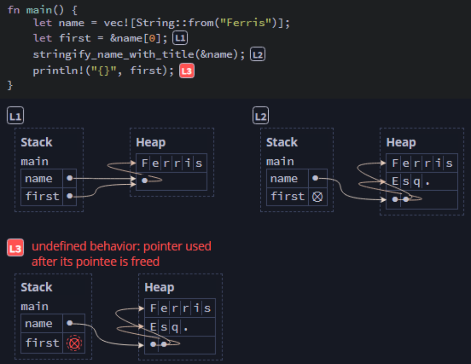

## Fixing Ownership Errors ##

Rust will:

* Always reject an unsafe program
* Sometimes reject a safe program

Understanding why a program is rejected is the key to debugging ownership errors.

---

### Case Study 1: Returning a Reference to the Stack ###

An unsafe function:

```rust
fn return_a_string() -> &String {
    let s = String::from("Hello world");
    &s
}
```

Attempting to compile results in this error


We're violating the rule that the data must outlive the 
reference, because ```s``` will be deallocated when the
function ends.

---

#### Four Ways to Extend the Lifetime of the String ####

**Option 1**: Move Ownership

By returning a ```String``` instead of ```&String```, we
transfer ownership to the calling function's scope.

```rust
fn return_a_string() -> String {
    let s = String::from("Hello world");
    s
}
```

---

**Option 2**: Return a Literal

If the string never needs to be modified, we can return a
literal ```&str```, for which no heap allocation is needed.
The literal's lifetime extends for the entire runtime of the
program.

```rust
fn return_a_string() -> &`static str {
    "Hello world"
}
```

---

**Option 3**: Use Garbage Collection

We can defer borrow-checking to runtime (not generally a
preferred practice) by implementing garbage collection. One
approach would be to use a reference-counted pointer.

```rust
use std::rc::Rc;

fn return_a_string() -> Rc<String> {
    let s = Rc::new(String::from("Hello world"));
    Rc::clone(&s)
}
```

Here, ```Rc``` clones the pointer and manages the data, only
deallocating after all references to it have been dropped.

---

**Option 4**: Use a Mutable Reference

By using a mutable reference, the calling function creates a
mutable space to hold the ```String``` data that is returned.

```rust
fn return_a_string(output: &mut String) {
    output.replace_range(.., "Hello world");
}
```

---
---

### Case Study 2: Insufficient Permissions ###

This code illustrates the problem with attempting to mutate
or drop data behind a reference.

```rust
// Note: This code will not compile
fn stringify_name_with_title(name: &Vec<String>) -> String {
    name.push(String::from("Esq.")); // Error - No Write
    let full = name.join(" ");
    full
}
```


<br><sup><sup>[Diagram from Brown University](https://rust-book.cs.brown.edu)</sup></sup>

The code fails to compile, because ```name``` is an immutable
reference, but ```name.push()``` requires the write (W)
permission.

An example of why this is unsafe would be the following:


<br><sup><sup>[Diagram from Brown University](https://rust-book.cs.brown.edu)</sup></sup>

---

#### Four Ways to Resolve This Issue ####

**Option 1**: Make the reference mutable

```rust
fn stringify_name_with_title(name: &mut Vec<String>) -> String {
    name.push(String::from("Esq."));
    let full = name.join(" ");
    full
}
```

This is non-optimal, as the function should not mutate the
vector unless the caller would expect it. Here, since we're
returning a ```String```, it's unexpected that we are also
mutating ```name```.

---

**Option 2**: Take ownership

```rust
fn stringify_name_with_title(name: Vec<String>) -> String {
    name.push(String::from("Esq."));
    let full = name.join(" ");
    full
}
```

Again, this is a non-optimal solution. It's not a good practice to take ownership of heap-owning data structures.
The caller likely anticipates being able to use ```name```,
and since the function takes ownership and does not return it,
that isn't possible.

---

**Option 3**: Clone the ```String```

```rust
fn stringify_name_with_title(name: Vec<String>) -> String {
    let mut name_clone = name.clone();
    name_clone.push(String::from("Esq."));
    let full = name_clone.join(" ");
    full
}
```

Creating the clone is somewhat wasteful of memory, so
there must still be a better option.

---

**Option 4**: Move the ```push()``` to minimize cloning

```rust
fn stringify_name_with_title(name: Vec<String>) -> String {
    let mut full = name.join(" ");
    full.push(String::from("cEsq."));
    full
}
```

since ```slice.join()``` is already making a copy, we don't 
need to clone it.

---
---

### Case Study 3: Aliasing and Mutating a Data Structure ###

This code illustrates the problem of mutating an aliased data 
structure.

```rust
// Note: This code will not compile
fn add_big_strings(dst: &mut Vec<String>, src: &[String]) {
    let largest: &String =
        dst.iter().max_by_key(|s| s.len()).unwrap();
    
    for s in src {
        if s.len() > largest.len() {
            dst.push(s.clone());
        }
    }
}
```


<br><sup><sup>[Diagram from Brown University](https://rust-book.cs.brown.edu)</sup></sup>

In this scenario, ```let largest...``` has removed the (W)
permission from ```dst```, but ```dst.push()``` requires the
(W) permission.

Because ```dst.push()``` could possibly deallocate the content
of ```dst```, the reference ```largest``` could become invalid. Since ```largest``` has a lifetime that extends beyond this point, the code is unsafe.

---

#### Three Ways to Shorten the Lifetime of Borrows on ```dst``` ###

**Option 1**: Clone ```largest```

```rust
fn add_big_strings(dst: &mut Vec<String>, src: &[String]) {
    let largest: &String =
        dst.iter().max_by_key(|s| s.len()).unwrap().clone();
    
    for s in src {
        if s.len() > largest.len() {
            dst.push(s.clone());
        }
    }
}
```

This will work but may cause a performance hit due to 
allocating and copying the string data.

---

**Option 2**: Separate comparisons and mutation

```rust
fn add_big_strings(dst: &mut Vec<String>, src: &[String]) {
    let largest: &String =
        dst.iter().max_by_key(|s| s.len()).unwrap();
    let to_add: Vec<String> =
        src.iter().filter(|s| s.len() > largest.len())
           .cloned().collect();
    dst.extend(to_add);
}
```

This approach also affects performance due to the allocation 
of ```to_add```

---

**Option 3**: Copy out the length and avoid needing the
reference

```rust
fn add_big_strings(dst: &mut Vec<String>, src: &[String]) {
    let largest_len: usize =
        dst.iter().max_by_key(|s| s.len()).unwrap().len();
    for s in src {
        if s.len() > largest_len {
            dst.push(s.clone());
        }
    }
}
```

Here, we avoid dealing with the reference's lifetime by doing
away with the reference entirely. Since we only need its
length, there is no reason to borrow the data.

---

### Case Study 4: Copying vs. Moving Out of Collection ###

This is a safe program that copies data from a vector:

```rust
let v: Vec<i32> = vec![1, 2, 3];
let n_ref: &i32 = &v[0];
let n: i32 = *n_ref;
```


<br><sup><sup>[Diagram from Brown University](https://rust-book.cs.brown.edu)</sup></sup>

Everything is fine, since only the (R) permission is needed.

---

But, if the vector type is ```String```, we would require the 
(O) permission.

```rust
let v: Vec<String> = vec![String::from("Hello world")];
let s_ref: &String = &v[0];
let s: String = *s_ref;
```


<br><sup><sup>[Diagram from Brown University](https://rust-book.cs.brown.edu)</sup></sup>

Dereferencing ```*s_ref``` tries to take ownership of the
string from the vector, but references are non-owning, so we
cannot take ownership via a reference.

---

This diagram illustrates where the code is unsafe.


<br><sup><sup>[Diagram from Brown University](https://rust-book.cs.brown.edu)</sup></sup>

There is a double-free error. Once ```s``` is dropped, the 
memory is deallocated, but since ```v``` still thinks it owns
the data, undefined behavior occurs when ```v``` is dropped.

Note: The reason this did not occur in the first example is
that ```i32`` does not copy a pointer, so that program does
not move heap data.

---

**Rule**:<br>
If a value does not own heap data, then it can be copied 
without a move.

Examples:

* An ```i32``` **does not** own heap data, so it **can** be 
  copied without a move.
* A ```String``` **does** own heap data so it **cannot** be
  copied without a move.
* An ```&String``` **does not** own heap data, so it **can**
  be copied without a move.

Exception:

Mutable references (even to copyable data) cannot be copied 
(to prevent having multiple mutable references). So, at the
end of this code, ```a``` cannot be used after being
assigned to ```b```.

```rust
let mut n = 0;
let a = &mut n;
let b = a;
// 'a' cannot be used, since 'b' did not create a copy
```

So, we have to resolve the issue of accessing an element of
the ```String```, which does not implement the ```Copy```
trait.

---

#### Three Ways to Access Non-Copy Data ####

**Option 1**: Avoid ownership by using the immutable reference

```rust
let v: Vec<String> = vec![String::from("Hello world")];
let s_ref: &String = &v[0];
println!("{s_ref}");
```

---

**Option 2**: Clone the data

```rust
let v: Vec<String> = vec![String::from("Hello world")];
let mut s = v[0].clone();
s.push('!');
println!("{s}");
```

---

**Option 3**: Remove the string from the vector

```rust
let mut v: Vec<String> = vec![String::from("Hello world")];
let mut s: String = v.remove(0);
s.push('!');
println!("{s}");
assert!(v.len() == 0);
```

---
---

### Case Study 5: Safe Program: Mutating Tuple Fields ###

Sometimes, Rust will reject a safe program.

This code works fine:

```rust
fn main() {
    let mut name = (
        String::from("Ferris"),
        String::from("Rustacean")
    );
    let first = &name.0;
    name.1.push_str(", Esq.");
    println!("{first} {}", name.1);
} // -> 'Ferris Rustacean, Esq.'
```


<br><sup><sup>[Diagram from Brown University](https://rust-book.cs.brown.edu)</sup></sup>

When ```name.0``` is borrowed by ```first```, both it and
```name``` lose the privileges (WO). However, ```name.1```
retains the (W) privilege, so the code is safe.

---

However, if we refactor this to use a function, we get an 
error.

```rust
fn get_first(name: &(String, String)) -> &String {
    &name.0
}

fn main() {
    let mut name = (
        String::from("Ferris"),
        String::from("Rustacean")
    );
    let first = get_first(&name);
    name.1.push_str(", Esq."); // Error - Missing (W)
    println!("{first} {}", name.1);
}
```


<br><sup><sup>[Diagram from Brown University](https://rust-book.cs.brown.edu)</sup></sup>

Even though this code performs the exact same operations and
should therefore be safe, after using the reference ```&name```, ```name.1``` no longer has (W).

This occurs because the borrow checker does not evaluate the
implementation of ```get_first()``` to see which component
string is borrowed. It just assumes that both ```name.0``` and
```name.1``` are borrowed and removes (W) from both.

Here, the solution is to ensure that we avoid letting
```name.1``` get borrowed. The easiest solution is to restore
the original inline code to obtain ```name.0``` rather than 
passing a reference to ```&name```.

---
---

### Case Study 6: Safe Program - Mutating Array Elements ###

A similar issue can occur when borrowing elements of an 
array.

This code runs fine

```rust
fn main() {
    let mut a = [0, 1, 2, 3];
    let x = &mut a[1];
    *x += 1;
    println!("{a:?}");
}
```


<br><sup><sup>[Diagram from Brown University](https://rust-book.cs.brown.edu)</sup></sup>

---

However, this code produces an error

```rust
fn main() {
    let mut a = [0, 1, 2, 3];
    let x = &mut a[1];
    let y = &a[2];
    *x += *y;
    println!("{a:?}");
}
```


<br><sup><sup>[Diagram from Brown University](https://rust-book.cs.brown.edu)</sup></sup>

Rust does not maintain separate paths for the elements in an
array. So, once we borrow ```a[1]``` as a mutable reference,
we can no longer borrow ```a[2]```. As far as Rust is
concerned, we have borrowed ```a[_]``` (any index).

The code is completely safe, but Rust rejects it anyway 
because it does not attempt to predict the indices used.

---

Solving this issue can require bypassing the borrow checker.

There are a couple of approaches:

**Option 1**: Use a borrow checker workaround function
```slice::split_at_mut```, which uses an ```unsafe``` block
to bypass the borrow checker.

```rust
fn main() {
    let mut a = [0, 1, 2, 3];
    // This creates two new arrays, and each can be borrowed
    let (a_left, a_right) = a.split_at_mut(2);
    let x = &mut a_left[1];
    let y = &a_right[0];
    *x += *y;
    println!("{a:?}");
}
```

or...

**Option 2**: Use an ```unsafe``` block directly to exclude a 
block of code from the borrow checker.

```rust
fn main() {
    let mut a = [0, 1, 2, 3];
    let x = &mut a[1] as *mut i32;
    let y = &a[2] as *const i32;
    // DO NOT DO THIS unless you know what you're doing
    unsafe { 
        *x += *y;
    }
    println!("{a:?}");
}
```

---

### Debugging Ownership Rule ###

Question: Is the code unsafe?

* If yes:
    1. Understand the root cause
    2. Modify the code to make it safe
* If no:
    1. Understand the limitations of the borrow checker
    2. Modify the code to work around limitations

---
