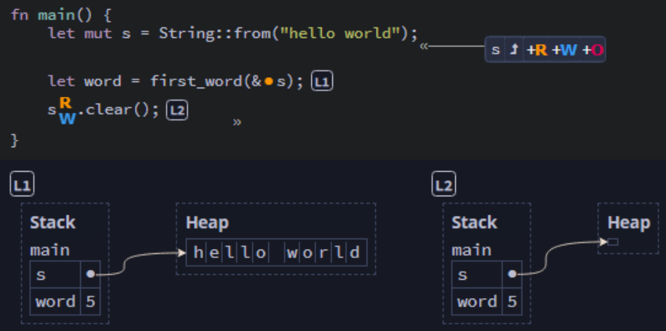
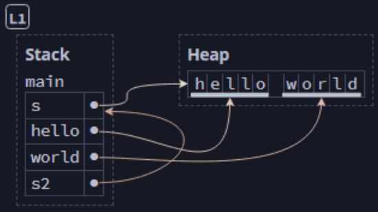
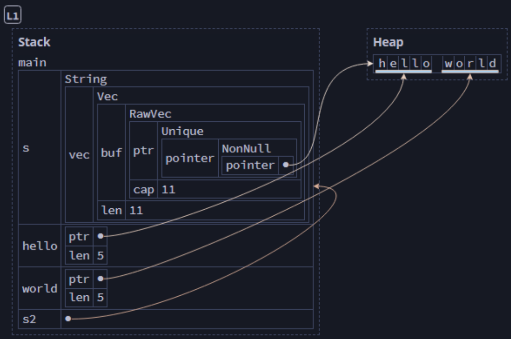
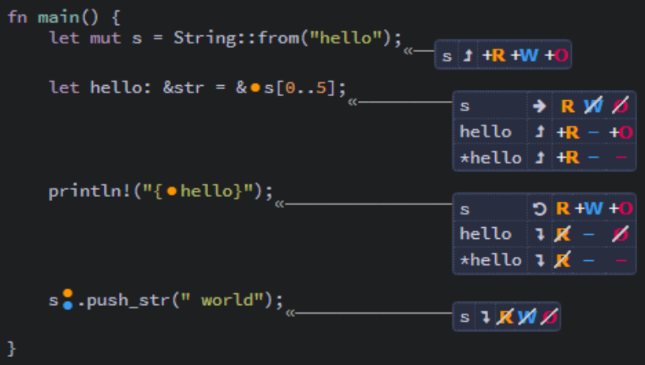

## Slices ##

A slice is a contiguous sequence of elements from a collection rather than
the whole collection itself.

---

To start with, we'll examine a program that attempts to get the length of the
first word in a string:

```rust
fn main() {
    let s = String::from("hello world");

    let word = first_word(&s);
    println!("The first word of 's' is {word} characters long.");
}

fn first_word(s: &String) -> usize {
    let bytes = s.as_bytes();

    // iter() returns each element in a collection
    // enumerate() wraps iter() to return tuples of (index, &element)
    for (i, &item) in bytes.iter().enumerate() {
        // Return the position of the first space in the string
        if item == b' ' {
            return i;
        }
    }
    // If no spaces were found, return the length of the string
    s.len()
}
```

We have a problem though. The ```usize``` returned by the function is not a
reference, so it's uncoupled from its context (the ```&String```).

The following modification would allow the code to compile and run, but would
result in invalid output.

```rust
fn main() {
    let s = String::from("hello world");

    let word = first_word(&s); // [L1]

    s.clear(); // [L2]

    // This is incorrect, since word is still 5, but s is 0 characters
    println!("The first word of 's' is {word} characters long.");
}

fn first_word(s: &String) -> usize {
    // * SNIP *
}
```


<br><sup><sup>[Diagram from Brown University](https://rust-book.cs.brown.edu)</sup></sup>

If we tried to use ```word``` to obtain the word from ```s```, it would 
fail. The data is out of sync.

Things could get even worse if we tried to use the index to get the second
word, like this:

```rust
fn second_word(s: &String, start: usize) -> usize {
    // * SNIP *
}
```

---

It is bad practice to set up related variables where the data may not remain
synchronized.

When working with strings (as in the examples above), we can avoid this by 
implementing *slices*.

String slices reference portions of a string.

```rust
let s = String::from("hello world");

// The slice is indicated as a range (with indices from start to end + 1)
let hello = &s[0..5];
let world = &s[6..11];
let s2: &String = &s; // [L1]
```


<br><sup><sup>[Diagram from Brown University](https://rust-book.cs.brown.edu)</sup></sup>

You can omit the first, last, or both indices from the range notation when
creating a slice to indicate that the slice continues to the omitted end.

```rust
let s = String::from("hello world");

let hello = &s[..5];
let world = &s[6..];
let hello_world = &s[..];
```

Note: Slices must begin and end at valid UTF-8 character boundaries.
Beginning a slice in the middle of a multi-byte character will cause an
error.

---

Slices are special kinds of references, because they are
"fat" pointers (pointers with metadata).


<br><sup><sup>[Diagram from Brown University](https://rust-book.cs.brown.edu)</sup></sup>

---

Now, we can modify our first_word function to return a value for the first
word.

```rust
fn first_word(s: &String) -> &str {
    let bytes = s.as_bytes();

    for (i, &item) in bytes.iter().enumerate() {
        // Return the slice containing the first word in the string
        if item == b' ' {
            return &s[0..i];
        }
    }
    // If no spaces were found, return a slice containing the whole string
    &s[..]
}
```

---

### Slices are References ###

Because slices are references, they change permissions on
the referenced data.

```rust
fn main() {
    let mut s = String::from("hello");
    let hello: &str = &s[0..5];
    println!("{hello}");
    s.push_str(" world");
}
```


<br><sup><sup>[Diagram from Brown University](https://rust-book.cs.brown.edu)</sup></sup>

---

The compiler understands that a slice is an immutable reference. Because of
that, it prevents modifying the string.

```rust
fn main() {
    let mut s = String::from("hello world");

    let word = first_word(&s);

    // Error: cannot borrow `s` as mutable because it is also
    //        borrowed as immutable
    s.clear();
}

fn first_word(s: &String) -> &str {
    // * SNIP *
}
```

This enables slicing to guarantee that the data remains unchanged
for the duration of the slice's scope.

---

### String Literals as Slices ###

A string literal is functionally equivalent to a slice. Both are of type
```&str```, which is an immutable reference to the collection of characters
in memory.

```rust
let s1 = String::from("hello world");

// Both s1 and s2 are &str references pointing to equivalent data
let s2 = &s[..];
let s3 = "hello world";
```

---

### Slices as Parameters ###

We can also pass a slice rather than s String. This allows us to improve the
first_word function.

```rust
fn main() {
    let my_string = String::from("hello world");

    // Either of these will now work
    let word = first_word(&my_string[0..6]);
    let word = first_word(&my_string[..]);

    // Since a String reference is equivalent to a slice,
    //     this works too
    let word = first_word(&my_string);

    let my_literal = "hello world";

    // This also works with literals
    let word = first_word(&my_literal[0..6]);
    let word = first_word(&my_literal[..]);

    // And, since a literal *is* a slice, this works too
    let word = first_word(my_literal);
}

// Because of 'deref coercions' (later lesson),
//   an &str parameter can accept either a slice or an &String argument
fn first_word(s: &str) -> &str {
    // * SNIP *
}
```

---

### Other Slices ###

Slices can return portions of collections other than strings.

For example:

```rust
let arr = [1, 2, 3, 4, 5];

let slice = &arr[1..3];

assert_eq!(slice, &[2, 3]);
```

---

