## Ownership Recap ##

### Ownership vs Garbage Collection ###

Most programming languages (.NET, Python, Java, JavaScript, 
Go, e.g.) use a *garbage collector* to manage memory. The 
garbage collector runs adjacent to the program and scans for
allocated memory no longer in use (defined as: unable to be 
reached from a function-local variable). Once items are 
identified as no longer used, the garbage collector will
deallocate the memory on the heap.

Garbage collection avoids undefined behavior (a vulnerability 
in C and C++). However, this comes with some drawbacks:

* Performance is impacted, since the GC will incur either
    * Frequent, small overhead for reference-counting (Python
      and Swift, e.g.)<br>or
    * Infrequent large overhead for tracing (.NET and Java,
      e.g.)
* Garbage collection is unpredictable
    * In C#, we learn that the garbage collector is 
      non-deterministic (meaning we can predict neither the
      timing nor the order in which items are deallocated).

---

Consider this Python program:

```python
class Document:
    def __init__(self, words: list[str]) -> None:
        """Create a new document"""
        self.words: list[str] = words

    def add_word(self, word: str) -> None:
        """Add a word to the document"""
        self.words.append(word)

    def get_words(self) -> list[str]:
        """Get a list of all words in the document"""
        return self.words

def main() -> None:
    """Create a document and copy it, then mutate the copy"""
    words = ["hello"]
    d = Document(words) # Create instance
    d2 = Document(d.get_words()) # Copy data to new instance
    d2.add_word("world")

if __name__ == "__main__":
    main()
```

This code leads to two questions:

1. **When is the ```words``` list deallocated?**<br>
   Because ```words```, ```d```, and ```d2``` all contain
   pointers to the same data on the heap, Python can only
   deallocate ```words``` after all three are out of scope.
2. **What are the contents of ```d```?**<br>
   Because both ```d``` and ```d2``` point to the same
   heap array, mutating ```d2``` changes ```d``` as well.
   This occurs because Python implicitly returns a mutable
   reference from ```d.get_words()```. This problem is
   sometimes called "data structures *leaking* internals."

Note: Python is only used as an example here. This issue can
occur in all garbage-collected languages.

---

If we convert the code into Rust (note: we should use a
*struct*, but those come next chapter), we see this:

```rust
type Document = Vec<String>;

fn new_document(words: Vec<String>) -> Document {
    words
}

fn add_word(this: &mut Document, word: String) {
    this.push(word);
}

fn get_words(this: &Document) -> &[String] {
    this.as_slice()
}

fn main() {
    let words = vec!["hello".to_string()];
    let d = new_document(words);

    // .to_vec() clones each string into a new Vec<string>
    let words_copy = get_words(&d).to_vec();
    let mut d2 = new_document(words_copy);
    add_word(&mut d2, "world".to_string());

    // Mutating d2 did not change d
    assert(!get_words(&d).contains(&"world".into()));
}
```

Now we have Rust's tighter control of the memory.

* ```new_document()``` consumes ownership of ```words```, so
  it is predictably deallocated when the owning Document goes
  out of scope.
* ```add_word()``` requires a mutable reference and therefore
  prevents any other process from mutating the words of the
  Document.
* ```get_words()``` explicitly returns an immutable reference
  to the strings in the Document.

As a result, we are forced to deep-copy the Document (as shown
in the ```main()``` function).

---

Together, these examples serve to show that Rust is simply
making the use of memory and pointers explicit. This has
two benefits:

1. Runtime performance is improved by avoiding garbage
   collection.
2. Memory deallocation is more predictable, as data
   structures are prevented from *leaking* their contents.

---

### Concepts of Ownership ###

#### Ownership at Runtime ####

* Rust allocates local variables in stack frames, which are
  allocated when a function is called and deallocated when
  the call ends.
* Local variables can hold either known-size data (numbers,
  booleans, tuples, etc.) or pointers.
* Pointers can be created wither through boxes (pointers
  owning data on the heap) or references (non-owning
  pointers).

Example:

```rust
fn main() {
    let mut a_num = 0;
    inner(&mut a_num); // [L2]
}

fn inner(x: &mut i32) {
    let another_num = 1;
    let a_stack_ref = &another_num;

    let a_box = Box::new(2);
    let a_box_stack_ref = &a_box;
    let a_box_heap_ref = &*a_box; // [L1]

    *x += 5;
}
```

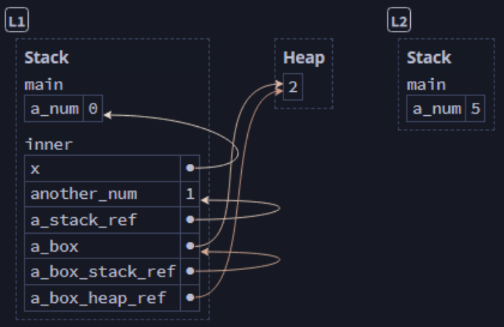
<br><sup><sup>[Diagram from Brown University](https://rust-book.cs.brown.edu)</sup></sup>

We should be able to answer the following questions about the
diagram:

* Why does ```a_box_stack_ref``` point to the stack, while
  ```a_box_heap_ref``` points to the heap?
    * ```&a_box``` is referencing the ```a_box``` variable,
      which, though a pointer to heap data, is just a pointer
      stored on the stack. ```&*a_box``` though, is a 
      reference to the data pointed to by ```a_box```, as
      we have dereferenced ```*a_box``` and then referenced
      that.
* Why is the value ```2``` no longer on the heap at ```L2```?
    * At the end of the function call, ```a_box``` goes out 
      of  scope. So the data it owns is deallocated.
* Why does ```a_num``` have the value ```5``` at ```L2```?
    * ```a_num``` is initialized to ```0```
    * ```x``` is a mutable reference to ```a_num```
    * So, ```*x += 5``` is equivalent to ```a_num += 5```
    * 0 + 5 = 5... et voila!

---

#### Slices ####

Slices are special references that point to contiguous
blocks (sequences) of data on the heap.

Example:

```rust
fn main() {
    let s = String::from("abcdefg");
    let s_slice = &s[2..5]; // [L1]
}
```

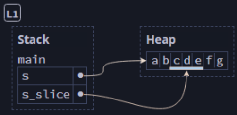
<br><sup><sup>[Diagram from Brown University](https://rust-book.cs.brown.edu)</sup></sup>

---

#### Ownership at Compile-Time ####

Rust tracks read (R), write (W), and own (O) permissions on
each variable and requires that a variable has the permissions
necessary for each operation. For example, if it is not
declared as ```let mut```, then it will not have the (W)
permission and cannot be mutated.

Example:

```rust
// Note: This code will not compile
fn main() {
    let n = 0;
    n += 1; // Error - cannot mutate
}
```

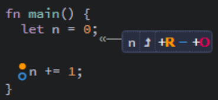
<br><sup><sup>[Diagram from Brown University](https://rust-book.cs.brown.edu)</sup></sup>

---

A variables permissions are changed if it is moved or
borrowed. A move of a non-copyable type (```String``` or
```Box<T>```, e.g.) requires (RO) permissions, and the move
eliminates all permissions on the variable.

Example:

```rust
// Note: This code does not compile
fn main() {
    let s = String::from("Hello world");
    consume_a_string(s);
    println!("{s}"); // Error: Can't read moved variable
}

fn consume_a_string(_s: String) {
    // om nom nom
}
```

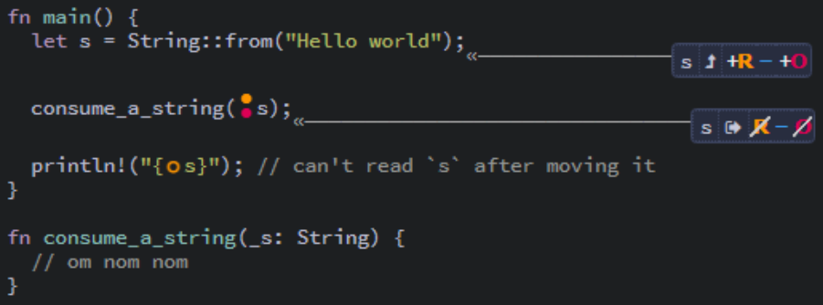
<br><sup><sup>[Diagram from Brown University](https://rust-book.cs.brown.edu)</sup></sup>

---

Borrowing a variable temporarily removes some of its
permissions.

**Immutable References:**

An immutable borrow creates an immutable reference but also 
prevents the borrowed variable from mutating.

---

Example 1: (printing an immutable reference is OK)

```rust
fn main() {
    let mut s = String::from("Hello");
    let s_ref = &s;
    println!("{s_ref}");
    println!("{s}");
}
```

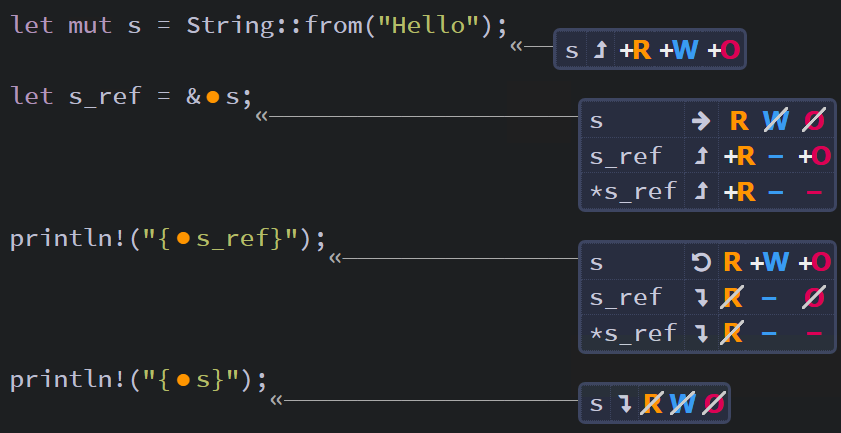
<br><sup><sup>[Diagram from Brown University](https://rust-book.cs.brown.edu)</sup></sup>

---

Example 2: (... but mutating an immutable reference is not)

```rust
// Note: This code will not compile
fn main() {
    let mut s = String::from("Hello");
    let s_ref = &s;
    s_ref.push_str(" world"); // Error: Ref isn't mutable
    println!("{s}");
}
```

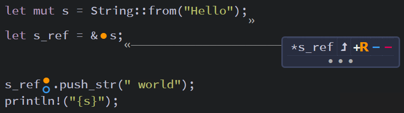
<br><sup><sup>[Diagram from Brown University](https://rust-book.cs.brown.edu)</sup></sup>

---

Example 3: (... and mutating the borrowed data is not OK)

```rust
// Note: This code will not compile
fn main() {
    let mut s = String::from("Hello");
    let s_ref = &s;
    s.push_str(" world"); // Error: Missing (W)
    println!("{s_ref}");
}
```

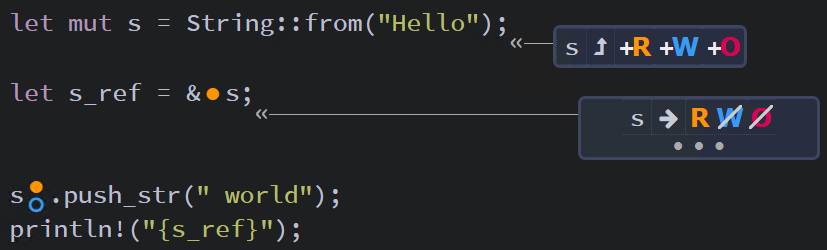
<br><sup><sup>[Diagram from Brown University](https://rust-book.cs.brown.edu)</sup></sup>

---

Example 4: (.. and moving data out of the reference is not OK)

```rust
// Note: This code will not compile
fn main() {
    let mut s = String::from("Hello");
    let s_ref = &s;
    let s2 = *s_ref; // Error: Missing (O)
    println!("{s}");
}
```

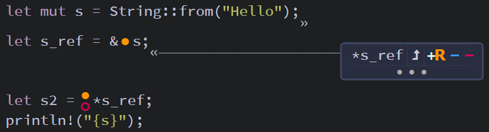
<br><sup><sup>[Diagram from Brown University](https://rust-book.cs.brown.edu)</sup></sup>

---

**Mutable References**

A mutable borrow creates a mutable reference, which disables
the borrowed data from being read, written, or moved.

---

Example 1: (Mutating the mutable reference is OK)

```rust
fn main() {
    let mut s = String::from("Hello");
    let s_ref = &mut s;
    s_ref.push_str(" world");
    println!("{s}");
}
```

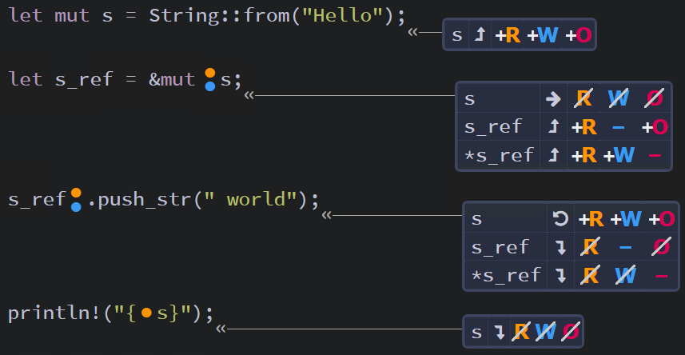
<br><sup><sup>[Diagram from Brown University](https://rust-book.cs.brown.edu)</sup></sup>

---

Example 2: (...but accessing the mutably borrowed data is not ok)

```rust
// Note: This code will not compile
fn main() {
    let mut s = String::from("Hello");
    let s_ref = &mut s;
    println!("{s}"); // Error: Missing (R)
    s_ref.push_str(" world");
}
```

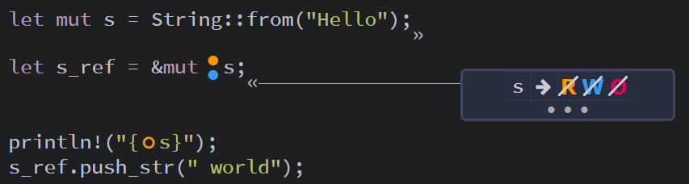
<br><sup><sup>[Diagram from Brown University](https://rust-book.cs.brown.edu)</sup></sup>

---

#### Connecting Ownership between Compile-time and Runtime ####

Rust's permissions are designed to prevent undefined behavior.

---

Example 1: (Error - use-after-free)

```rust
// Note: This code will not compile
fn main() {
    let mut v = vec![1, 2, 3];
    let n = &v[0]; // [L1]
    v.push(4); // [L2]
    println!("{n}"); // [L3] - Error: Use after freed
}
```

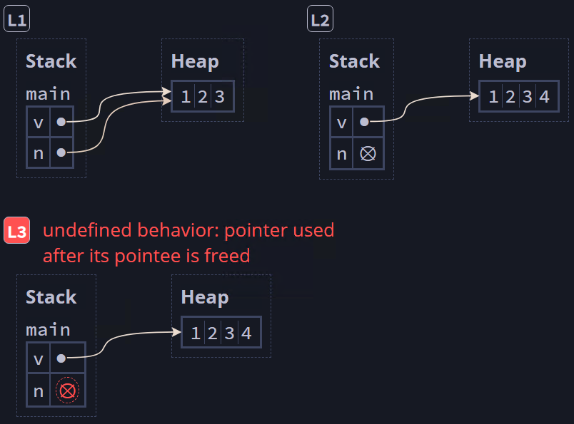
<br><sup><sup>[Diagram from Brown University](https://rust-book.cs.brown.edu)</sup></sup>

---

Example 2: (Error: double-free)

```rust
// Note: This code will not compile
fn main() {
    let v = vec![1, 2, 3];
    let v_ref: &Vec<i32> = &v;
    let v2 = *v_ref; // [L1]
    drop(v2); // [L2]
    drop(v); // [L3]
}
```

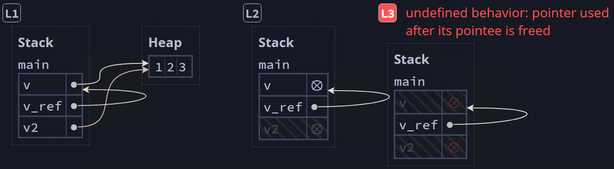
<br><sup><sup>[Diagram from Brown University](https://rust-book.cs.brown.edu)</sup></sup>

---
