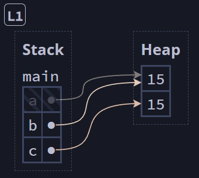
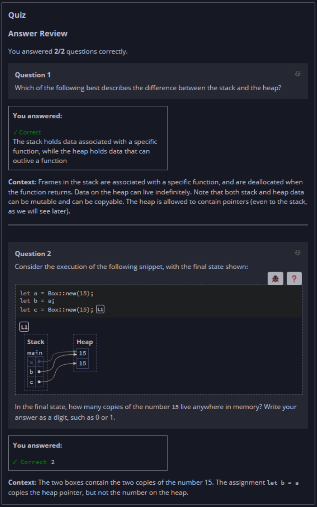

## Quiz - Chapter 4.1 a ##

> ---
> **Question 1**<br>
> Which of the following best describes the difference 
> between the stack and the heap?
> 
> > Response<br>
> > ⊚ The stack holds immutable data, while the heap holds 
> > mutable data.<br>
> > ⊚ The stack can hold pointers to data stored on the 
> > heap, while the heap only holds data without pointers<br>
> > ⊚ The stack holds copyable data, while the heap holds 
> > uncopyable data.<br>
> > ⦿ The stack holds data associated with a specific 
> > function, while the heap holds data that can outlive a 
> > function.<br>
> 
> ---
>
> **Question 2**<br>
> Consider the execution of the following snippet, with the 
> final state shown:
>
> ```rust
> fn main() {
>     let a = Box::new(15);
>     let b = a;
>     let c = Box::new(15); // [L1]
> }
> ```
>
> <br>
>
> In the final state, how many copies of the number 15 live 
> anywhere in memory? Write your answer as a digit, such as 0 
> or 1.
>
> > Response<br>
> > [ ```2``` ]
> 
> ---


