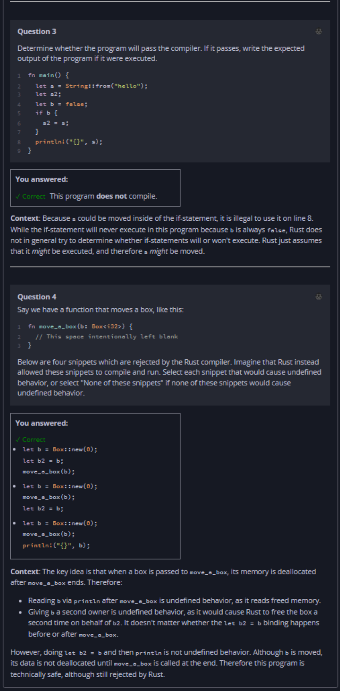

## Quiz - Chapter 4.1 b ##

> ---
> **Question 1**<br>
> Which of the following is NOT a kind of undefined behavior?
> 
> > Response<br>
> > ○ Using a non-boolean value as an if condition<br>
> > ○ Freeing the same memory a second time<br>
> > ◉ Having a pointer to freed memory in a stack frame<br>
> > ○ Using a pointer that points to freed memory<br>
> 
> ---
>
> **Question 2**<br>
> Determine whether the program will pass the compiler. If it 
> passes, write the expected output of the program if it were 
> executed.
>
> ```rust
> fn add_suffix(mut s: String) -> String {
>     s.push_str(" world");
>     s
> }
> 
> fn main() {
>     let s = String::from("hello");
>     let s2 = add_suffix(s);
>     println!("{}", s2);
> }
> ```
>
> > Response<br>
> > This program:<br>
> > ◉ DOES compile<br>
> > ○ Does NOT compile<br>
> >
> > The output of this program will be:<br>
> > [ ```hello world``` ]
> 
> ---
>
> **Question 3**<br>
> Determine whether the program will pass the compiler. If it 
> passes, write the expected output of the program if it were 
> executed.
>
> ```rust
> fn main() {
>     let s = String::from("hello");
>     let s2;
>     let b = false;
>     if b {
>         s2 = s;
>     }
>     println!("{}", s);
> }
> ```
>
> > Response<br>
> > This program:<br>
> > ○ DOES compile<br>
> > ◉ Does NOT compile<br>
> 
> ---
>
> **Question 4**<br>
> Say we have a function that moves a box, like this:
> ```rust
> fn move_a_box(b: Box<i32>) {
>     // This space intentionally left blank
> }
> ```
> Below are four snippets which are rejected by the Rust 
> compiler. Imagine that Rust instead allowed these snippets 
> to compile and run. Select each snippet that would cause 
> undefined behavior, or select "None of these snippets" if 
> none of these snippets would cause undefined behavior.
>
> > Response<br>
> > 
> > ---
> > 
> > ☑ Snippet 1 (```b``` deallocated after ```move_a_box```)
> > ```rust
> > let b = Box::new(0);
> > move_a_box(b);
> > let b2 = b;
> > ```
> > ---
> > 
> > ☐ None of these snippets
> > 
> > ---
> > 
> > ☑ Snippet 2 (```b``` deallocated after ```move_a_box```)
> > ```rust
> > let b = Box::new(0);
> > move_a_box(b);
> > println("{}", b);
> > ```
> > ---
> > 
> > ☑ Snippet 3 (```b``` moved to ```b2``` before 
> > ```move_a_box```)
> > ```rust
> > let b = Box::new(0);
> > let b2 = b;
> > move_a_box(b);
> > ```
> > ---
> > 
> > ☐ Snippet 4
> > ```rust
> > let b = Box::new(0);
> > let b2 = b;
> > println("{}", b);
> > move_a_box(b2);
> > ```
> > ---
> > 
> 



