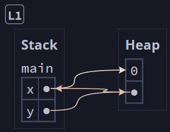
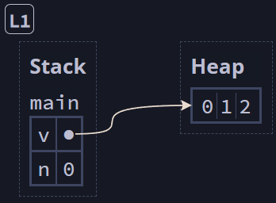
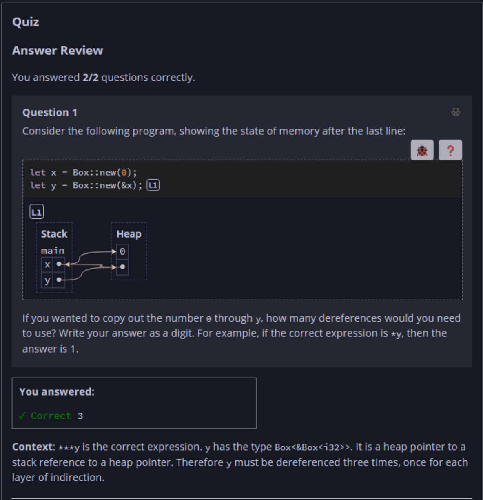
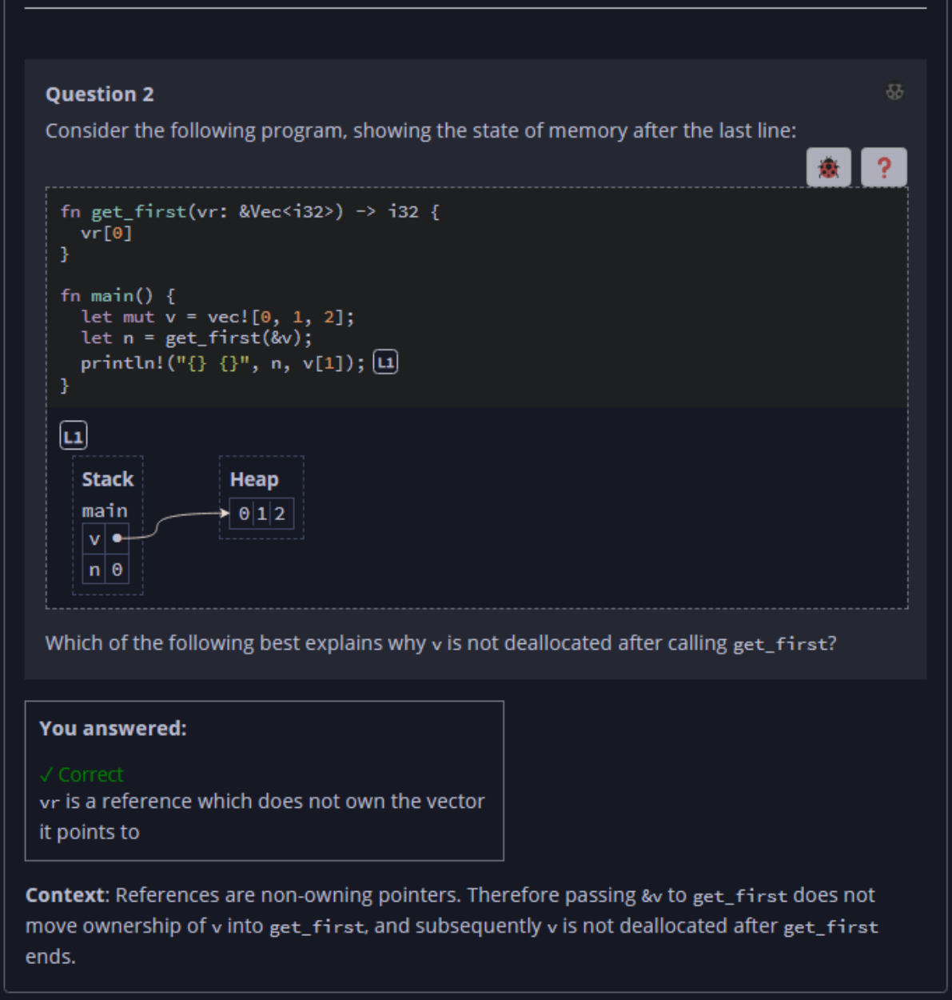

## Quiz - Chapter 4.2 a ##

> ---
> **Question 1**<br>
> Consider the execution of the following snippet, with the 
> final state shown:
>
> ```rust
> fn main() {
>     let x = Box::new(0);
>     let y = Box::new(&x);
> }
> ```
>
> <br>
>
> If you wanted to copy out the number ```0``` through 
> ```y```, how many dereferences would you need to use? Write 
> your answer as a digit. For example, if the correct 
> expression is ```*y```, then the answer is 1.
>
> > Response<br>
> > [ ```3``` ] -> (```***y```)
> 
> ---
> 
> **Question 2**<br>
> Consider the execution of the following snippet, with the 
> final state shown:
>
> ```rust
> fn get_first(vr: &Vec<i32>) -> i32 {
>     vr[0]
> }
>
> fn main() {
>     let mut v = vec![0, 1, 2];
>     let n = get_first(&v);
>     println!("{} {}", n, v[1]); // [L1]
> }
> ```
>
> <br>
>
> Which of the following best explains why ```v``` is not 
> deallocated after calling ```get_first```?
>
> > Response<br>
> > ⊚ ```vr``` is not mutated within ```get_first```<br>
> > ⦿ ```vr``` is a reference, which does not own the vector
> > it points to<br>
> > ⊚ ```vr``` is used after calling ```get_first``` in the
> > ```println```<br>
> > ⊚ ```get_first``` returns a value of type ```i32```, 
> > not the vector itself<br>
> 
> ---



