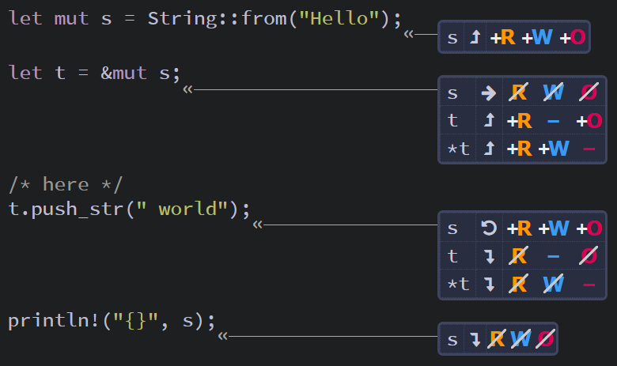
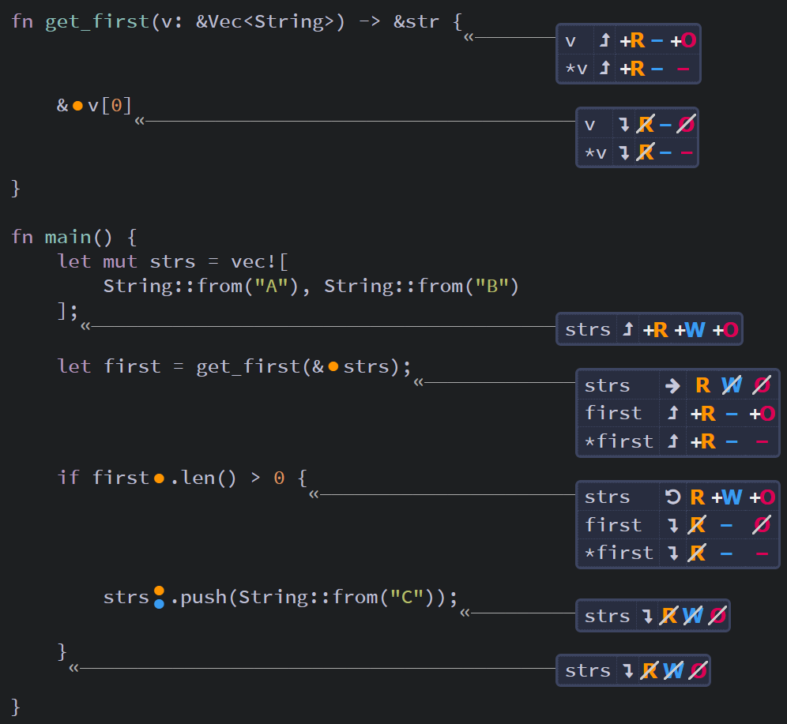
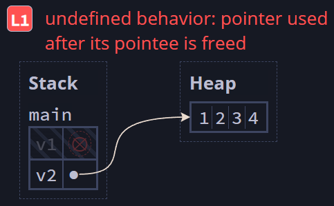
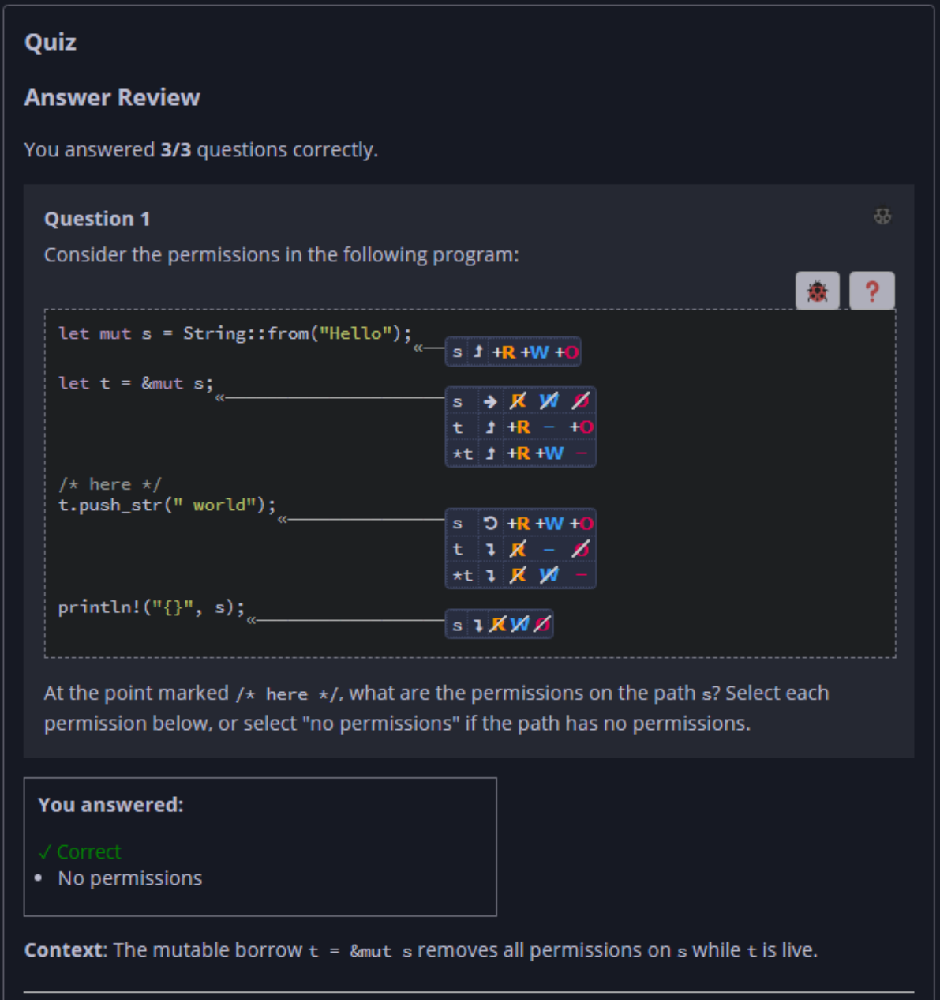
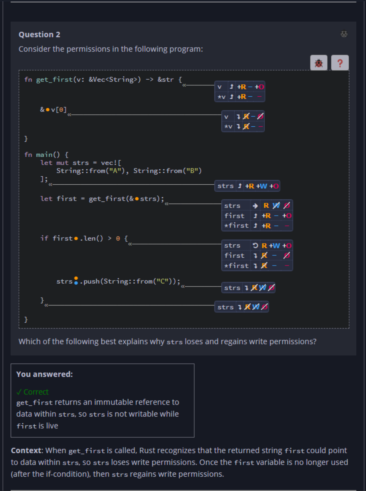
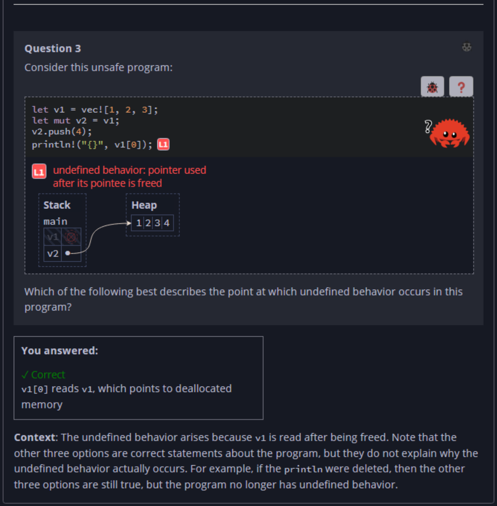

## Quiz - Chapter 4.2 b ##

> ---
> **Question 1**<br>
> Consider the permissions in the following program:
>
> ```rust
> let mut s = String::from("Hello");
> let t = &mut s;
> /* here */
> t.push_str(" world");
> println!("{}", s);
> ```
>
> <br>
>
> At the point marked ```/* here */```, what are the 
> permissions on the path ```s```? Select each permission 
> below, or select "no permissions" if the path has no 
> permissions.
>
> > Response<br>
> > ☐ R<br>
> > ☐ W<br>
> > ☐ O<br>
> > ☑ No permissions<br>
> 
> ---
>
> **Question 2**<br>
> Consider the permissions in the following program:
>
> ```rust
> fn get_first(v: &Vec<String>) -> &str {
>     &v[0]
> }
> 
> fn main() {
>     let mut strs = vec![
>         String::from("A"), String::from("B")
>     ];
>     let first = get_first(&strs);
>     if first.len() > 0 {
>         strs.push(String::from("C"));
>     }
> }
> ```
>
> <br>
>
> Which of the following best explains why ```strs``` loses 
> and regains write permissions?
>
> > Response<br>
> > ⦿ ```get_first``` returns an immutable reference to 
> > data within ```strs```, so ```strs``` is not writable
> > while ```first``` is live<br>
> > ⊚ ```strs``` is not writable while the immutable 
> > reference ```&strs``` passed to ```get_first``` is 
> > live<br>
> > ⊚ Because ```first``` refers to ``strs``, then ``strs`` 
> > can only be mutated within a nested scope like the 
> > if-statement<br>
> > ⊚ ```strs``` does not need write permissions until the 
> > ```strs.push(..)``` operation, so it only regains write 
> > permissions at that statement<br>
> 
> ---
>
> **Question 3**<br>
> Consider this unsafe program:
>
> ```rust
> let v1 = vec![1, 2, 3];
> let mut v2 = v1;
> v2.push(4);
> println!("{}", v1[0]); // [L1]
> ```
> 
> <br>
>
> Which of the following best describes the point at which 
> undefined behavior occurs in this program?
>
> > Response<br>
> > ⊚ ```v2``` owns the vector data on the heap, while 
> > ```v1``` does not<br>
> > ⊚ ```v1``` has its pointer invalidated by the push on 
> > line 3<br>
> > ⊚ ```v1``` has been moved into ```v2``` on line 2<br>
> > ⊚ ```v1[0]``` reads ```v1```, which points to 
> > deallocated memory<br>
> 
> ---




