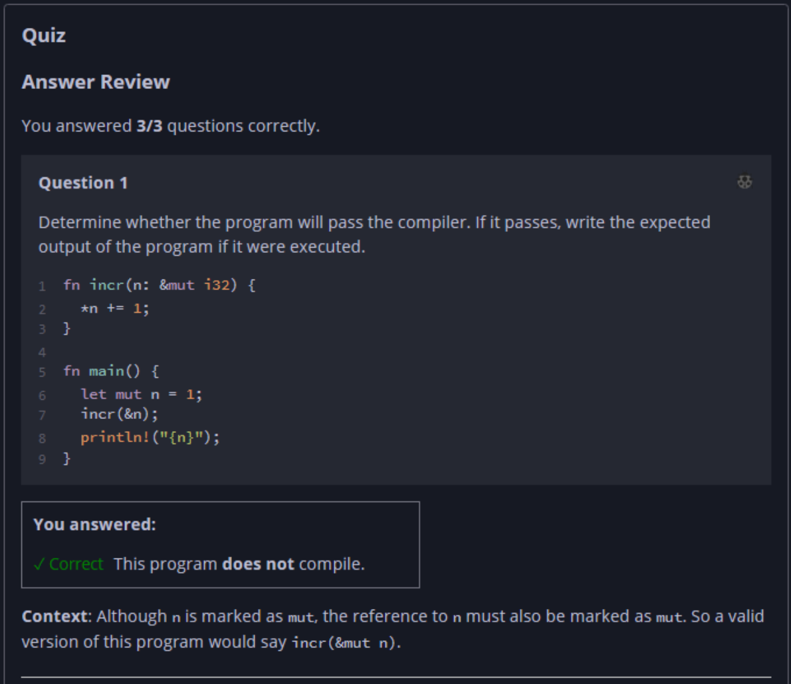
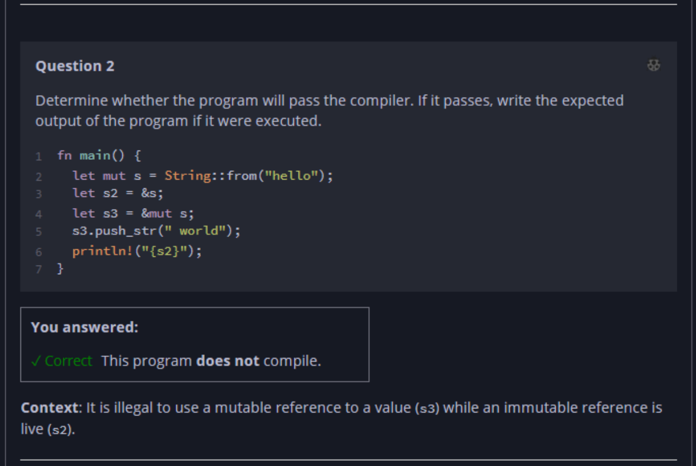
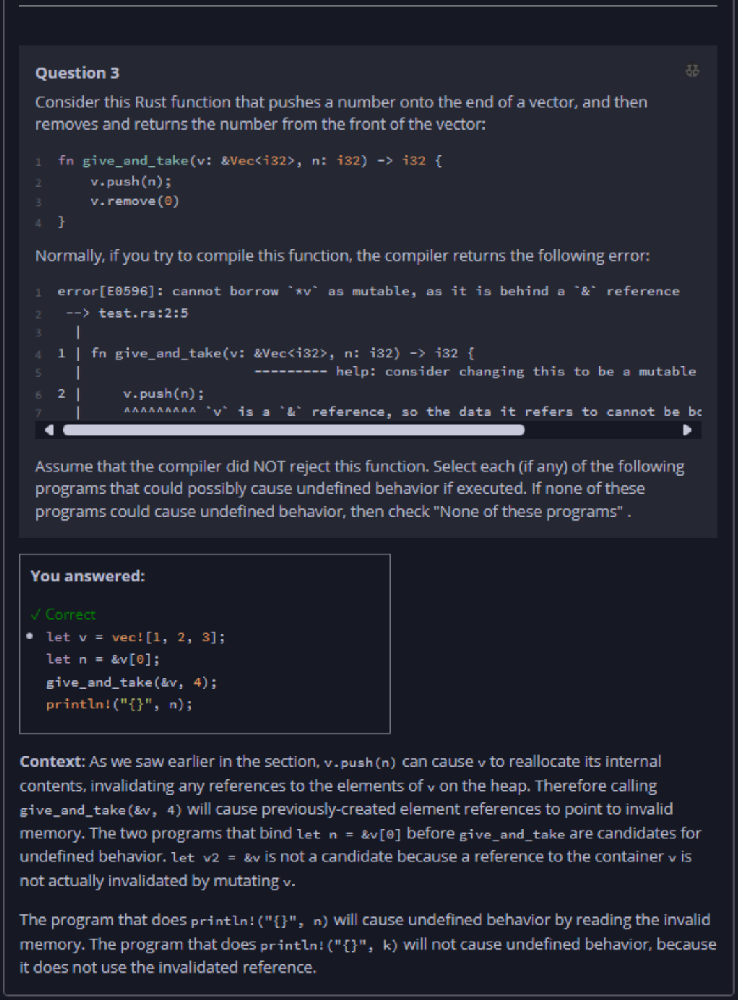

## Quiz - Chapter 4.2 c ##

> ---
> **Question 1**<br>
> Determine whether the program will pass the compiler. If it 
> passes, write the expected output of the program if it were 
> executed.
>
> ```rust
> fn incr(n: &mut i32) {
>     *n += 1;
> }
> fn main() {
>     let mut n = 1;
>     incr(&n);
>     println!("{n}");
> }
> ```
>
> > Response<br>
> > This program:<br>
> > ○ DOES compile<br>
> > ◉ Does NOT compile<br>
> 
> ---
>
> **Question 2**<br>
> Determine whether the program will pass the compiler. If it 
> passes, write the expected output of the program if it were 
> executed.
>
> ```rust
> fn main() {
>     let mut s = String::from("hello");
>     let s2 = &s;
>     let s3 = &mut s;
>     s3.push_str(" world");
>     println!("{s2}");
> }
> ```
>
> > Response<br>
> > This program:<br>
> > ○ DOES compile<br>
> > ◉ Does NOT compile<br>
> 
> ---
>
> **Question 3**<br>
> Consider this Rust function that pushes a number onto the 
> end of a vector, and then removes and returns the number 
> from the front of the vector:
>
> ```rust
> fn give_and_take(v: &Vec<i32>, n: i32) -> i32 {
    > v.push(n);
    > v.remove(0)
> }
> ```
> 
> Normally, if you try to compile this function, the compiler 
> returns the following error:
> ```
> error[E0596]: cannot borrow `*v` as mutable, as it is behind > a `&` reference
>   --> test.rs:2:5
>   |
> 1 | fn give_and_take(v: &Vec<i32>, n: i32) -> i32 {
>   |                     --------- help: consider changing > this to be a mutable reference: `&mut Vec<i32>`
> 2 |     v.push(n);
>   |     ^^^^^^^^^ `v` is a `&` reference, so the data it > refers to cannot be borrowed as mutable
> ```
> 
> Assume that the compiler did NOT reject this function. 
> Select each (if any) of the following programs that could 
> possibly cause undefined behavior if executed. If none of 
> these programs could cause undefined behavior, then check 
> "None of these programs."
>
> > Response<br>
> > ---
> > ☐
> > ```rust
> > let v = vec![1, 2, 3];
> > let n = &v[0];
> > let k = give_and_take(&v, 4);
> > println!("{}", k);
> > ```
> > ---
> > ☑
> > ```rust
> > let v = vec![1, 2, 3];
> > let n = &v[0];
> > give_and_take(&v, 4);
> > println!("{}", n);
> > ```
> > ---
> > ☐
> > ```rust
> > let v = vec![1, 2, 3];
> > let v2 = &v;
> > give_and_take(&v, 4);
> > println!("{}", v2[0]);
> > ```
> > ---
> > ☐ None of these programs<br>
> 
> ---
> 




