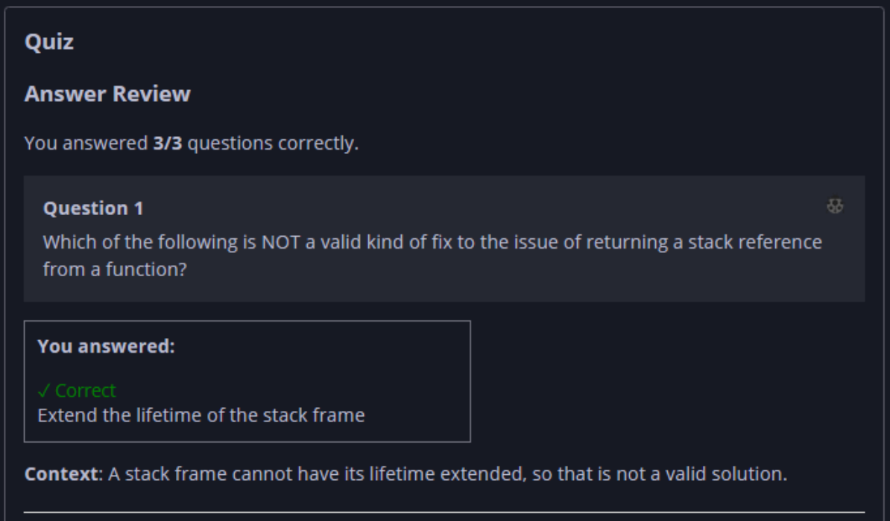
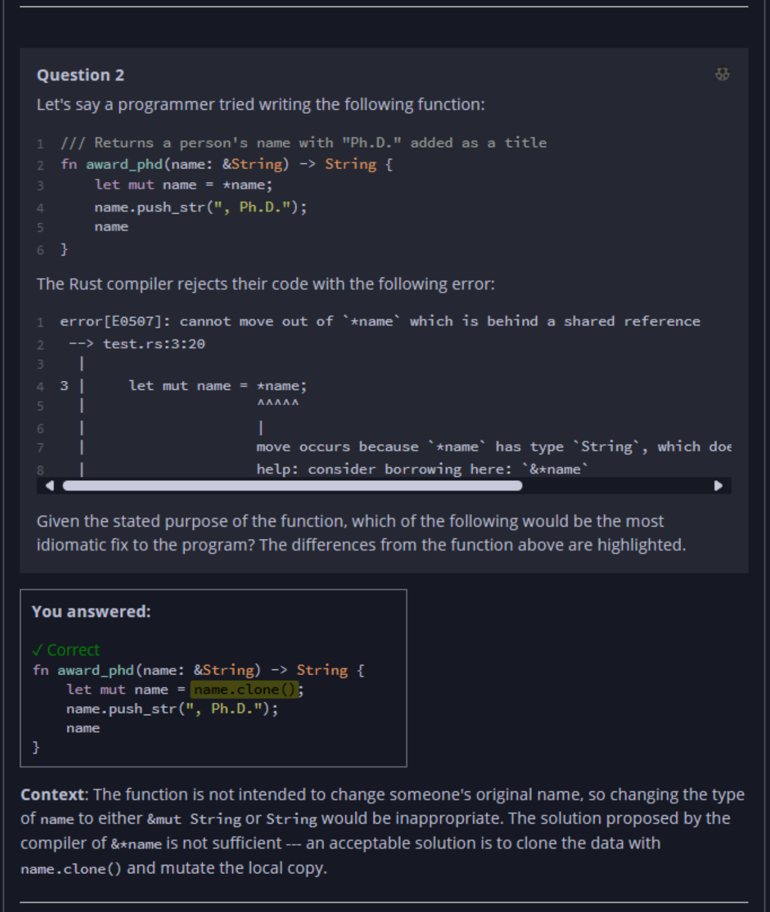
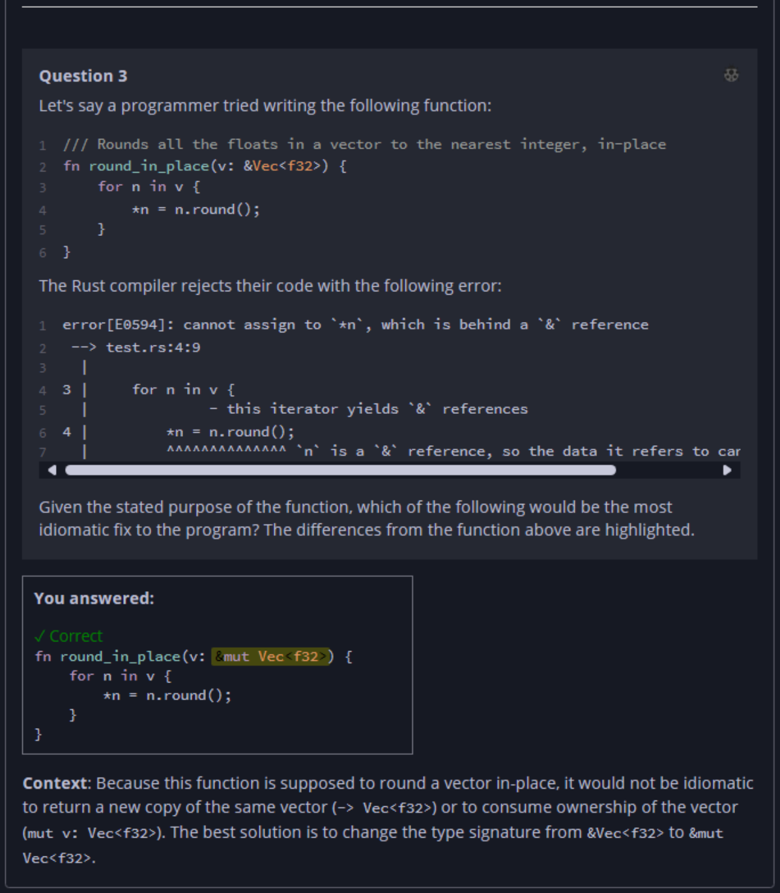

## Quiz - Chapter 4.3 a ##

> ---
> **Question 1**<br>
> Which of the following is NOT a valid kind of fix to the 
> issue of returning a stack reference from a function?
>
> > Response<br>
> > ◉ Extend the lifetime of the stack frame<br>
> > ○ Expect a mutable slot from the caller<br>
> > ○ Take ownership of the returned value<br>
> > ○ Use a reference-counted pointer<br>
> 
> ---
> 
> **Question 2**<br>
> Let's say a programmer tried writing the following function:
>
> ```rust
> /// Returns a person's name with "Ph.D." added as a title
> fn award_phd(name: &String) -> String {
>     let mut name = *name;
>     name.push_str(", Ph.D.");
>     name
> }
> ```
> 
> The Rust compiler rejects their code with the following 
> error:
> 
> ```
> error[E0507]: cannot move out of `*name` which is behind a shared reference
>  --> test.rs:3:20
>   |
> 3 |     let mut name = *name;
>   |                    ^^^^^
>   |                    |
>   |                    move occurs because `*name` has type `String`, which does not implement the `Copy` trait
>   |                    help: consider borrowing here: `&*name`
> ```
>
> Given the stated purpose of the function, which of the 
> following would be the most idiomatic fix to the program? 
> The differences from the function above are highlighted.
> 
> > Response<br>
> > ○
> > ```rust
> > fn award_phd(name: &mut String) {
> >     name.push_str(", Ph.D.");
> > }
> > ```
> > ---
> > 
> > ◉
> > ```rust
> > fn award_phd(name: &String) -> String {
> >     let mut name = name.clone();
> >     name.push_str(", Ph.D.");
> >     name
> > }
> > ```
> > ---
> > 
> > ○
> > ```rust
> > fn award_phd(name: &String) -> String {
> >     let mut name = &*name;
> >     name.push_str(", Ph.D.");
> >     name
> > }
> > ```
> > ---
> > 
> > ○
> > ```rust
> > fn award_phd(mut name: String) -> String {
> >     name.push_str(", Ph.D.");
> >     name
> > }
> > ```
> > 
> ---
> 
> 
> **Question 3**<br>
> Let's say a programmer tried writing the following function:
>
> ```rust
> /// Rounds all the floats in a vector to the nearest integer, in-place
> fn round_in_place(v: &Vec<f32>) {
>     for n in v {
>         *n = n.round();
>     }
> }
> ```
> 
> The Rust compiler rejects their code with the following 
> error:
> 
> ```
> error[E0594]: cannot assign to `*n`, which is behind a `&` reference
>  --> test.rs:4:9
>   |
> 3 |     for n in v {
>   |              - this iterator yields `&` references
> 4 |         *n = n.round();
>   |         ^^^^^^^^^^^^^^ `n` is a `&` reference, so the data it refers to cannot be written
> ```
>
> Given the stated purpose of the function, which of the 
> following would be the most idiomatic fix to the program? 
> The differences from the function above are highlighted.
> 
> > Response<br>
> > ○
> > ```rust
> > fn round_in_place(v: &Vec<f32>) -> Vec<f32> {
> >     let mut v2 = Vec::new();
> >     for n in v {
> >         v2.push(n.round());
> >     }
> >     v2
> > }
> > ```
> > ---
> > 
> > ○
> > ```rust
> > fn round_in_place(v: &Vec<f32>) {
> >     for mut n in &mut v.clone() {
> >         n = n.round();
> >     }
> > }
> > ```
> > ---
> > 
> > ◉
> > ```rust
> > fn round_in_place(v: &mut Vec<f32>) {
> >     for n in v {
> >         *n = n.round();
> >     }
> > }
> > ```
> > 
> > ---
> > 
> > ○
> > ```rust
> > fn round_in_place(mut v: Vec<f32>) {
> >     for n in v {
> >         *n = n.round();
> >     }
> > }
> > ```
> > 
> ---




