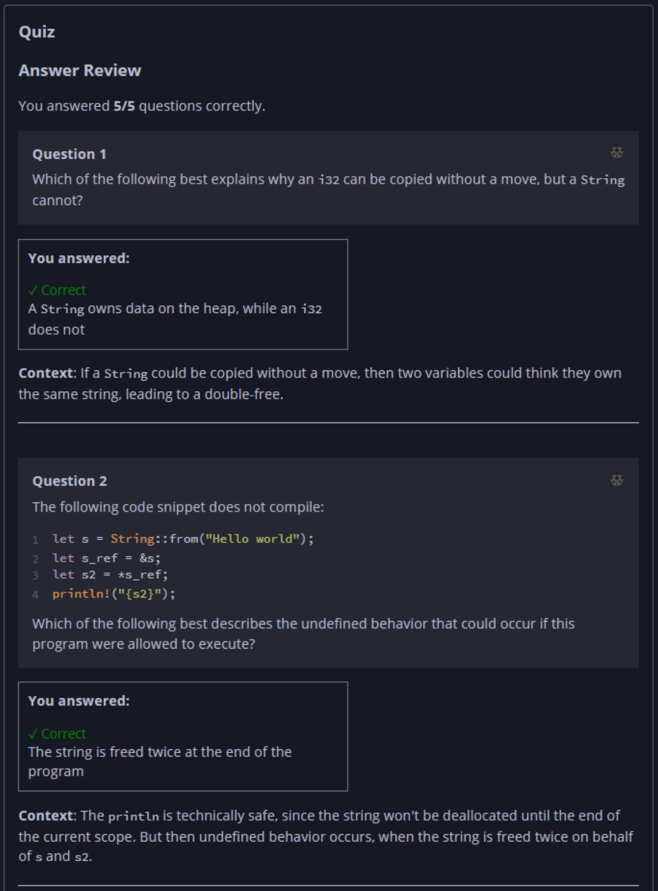

## Quiz - Chapter 4.3 b ##

> ---
> **Question 1**<br>
> Which of the following best explains why an ```i32``` can 
> be copied without a move, but a ```String``` cannot?
>
> > Response<br>
> > ◉ A ```String``` owns data on the heap, while an 
> > ```i32``` does not<br>
> > ○ An ```i32``` is a primitive type in Rust, while a 
> > ```String``` is not<br>
> > ○ An ```i32``` is smaller in memory than a 
> > ```String```<br>
> > ○ A ```String``` can be placed on the heap, while an 
> > ```i32``` can only be placed on the stack<br>
> >
> ---
>
> **Question 2**<br>
> The following code snippet does not compile:
>
> ```rust
> let s = String::from("Hello world");
> let s_ref = &s;
> let s2 = *s_ref;
> println!("{s2}");
> ```
> 
> Which of the following best describes the undefined 
> behavior that could occur if this program were allowed to 
> execute?
>
> > Response<br>
> > ◉ The string is freed twice at the end of the program<br>
> > ○ The read of ```s2``` in println is a use of freed 
> > memory<br>
> > ○ The dereference ```*s_ref``` is a use of freed 
> > memory<br>
> > ○ There is no undefined behavior in this program<br>
> >
> ---
>
> **Question 3**<br>
> The following program does not compile:
>
> ```rust
> fn copy_to_prev(v: &mut Vec<i32>, i: usize) {
>     let n = &mut v[i];
>     *n = v[i - 1];
> }
> 
> fn main() {
>     let mut v = vec![1, 2, 3];
>     copy_to_prev(&mut v, 1);
> }
> ```
> 
> Which of the following best describes the undefined 
> behavior that could occur if this program were allowed to 
> execute?
>
> > Response<br>
> > ○ The borrow ```&mut v[i]``` creates a pointer to freed 
> > memory<br>
> > ◉ There is no undefined behavior in this program<br>
> > ○ The assignment ```*n``` is a use of freed memory<br>
> > ○ The read of ```v[i - 1]``` is a use of freed memory<br>
> >
> ---
>
> **Question 3**<br>
> Consider this function that is a simplified variant of the 
> function from the previous quiz:
>
> ```rust
> /// Adds "Ph.D." to a person's name
> fn award_phd(name: &String) {
>     let mut name = *name;
>     name.push_str(", Ph.D.");
> }
> ```
>
> The Rust compiler rejects this function with the following 
> error:
>
> ```
> error[E0507]: cannot move out of `*name` which is behind a > shared reference
>  --> test.rs:3:20
>   |
> 3 |     let mut name = *name;
>   |                    ^^^^^
>   |                    |
>   |                    move occurs because `*name` has type `String`, which does not implement the `Copy` trait
>   |                    help: consider borrowing here: `&*name`
> ```
> 
> Assume that the compiler did NOT reject this function. 
> Select each (if any) of the following programs that could 
> possibly cause undefined behavior if executed. If none of 
> these programs could cause undefined behavior, then check 
> "None of these programs."
>
> > Response<br>
> > ☑
> > ```rust
> > let name = String::from("Ferris");
> > award_phd(&name);
> > println!("{}", name);
> > ```
> > ---
> > ☑
> > ```rust
> > let name = String::from("Ferris");
> > let name_ref = &name;
> > award_phd(&name);
> > println!("{}", name_ref);
> > ```
> > ---
> > 
> > ☐ None of these programs.
> > 
> > ---
> > ☑
> > ```rust
> > let name = String::from("Ferris");
> > award_phd(&name);
> > ```
> >
> ---
>
> **Question 5**<br>
> Determine whether the program will pass the compiler. If it 
> passes, write the expected output of the program if it were 
> executed.
> 
> ```rust
> fn main() {
>     let mut point = [0, 1];
>     let mut x = point[0];
>     let y = &mut point[1];
>     x += 1;
>     *y += 1;
>     println!("{} {}", point[0], point[1]);
> }
> ```
>
> > Response<br>
> > This program:<br>
> > ◉ DOES compile<br>
> > ○ Does NOT compile<br>
> > The output of this program will be:<br>
> > [ ```0 2``` ]
> >
>  
> ---




