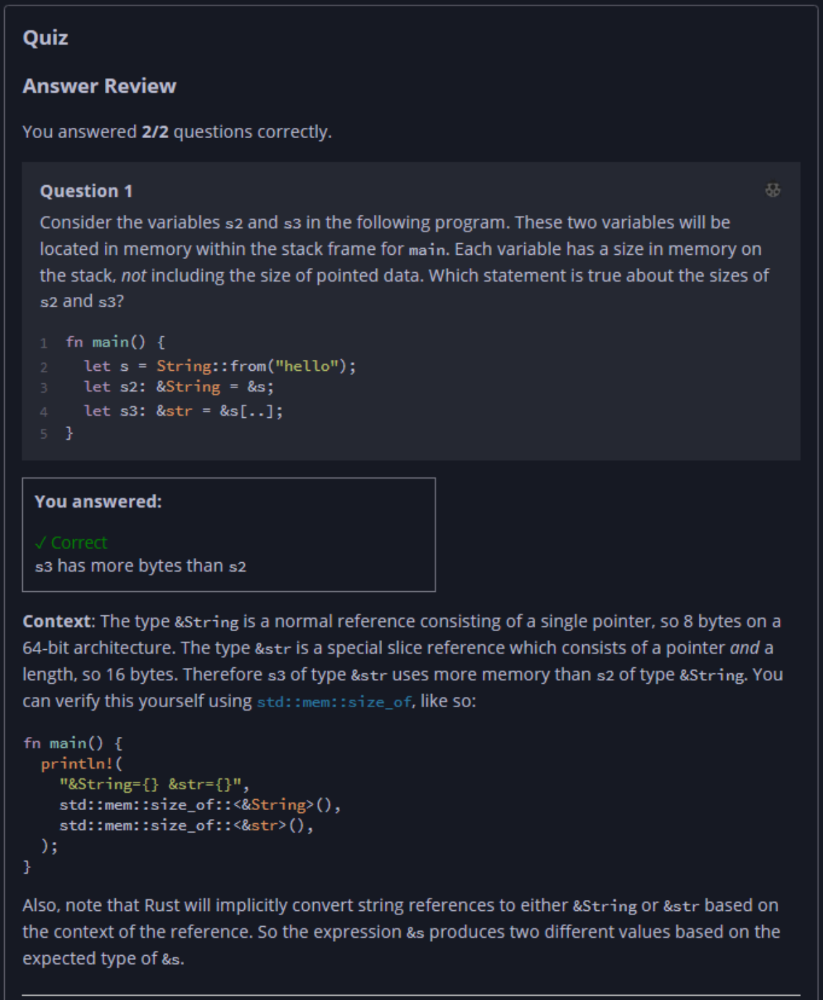
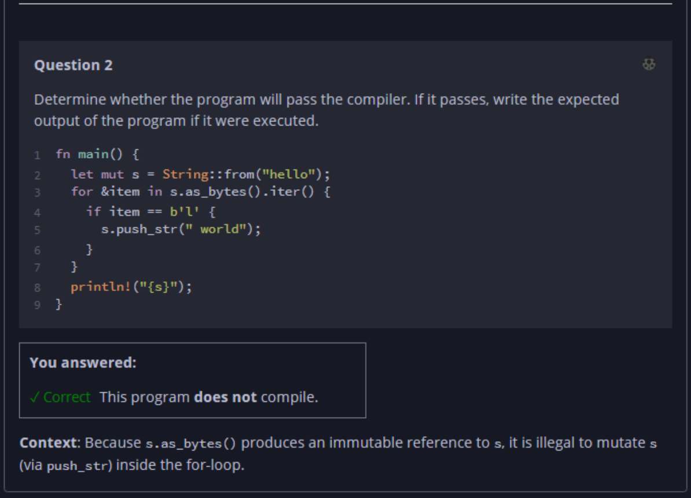

## Quiz - Chapter 4.4 ##

> ---
> **Question 1**<br>
> Consider the variables ```s2``` and ```s3``` in the following 
> program. These two variables will be located in memory within 
> the stack frame for main. Each variable has a size in memory 
> on the stack, not including the size of pointed data. Which 
> statement is true about the sizes of ```s2``` and ```s3```?
> 
> ```rust
> fn main() {
>     let s = String::from("hello");
>     let s2: &String = &s;
>     let s3: &str = &s[..];
> }
> ```
>
> > Response<br>
> > ○ ```s3``` has fewer bytes than ```s2```<br>
> > ◉ ```s3``` has more bytes than ```s2```<br>
> > ○ ```s3``` has the same number of bytes as ```s2```<br>
> >
> ---
>
> **Question 2**<br>
> Determine whether the program will pass the compiler. If it 
> passes, write the expected output of the program if it were 
> executed.
> 
> ```rust
> fn main() {
>     let mut s = String::from("hello");
>     for &item in s.as_bytes().iter() {
>         if item == b'l' {
>             s.push_str(" world");
>         }
>     }
>     println!("{s}");
> }
> ```
>
> > Response<br>
> > This program:<br>
> > ○ DOES compile<br>
> > ◉ Does NOT compile
> >
> ---



