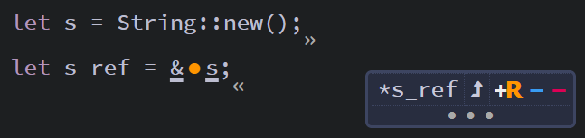
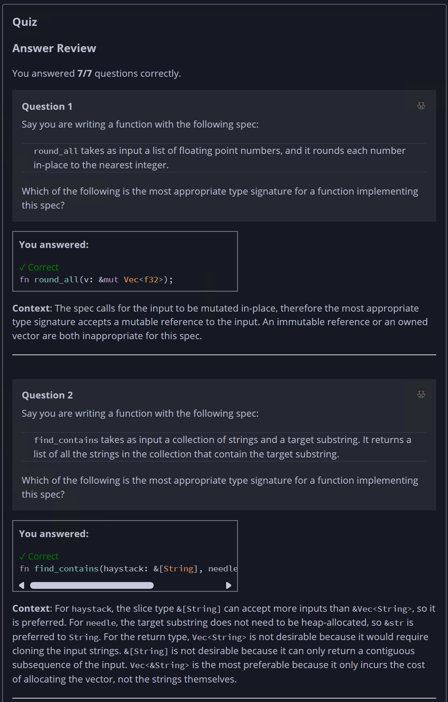
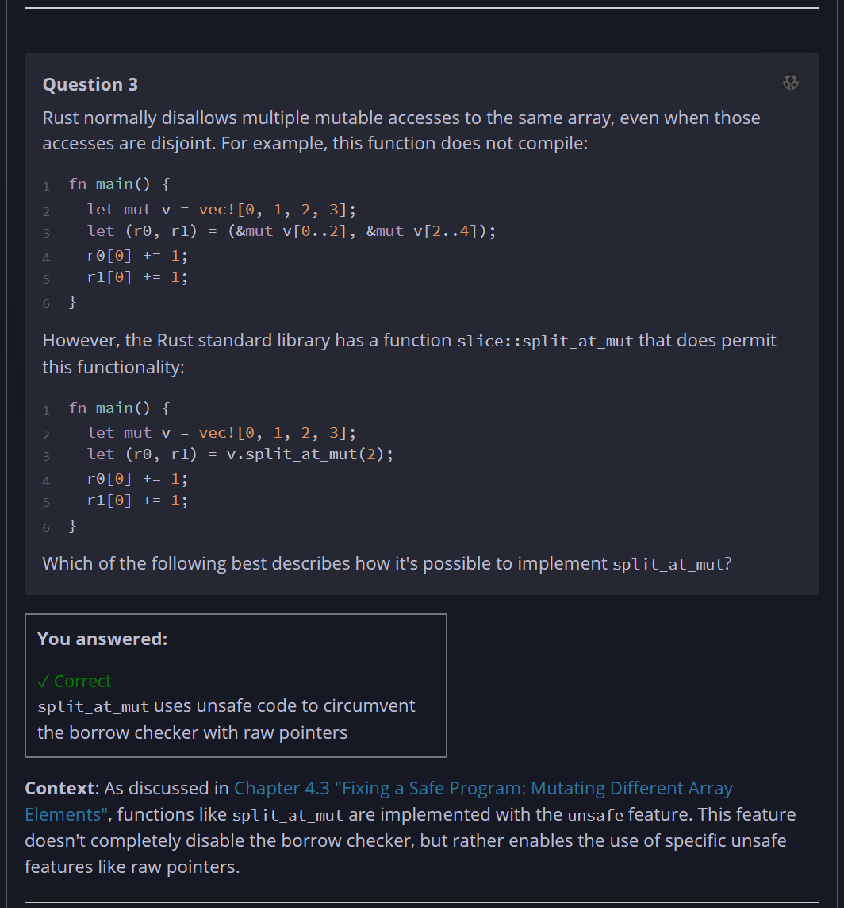
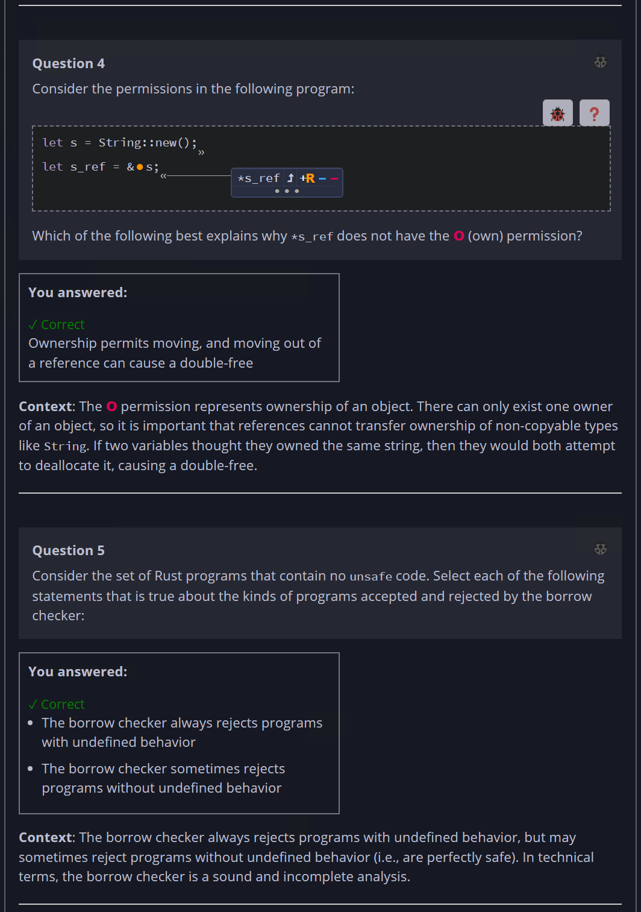
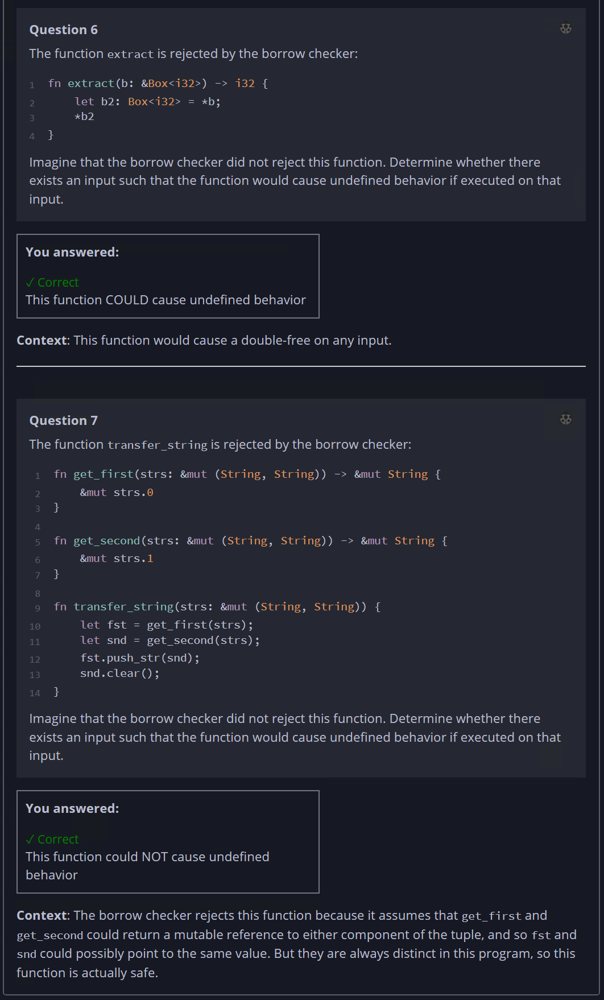

## Quiz - Chapter 4.5 ##

> ---
> **Question 1**<br>
> Say you are writing a function with the following spec:
> 
> > ```round_all``` takes as input a list of floating point 
> > numbers, and it rounds each number in-place to the nearest 
> > integer.
> 
> Which of the following is the most appropriate type signature 
> for a function implementing this spec?
>
> > Response<br>
> > ○ ```fn round_all(v: Vec<f32>);```<br>
> > ○ ```fn round_all(v: &Vec<f32>) -> Vec<f32>;```<br>
> > ○ ```fn round_all(v: &Vec<f32>);```<br>
> > ◉ ```fn round_all(v: &mut Vec<f32>);```<br>
> >
> ---
>
> **Question 2**<br>
> Say you are writing a function with the following spec:
> 
> > ```find_contains``` takes as input a collection of strings 
> > and a target substring. It returns a list of all the 
> > strings in the collection that contain the target substring.
> 
> Which of the following is the most appropriate type signature 
> for a function implementing this spec?
>
> > Response<br>
> > ○ ```fn find_contains(haystack: &[String], needle: &str) -> Vec<String>;```<br>
> > ○ ```fn find_contains(haystack: &Vec<String>, needle: String) -> Vec<String>;```<br>
> > ○ ```fn find_contains(haystack: &Vec<String>, needle: &str) -> &[String];```<br>
> > ◉ ```fn find_contains(haystack: &[String], needle: &str) -> Vec<&String>;```<br>
> >
> ---
>
> **Question 3**<br>
> Rust normally disallows multiple mutable accesses to the same 
> array, even when those accesses are disjoint. For example, 
> this function does not compile:
>
> ```rust
> fn main() {
>     let mut v = vec![0, 1, 2, 3];
>     let (r0, r1) = (&mut v[0..2], &mut v[2..4]);
>     r0[0] += 1;
>     r1[0] += 1;  
> }
> ```
> 
> However, the Rust standard library has a function 
> ```slice::split_at_mut``` that does permit this functionality:
>
> ```rust
> fn main() {
>     let mut v = vec![0, 1, 2, 3];
>     let (r0, r1) = v.split_at_mut(2);
>     r0[0] += 1;
>     r1[0] += 1;  
> }
> ```
> 
> Which of the following best describes how it's possible to 
> implement ```split_at_mut```?
>
> > Response<br>
> > ○ ```split_at_mut``` uses unsafe code to disable the borrow 
> > checker from checking the safety of mutable references<br>
> > ○ ```split_at_mut``` calls into a C library that can't be 
> > analyzed by Rust<br>
> > ○ ```split_at_mut``` is a special compiler primitive that 
> > cannot be implemented within the language<br>
> > ◉ ```split_at_mut``` uses unsafe code to circumvent the 
> > borrow checker with raw pointers<br>
> >
> ---
>
> **Question 4**<br>
> Consider the permissions in the following program:
> 
> ```rust
> let s = String::new();
> let s_ref = &s;
> ```
> 
> 
> 
> Which of the following best explains why ```*s_ref``` does 
> not have the O (own) permission?
>
> > Response<br>
> > ○ Ownership permits moving, and moving out of a reference 
> > can cause a double-free<br>
> > ○ Ownership permits mutation, and mutating ```*s_ref``` can 
> > cause a use-after-free<br>
> > ○ Ownership permits borrowing, and reborrowing ```*s_ref``` 
> > can cause a double-free<br>
> > ○ Ownership permits reading, and reading ```*s_ref``` can 
> > cause a use-after-free<br>
> > 
> ---
>
> **Question 5**<br>
> Consider the set of Rust programs that contain no 
> ```unsafe``` code. Select each of the following statements 
> that is true about the kinds of programs accepted and 
> rejected by the borrow checker:
>
> > Response<br>
> > ☑ The borrow checker always rejects programs with undefined 
> > behavior<br>
> > ☑ The borrow checker sometimes rejects programs without 
> > undefined behavior<br>
> > ☐ The borrow checker sometimes accepts programs with 
> > undefined behavior<br>
> > ☐ The borrow checker always accepts programs without 
> > undefined behavior<br>
> > 
> ---
>
> **Question 6**<br>
> The function ```extract``` is rejected by the borrow checker:
> 
> ```rust
> fn extract(b: &Box<i32>) -> i32 {
>     let b2: Box<i32> = *b;
>     *b2
> }
> ```
> 
> Imagine that the borrow checker did not reject this function. 
> Determine whether there exists an input such that the 
> function would cause undefined behavior if executed on that 
> input.
>
> > Response<br>
> > ○ This function could NOT cause undefined behavior<br>
> > ◉ This function COULD cause undefined behavior<br>
> >
> ---
>
> **Question 7**<br>
> The function ```transfer_string``` is rejected by the borrow 
> checker:
> 
> ```rust
> fn get_first(strs: &mut (String, String)) -> &mut String {
>     &mut strs.0
> }
> fn get_second(strs: &mut (String, String)) -> &mut String {
>     &mut strs.1
> }
> fn transfer_string(strs: &mut (String, String)) {
>     let fst = get_first(strs);
>     let snd = get_second(strs);
>     fst.push_str(snd);
>     snd.clear();
> }
> ```
> 
> Imagine that the borrow checker did not reject this function. 
> Determine whether there exists an input such that the 
> function would cause undefined behavior if executed on that 
> input.
>
> > Response<br>
> > ◉ This function could NOT cause undefined behavior<br>
> > ○ This function COULD cause undefined behavior<br>
> > 
> ---





