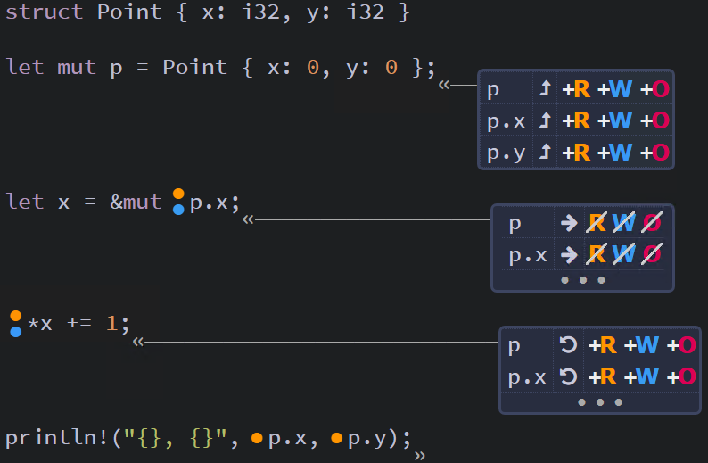
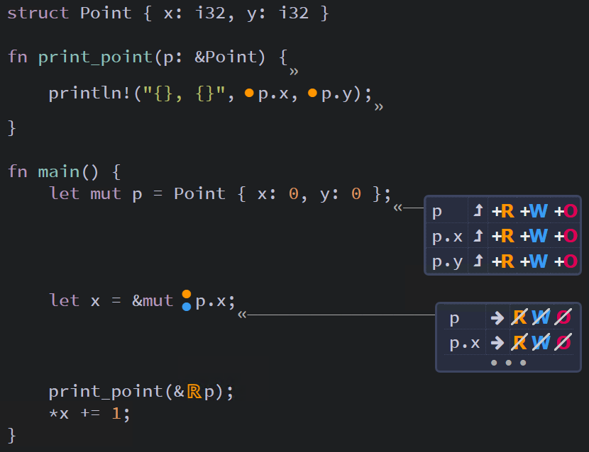

## Ownership of Struct Data ##

### Structs Should Own Their Data ###

In general, it is best to have a struct own its own data fields. In the
previous examples, this is why the ```User``` struct was defined with
```String``` members rather than ```&str``` references.

```rust
struct User {
    active: bool,
    username: String,
    email: String,
    sign_in_count: u64,
}
```

If we used references instead, it would require the use of *lifetimes*, so
this would not work:

```rust
// Note: This code does not compile
struct User {
    active: bool,
    username: &str,
    email: &str,
    sign_in_count: u64,
}

fn main() {
    let User1 = User {
        active: true,
        // These cause the following error
        //   missing lifetime parameter
        username: "someusername123",
        email: "someone@example.com",
        sign_in_count: 1,
    };
}
```

---

### Borrowing Fields of a Struct ###

The borrow checker tracks ownership permissions at both the
```struct``` and field levels.

In this example, when we borrow field ```x``` from a
```Point``` ```p```, both ```p``` and ```p.x``` lose their
permissions, but not ```p.y```

```rust
struct Point { x: i32, y: i32 }

fn main() {
    let mut p = Point { x: 0, y: 0 };
    let x = &mut p.x;
    *x += 1;
    println!("{}, {}", p.x, p.y);
}
```


<br><sup><sup>[Diagram from Brown University](https://rust-book.cs.brown.edu)</sup></sup>

---

So, if we try to use ```p``` while ```p.x``` is borrowed,
we receive an error.

```rust
// Note: This code will not compile
struct Point { x: i32, y: i32 }

fn print_point(p: &Point) {
    println!("{}, {}", p.x, p.y);
}

fn main() {
    let mut p = Point { x: 0, y: 0 };
    let x = &mut p.x;
    print_point(&p); // Error: Missing (R)
    *x += 1;
}
```


<br><sup><sup>[Diagram from Brown University](https://rust-book.cs.brown.edu)</sup></sup>

---
