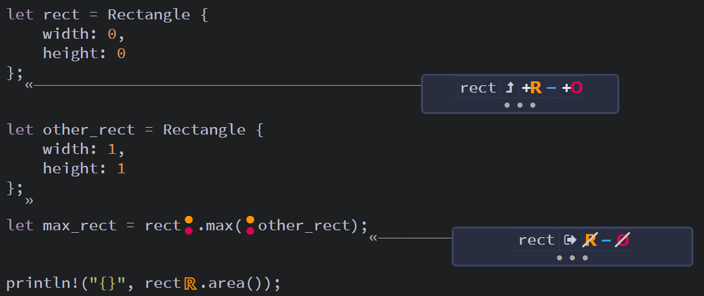

## Struct Method Syntax ##

Note: This file recaps the lessons illustrated 
across the sample project.

Methods are similar to functions: we declare them with the
```fn``` keyword and a name, they can have parameters and a 
return value, and they contain some code that's run when the 
method is called from somewhere else.

Unlike functions, methods are defined within the context of a 
```struct``` (or an enum or a trait), and their first 
parameter is always ```self```, which represents the instance 
of the struct the method is being called on.

---

### Defining Methods ###

Consider the following example that uses a function:

```rust
#[derive(Debug)]
struct Rectangle {
    width: u32,
    height: u32,
}

fn area(rect: &Rectangle) -> u32 {
    rect.width * rect.height
}

fn main() {
    let rect1 = Rectangle {
        width: 30,
        height: 50,
    };

    println!(
        "The area of the rectangle is {} square pixels.",
        area(&rect1)
    );
}
```

---

It doesn't make sense to group the ```area()``` function
separately from the ```Rectangle``` struct.

So, we can add an implementation block (using the ```impl```
keyword) and make the function a member method of the
```Rectangle``` struct.

```rust
#[derive(Debug)]
struct Rectangle {
    width: u32,
    height: u32,
}

// Implement the `area` method as a member or `Rectangle`
impl Rectangle {
    fn area(&self) -> u32 {
        self.width * self.height
    }
}

fn main() {
    let rect1 = Rectangle {
        width: 30,
        height: 50,
    };

    println!(
        "The area of the rectangle is {} square pixels.",
        rect1.area() // Now called from the `Rectangle` instance
    );
}
```

---

### Methods with More Parameters ###

Of course, methods can take parameters other than ```&self```

For example:

```rust
impl Rectangle {
    fn area(&self) -> u32 {
        self.width * self.height
    }

    fn can_hold(&self, other: &Rectangle) -> bool {
        self.width > other.width && self.height > other.height
    }
}
```

---

### Method Calls are Syntactic Sugar* for Function Calls ###

*Syntactic Sugar: Language features that make code
easier to read or write.

---

Consider this code:

```rust
// * SNIP *
impl Rectangle {
    fn area(&self) -> u32 {
        self.width * self.height
    }

    fn set_width(&mut self, width: u32) {
        self.width = width;
    }
}
```

If we have a rectangle ```r```, then we see that we
have simplified the equivalent code:

```rust
fn main() {
    let mut r = Rectangle { 
        width: 1,
        height: 2
    };

    let area1 = r.area(); // Sugar here
    let area2 = Rectangle::area(&r);
    assert_eq!(area1, area2);

    r.set_width(2); // Sugar here
    Rectangle::set_width(&mut r, 2);
}
```

---

In languages like C++, you have two different method
calling operators:

* ```.``` calls a function with a pointer
    * e.g.: ```foo.bar()```
* ```->``` dereferences the pointer fist
    * ```foo->bar()``` === ```(*foo).bar()```

In Rust, we don't have an equivalent to the
```->``` operator, because Rust automatically
references or dereferences the pointer as needed,
so we only require the ```.``` operator.

Example with two equivalent calls:

```rust
    let r = &mut Box::new(Rectangle { 
        width: 1,
        height: 2
    });
    // Dot notation handles ref/deref
    let area1 = r.area();
    let area2 = Rectangle::area(&**r);
    assert_eq!(area1, area2);
```

---

### Methods and Ownership ###

Just like functions, methods must be called on 
structs that have the necessary permissions:

Consider these methods that accept each of the
following:

* ```&self```
* ```&mut self```
* ```self```

```rust
impl Rectangle {    
    fn area(&self) -> u32 {
        self.width * self.height
    }

    fn set_width(&mut self, width: u32) {
        self.width = width;
    }

    fn max(self, other: Rectangle) -> Rectangle {
        Rectangle { 
            width: self.width.max(other.width),
            height: self.height.max(other.height),
        }
    }
}
```

---

#### Reads and Writes with ```&self``` and ```&mut self``` ####

An owned rectangle ```rect``` has permissions (RO), and with 
those, we can call the ```area``` and ```max``` methods...

```rust
let rect = Rectangle {
    width: 0,
    height: 0
};
println!("{}", rect.area());

let other_rect = Rectangle { width: 1, height: 1 };
let max_rect = rect.max(other_rect);
```


<br><sup><sup>[Diagram from Brown University](https://rust-book.cs.brown.edu)</sup></sup>

---

... but we cannot call ```set_width```, because we are missing
the (W) permission.

```rust
// Note: This code will not compile
let rect = Rectangle {
    width: 0,
    height: 0
};
rect.set_width(0); // Error
```


<br><sup><sup>[Diagram from Brown University](https://rust-book.cs.brown.edu)</sup></sup>

---

... and the same error occurs if we use an immutable reference

```rust
// Note: This code will not compile

// Added the mut keyword to the let-binding
let mut rect = Rectangle {
    width: 0,
    height: 0
};
rect.set_width(1);     // this is now ok

let rect_ref = &rect;
rect_ref.set_width(2); // but this is still not ok
```


<br><sup><sup>[Diagram from Brown University](https://rust-book.cs.brown.edu)</sup></sup>

---

#### Moves with ```self``` ####

Unless the struct implements the ```Copy``` trait, calling
a method with ```self``` moves the input struct.

```rust
// Note: This code will not compile
let rect = Rectangle {
    width: 0,
    height: 0
};

let other_rect = Rectangle { 
    width: 1, 
    height: 1 
};

let max_rect = rect.max(other_rect);
println!("{}", rect.area()); // Error - Missing (R)
```


<br><sup><sup>[Diagram from Brown University](https://rust-book.cs.brown.edu)</sup></sup>

After the call to ```rect.max()```, ```rect``` is moved and
cannot be accessed.

---

A similar situation arises if we try to call a ```self``` 
method on a reference. For instance, say we tried to make a 
method ```set_to_max``` that assigns ```self``` to the output of ```self.max(..)```:

```rust
// Note: This code will not compile
impl Rectangle {
    // * SNIP *

    fn set_to_max(&mut self, other: Rectangle) {
        *self = self.max(other); // Error - Missing (O)
    }
}
```


<br><sup><sup>[Diagram from Brown University](https://rust-book.cs.brown.edu)</sup></sup>

Because ```self``` lacks the (O) permission, we cannot call
```self.max```, which requires moving the input.

---

#### Good Moves and Bad Moves ####

Why does it matter if we move out of ```*self```? In fact, 
for the case of ```Rectangle```, it actually is safe to move 
out of ```*self```, even though Rust doesn't let you do it.

```rust
// Note: This code will not compile
impl Rectangle {
    fn max(self, other: Self) -> Self {
        let w = self.width.max(other.width);
        let h = self.height.max(other.height);
        Rectangle { 
            width: w,
            height: h
        }
    }

    fn set_to_max(&mut self, other: Rectangle) {
        let max = self.max(other); // [L2]
        *self = max;
    }
}

fn main() {
    let mut rect = Rectangle { width: 0, height: 1 };
    let other_rect = Rectangle { width: 1, height: 0 }; // [L1]
    rect.set_to_max(other_rect); // [L3]
}
```


<br><sup><sup>[Diagram from Brown University](https://rust-book.cs.brown.edu)</sup></sup>

Here, ```Rectangle``` doesn't own any heap data, so logically
it is safe to move out of ```*self```, even though Rust prevents it

---

We can overcome this limitation by adding the ```Copy``` and
```Clone``` traits to the ```Rectangle``` struct.

```rust
#[derive(Copy, Clone)]
struct Rectangle {
    width: u32,
    height: u32,
}

impl Rectangle {    
    fn max(self, other: Self) -> Self {
        let w = self.width.max(other.width);
        let h = self.height.max(other.height);
        Rectangle { 
            width: w,
            height: h
        }
    }

    // Now, set_to_max will compile
    fn set_to_max(&mut self, other: Rectangle) {
        *self = self.max(other);
    }
}
```


<br><sup><sup>[Diagram from Brown University](https://rust-book.cs.brown.edu)</sup></sup>

With the ```Copy``` trait, the move no longer requires the (O)
permission, so the code compiles.

---

Note: Rust intentionally does not auto-derive ```Copy```, in 
order to maintain stability across API changes.

For example, if we added a ```String``` member to the struct,
auto-deriving ```Copy```, it would create a "double-free"
error.

```rust
struct Rectangle {
    width: u32,
    height: u32,
    name: String,
}

impl Rectangle {    
    fn max(self, other: Self) -> Self {
        let w = self.width.max(other.width);
        let h = self.height.max(other.height);
        Rectangle { 
            width: w,
            height: h,
            name: String::from("max")
        }
    }

    fn set_to_max(&mut self, other: Rectangle) {
        // [L1]
        let max = self.max(other); // [L2] Error!

        drop(*self); // This is usually implicit,
                     //   but added here for clarity.
        // [L3]
        *self = max;
    }
}

fn main() {
    let mut r1 = Rectangle { 
        width: 9, 
        height: 9, 
        name: String::from("r1") 
    };

    let r2 = Rectangle {
        width: 16,
        height: 16,
        name: String::from("r2")
    };

    r1.set_to_max(r2);
}
```


<br><sup><sup>[Diagram from Brown University](https://rust-book.cs.brown.edu)</sup></sup>

In this program:

* We call ```set_to_max``` with two rectangles ```r1``` and 
  ```r2```.
* ```self``` is a mutable reference to ```r1``` and 
* ```other``` is a move of ```r2```.

After calling ```self.max(other)```, the ```max``` method 
consumes ownership of both rectangles.

When ``max`` returns, Rust deallocates both strings ```r1``` 
and ```r2``` in the heap.

Notice the problem: at the location [L2], ```*self``` is 
supposed to be readable and writable. However,
```(*self).name``` (actually ```r1.name```) has been 
deallocated.

Therefore when we do ```*self = max```, we encounter 
undefined behavior. When we overwrite ```*self```, Rust will 
implicitly drop the data previously in ```*self```. To make 
that behavior explicit, we have added ```drop(*self)```. 

After calling ```drop(*self)```, Rust attempts to free
```(*self).name``` a second time. That action is a double-free, which is undefined behavior.

---
