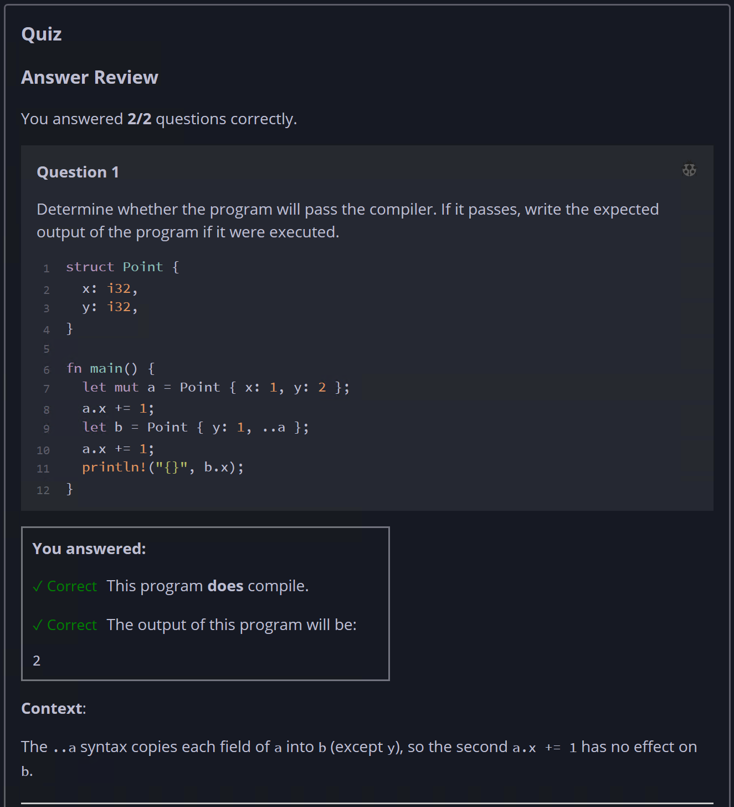
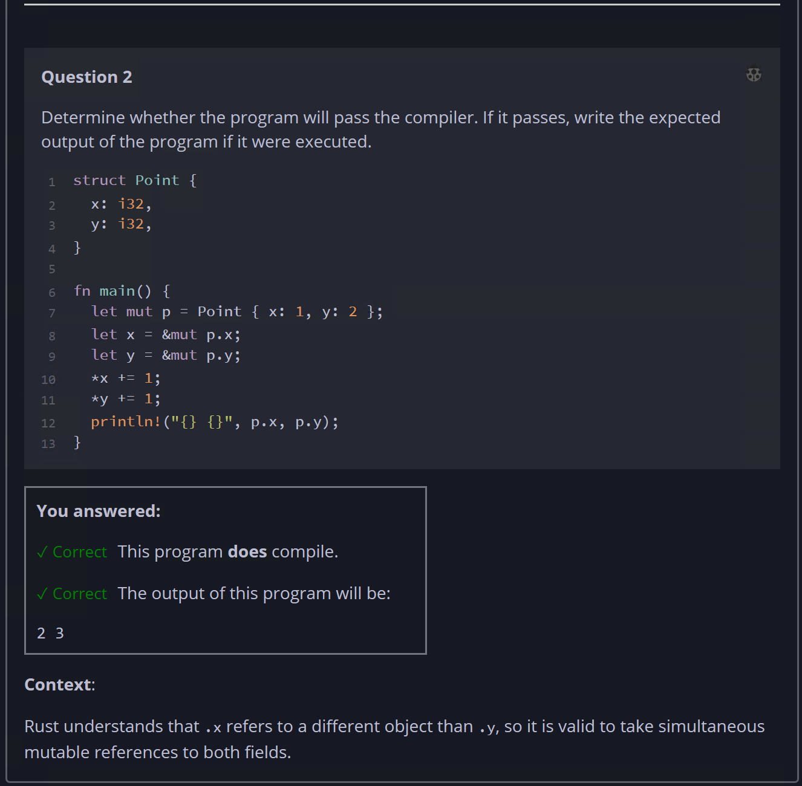

## Quiz - Chapter 3.5 b ##

> ---
> **Question 1**<br>
> True/false: this code will terminate (that is, it will not 
> loop forever).
>
> ```rust
> fn main() {
>     let mut x = 0;
>     'a: loop {
>         x += 1;
>         'b: loop {
>             if x > 10 {
>                 continue 'a;
>             } else {
>                 break 'b;
>             }
>         }
>         break;
>     }
> }
> ```
>
> (Note: both of these snippets compile!)
> 
> > Response<br>
> > ◉ True<br>
> > ○ False<br>
> 
> ---
>
> **Question 2**<br>
> Determine whether the program will pass the compiler. If it 
> passes, write the expected output of the program if it were 
> executed.
>
> ```rust
> fn main() {
>     let a = [5; 10];
>     let mut sum = 0;
>     for x in a {
>         sum += x;
>     }
>     println!("{sum}");
> }
> ```
>
> > Response<br>
> > This program:<br>
> > ◉ DOES compile<br>
> > ○ Does NOT compile<br>
> >
> > The output of this program will be:<br>
> > [ ```50``` ]
> 
> ---



