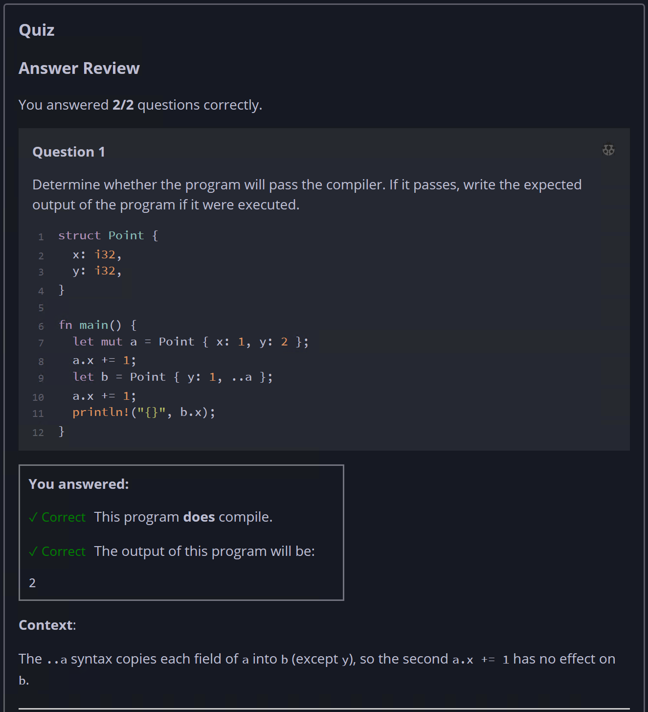
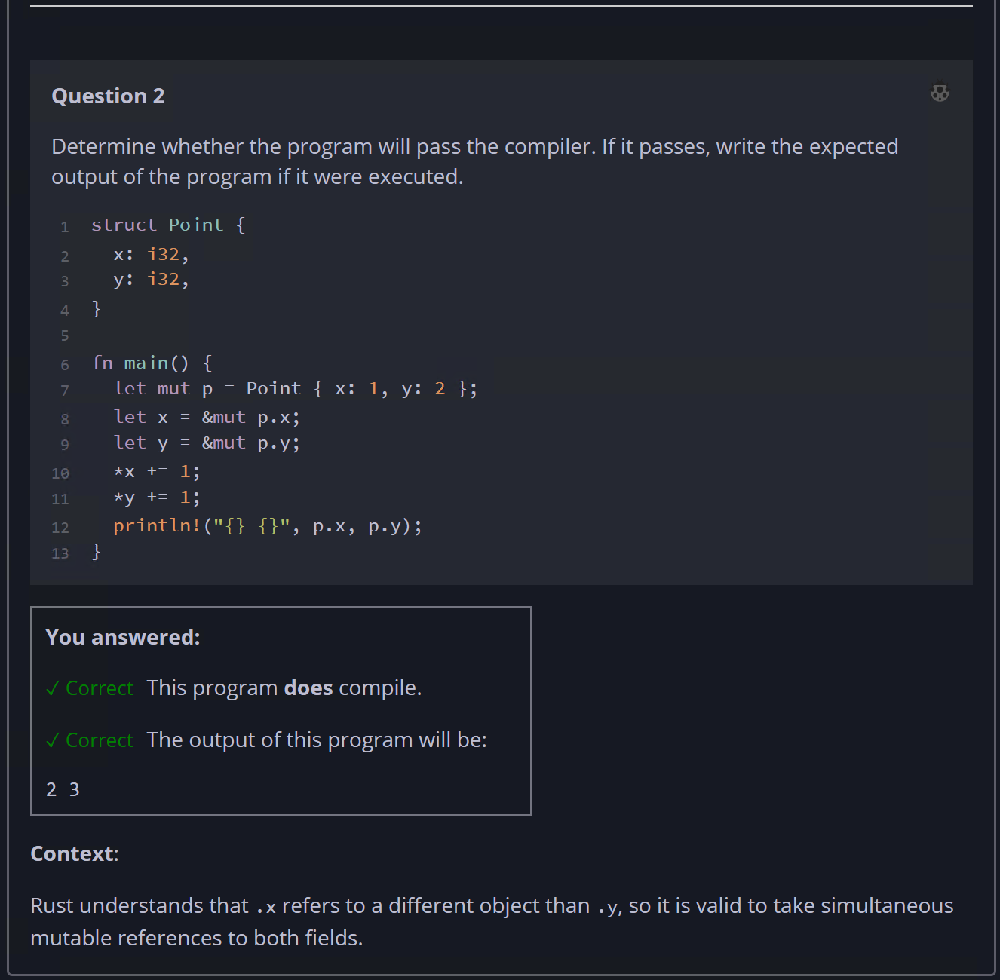

## Quiz - Chapter 5.1 ##

> ---
> **Question 1**<br>
> Determine whether the program will pass the compiler. If it 
> passes, write the expected output of the program if it were 
> executed.
>
> ```rust
> struct Point {
>     x: i32,
>     y: i32,
> }
> 
> fn main() {
>     let mut a = Point { x: 1, y: 2 };
>     a.x += 1;
>     let b = Point { y: 1, ..a };
>     a.x += 1;
>     println!("{}", b.x);
> }
> ```
>
> > Response<br>
> > This program:<br>
> > ◉ DOES compile<br>
> > ○ Does NOT compile<br>
> >
> > The output of this program will be:<br>
> > [ ```2``` ]
> 
> ---
>
> **Question 2**<br>
> Determine whether the program will pass the compiler. If it 
> passes, write the expected output of the program if it were 
> executed.
>
> ```rust
> struct Point {
>     x: i32,
>     y: i32,
> }
> 
> fn main() {
>     let mut p = Point { x: 1, y: 2 };
>     let x = &mut p.x;
>     let y = &mut p.y;
>     *x += 1;
>     *y += 1;
>     println!("{} {}", p.x, p.y);
> }
> ```
>
> > Response<br>
> > This program:<br>
> > ◉ DOES compile<br>
> > ○ Does NOT compile<br>
> >
> > The output of this program will be:<br>
> > [ ```2 3``` ]
> 
> ---



