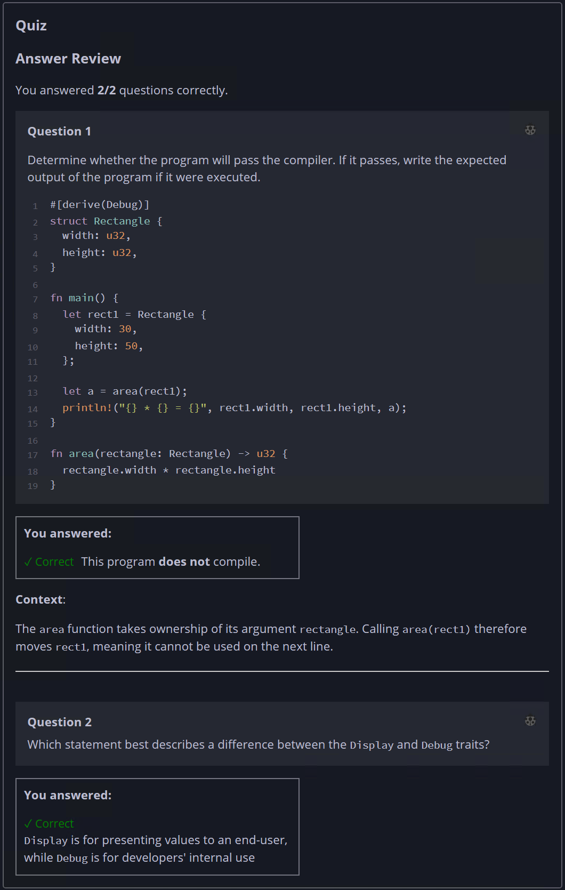

## Quiz - Chapter 5.2 ##

> ---
> **Question 1**<br>
> Determine whether the program will pass the compiler. If it 
> passes, write the expected output of the program if it were 
> executed.
> 
> ```rust
> #[derive(Debug)]
> struct Rectangle {
>     width: u32,
>     height: u32,
> }
> 
> fn main() {
>     let rect1 = Rectangle {
>         width: 30,
>         height: 50,
>     };
>     let a = area(rect1);
>     println!("{} * {} = {}", rect1.width, rect1.height, a);
> }
> 
> fn area(rectangle: Rectangle) -> u32 {
>     rectangle.width * rectangle.height
> }
> ```
>
> > Response<br>
> > This program:<br>
> > ○ DOES compile<br>
> > ◉ Does NOT compile<br>
> >
> 
> ---
>
> **Question 2**<br>
> Which statement best describes a difference between the 
> ```Display``` and ```Debug``` traits?
>
> > Response<br>
> > ○ ```Display``` is for printing values to the console, 
> > while ```Debug``` is for viewing values in a debugger<br>
> > ○ ```Display``` cannot be implemented for structs, while 
> > ```Debug``` can be implemented for structs<br>
> > ○ There is no difference. ```Display``` and ```Debug``` 
> > are aliases for the same trait<br>
> > ◉ ```Display``` is for presenting values to an end-user, 
> > while ```Debug``` is for developers' internal use<br>
> >
> ---
> 


