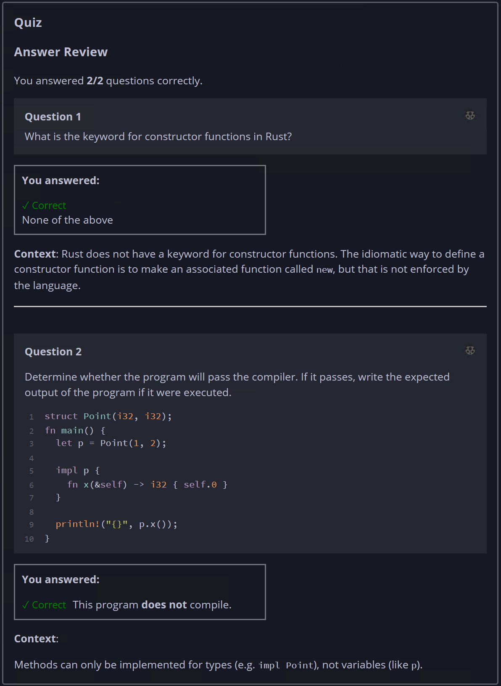

## Quiz - Chapter 5.3 a ##

> ---
> **Question 1**<br>
> What is the keyword for constructor functions in Rust?
>
> > Response<br>
> > ○ ```constructor```<br>
> > ○ ```new```<br>
> > ○ The name of the type being constructed<br>
> > ◉ None of the above<br>
> >
> 
> ---
> 
> **Question 2**<br>
> Determine whether the program will pass the compiler. If it 
> passes, write the expected output of the program if it were 
> executed.
>
> ```rust
> struct Point(i32, i32);
> 
> fn main() {
>     let p = Point(1, 2);
> 
>     impl p {
>         fn x(&self) -> i32 { self.0 }
>     }
> 
>     println!("{}", p.x());
> }
> ```
>
> > Response<br>
> > This program:<br>
> > ○ DOES compile<br>
> > ◉ Does NOT compile<br>
> >
> ---
> 


