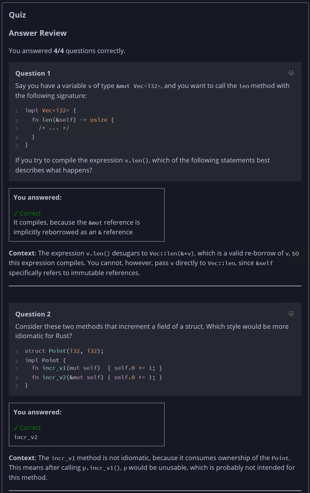
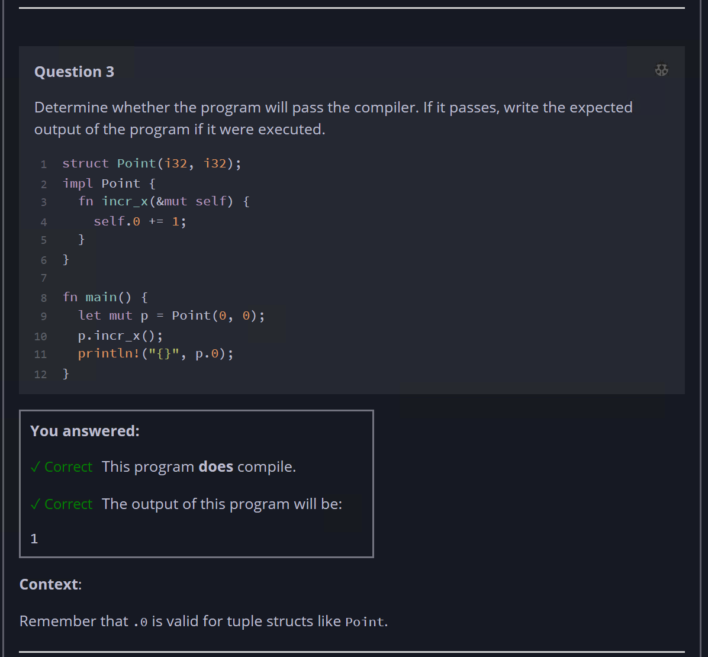
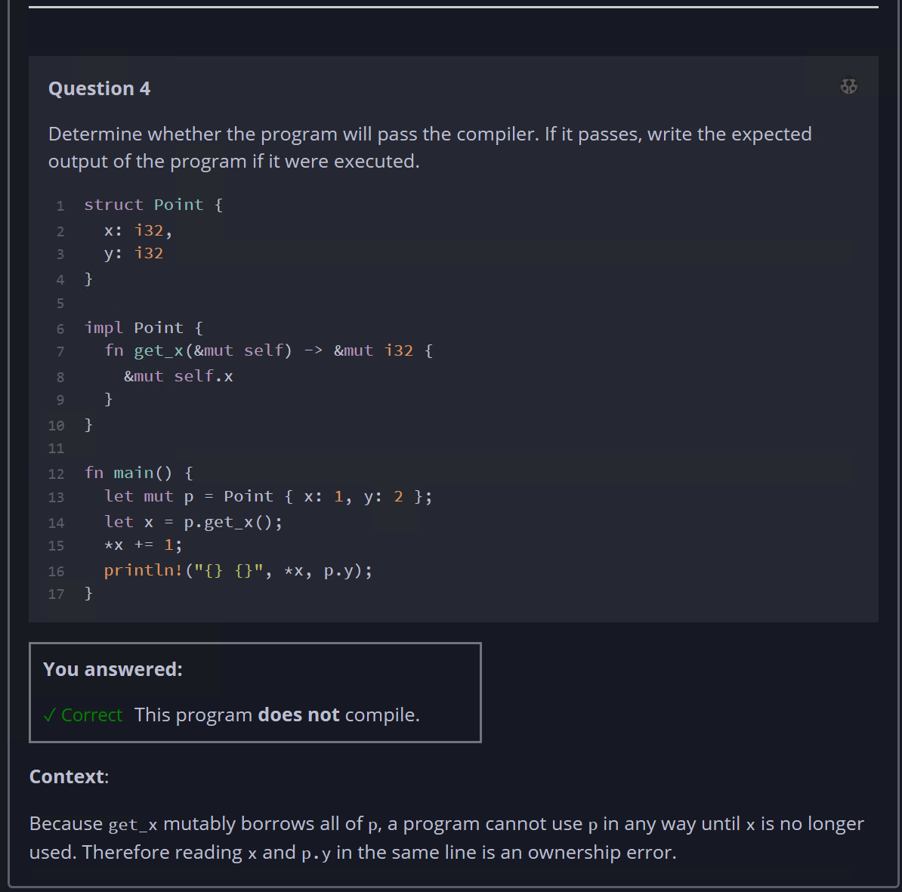

## Quiz - Chapter 5.3 b ##

> ---
> **Question 1**<br>
> Say you have a variable ```v``` of type 
> ```&mut Vec<i32>```, and you want to call the ```len``` 
> method with the following signature:
>
> ```rust
> impl Vec<i32> {
>     fn len(&self) -> usize {
>         /* ... */
>     }
> }
> ```
> 
> If you try to compile the expression ```v.len()```, which 
> of the following statements best describes what happens?
>
> > Response<br>
> > ○ It does not compile, because ```&mut Vec<i32>``` is not 
> > the same type as ```&Vec<i32>```<br>
> > ○ It compiles, because ```&self``` can take any kind of 
> > reference<br>
> > ○ It does not compile, ```v``` is not explicitly 
> > dereferenced<br>
> > ◉ It compiles, because the ```&mut``` reference is 
> > implicitly reborrowed as an ```&``` reference<br>
> >
> ---
>
> **Question 2**<br>
> Consider these two methods that increment a field of a 
> struct. Which style would be more idiomatic for Rust?
> 
> ```rust
> struct Point(i32, i32);
> 
> impl Point {
>     fn incr_v1(mut self)  { self.0 += 1; }
>     fn incr_v2(&mut self) { self.0 += 1; }
> }
> ```
>
> > Response<br>
> > ○ ```incr_v1```<br>
> > ◉ ```incr_v2```<br>
> > ○ Both are idiomatic<br>
> > ○ Neither are idiomatic<br>
> >
> ---
>
> **Question 3**<br>
> Determine whether the program will pass the compiler. If it 
> passes, write the expected output of the program if it were 
> executed.
>
> ```rust
> struct Point(i32, i32);
> 
> impl Point {
>     fn incr_x(&mut self) {
>         self.0 += 1;
>     }
> }
> 
> fn main() {
>     let mut p = Point(0, 0);
>     p.incr_x();
>     println!("{}", p.0);
> }
> ```
>
> > Response<br>
> > This program:<br>
> > ◉ DOES compile<br>
> > ○ Does NOT compile<br>
> >
> > The output of this program will be:
> > [ ```1``` ]
> 
> ---
>
> **Question 4**<br>
> Determine whether the program will pass the compiler. If it 
> passes, write the expected output of the program if it were 
> executed.
>
> ```rust
> struct Point {
>     x: i32,
>     y: i32
> }
> 
> impl Point {
>     fn get_x(&mut self) -> &mut i32 {
>         &mut self.x
>     }
> }
> 
> fn main() {
>     let mut p = Point { x: 1, y: 2 };
>     let x = p.get_x();
>     *x += 1;
>     println!("{} {}", *x, p.y);
> }
> ```
>
> > Response<br>
> > This program:<br>
> > ○ DOES compile<br>
> > ◉ Does NOT compile<br>
> >
> ---
>




