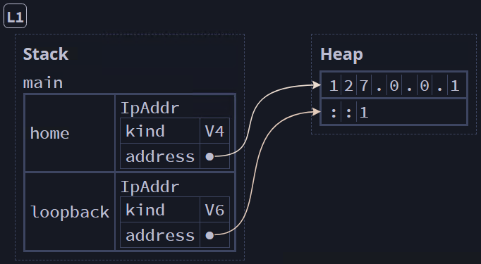

## Using an Enum in a Struct ##

We can use an enum as a field in a struct

```rust
#[derive(Debug)]
enum IpAddrKind {
    V4,
    V6,
}

// Here, we're assigning the enum to a struct to group it with an address
#[derive(Debug)]
struct IpAddr {
    kind: IpAddrKind,
    address: String,
}

fn main() {
    let home = IpAddr {
        kind: IpAddrKind::V4,
        address: String::from("127.0.0.1"),
    };

    // println!("{:#?}\n", home);
    println!("home = {:?} | {}", home.kind, home.address);

    let loopback = IpAddr {
        kind: IpAddrKind::V6,
        address: String::from("::1"),
    }; // [L1]

    // println!("{:#?}\n", loopback);
    println!("loopback = {:?} | {}", loopback.kind, loopback.address);
}
```


<br><sup><sup>[Diagram from Brown University](https://rust-book.cs.brown.edu)</sup></sup>

Of course, this is a bit cluttered

---
