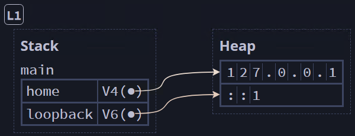

## Attaching Data to an Enum ##

We can simplify the previous example by assigning data directly to the enum

```rust
// Instead of creating a struct, we can tie the address String to the enum
#[derive(Debug)]
enum IpAddr {
    // This makes each enum variant a function (constructor)
    V4(String),
    V6(String),
}

fn main() {
    let home = IpAddr::V4(String::from("127.0.0.1"));
    println!("home = {:?}", home);

    let loopback = IpAddr::V6(String::from("::1"));
    println!("loopback = {:?}", loopback); // [L1]
}
```


<br><sup><sup>[Diagram from Brown University](https://rust-book.cs.brown.edu)</sup></sup>

---
