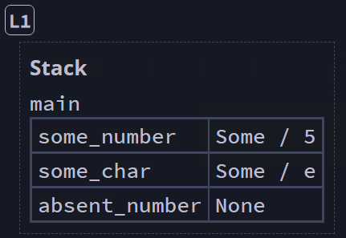

## The ```Option``` Enum and Its Advantages Over Null Values ##

Unlike many other languages, Rust does not include the *null* feature,
which has frequently been viewed as unnecessary and a mistake.

> Tony Hoare<br>
> [Null References: The Billion Dollar Mistake](https://en.wikipedia.org/wiki/Tony_Hoare#Apologies_and_retractions)
> 
> I call it my billion-dollar mistake. It was the invention of the null
> reference in 1965. At that time, I was designing the first
> comprehensive type system for references in an object oriented
> language (ALGOL W). My goal was to ensure that all use of references
> should be absolutely safe, with checking performed automatically by the
> compiler. But I couldn't resist the temptation to put in a null
> reference, simply because it was so easy to implement. This has led to
> innumerable errors, vulnerabilities, and system crashes, which have
> probably caused a billion dollars of pain and damage in the last forty
> years.

The issue is that null pointers open the door to a common set of issues
often called *null reference errors* that occur when a program tries to
use an object as though it is non-null when it is actually null.

This means that we cannot just "check for null" as we might typically do
in other programming where any datum exists in one of two states: 
***null*** or ***not null***.

---

Rather than implementing *null*, the Rust standard library defines the enum ```Option<T>```, which handles the common scenario where a value
could potentially contain nothing.

```Option<T>``` defines two variants:

* ```None```
* ```Some(T)```

```rust
// Standard library definition of `Option`
enum Option<T> {
    None,
    Some(T),
}
```

Because of its usefulness, these two variants can be used without the
```Option::``` prefix.

---

Here are a couple examples of declaring an ```Option```:

```rust
let some_num = Some(5);         // Option<i32>
let come_char = Some('e');      // Option<char>

// We have to specify this data type, because 'None' doesn't imply one
let absent_number: Option<i32> = None; // [L1]
```


<br><sup><sup>[Diagram from Brown University](https://rust-book.cs.brown.edu)</sup></sup>

When we have a ```Some``` value, data is present and is held
within the ```Some```.

When we have a ```None``` value, no data is present.

Note (Advantage):
* The compiler will not allow us to automatically use an ```Option<T>``` 
  as a valid value. It must first be converted to the type matching
  ```T```.
* This ensures that most scenarios that in other languages might result
  in a null reference error are caught and properly handled.

---
