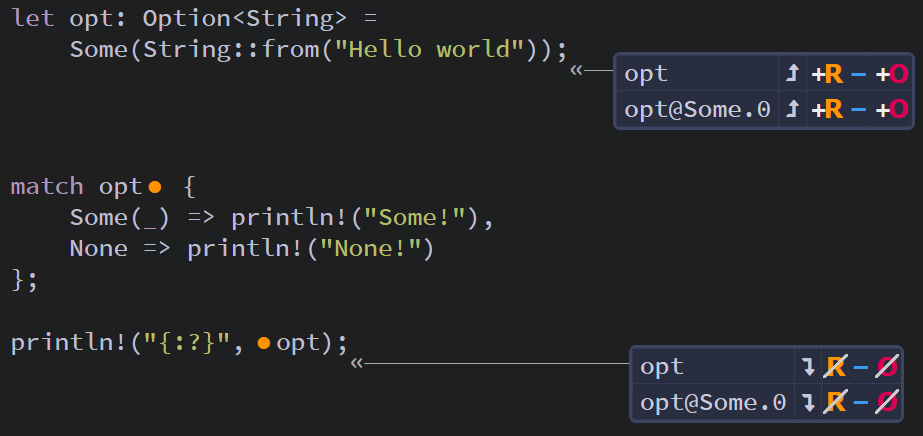
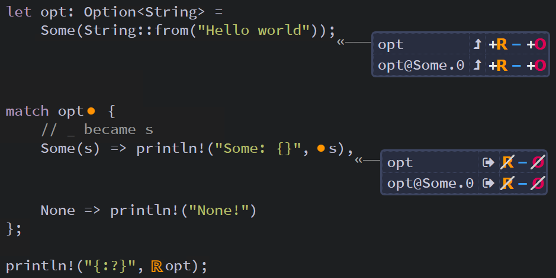
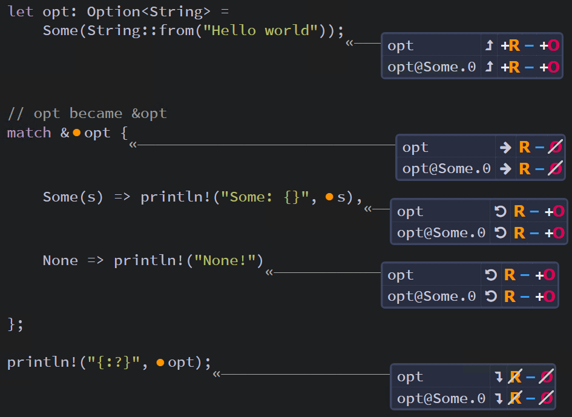

## How Matches Interact with Ownership ##

If an enum contains non-copyable data like a ```String```, 
then you should be careful with whether a match will move or 
borrow that data.

For example, this program using an ```Option<String>``` will 
compile:

```rust
let opt: Option<String> = 
    Some(String::from("Hello world"));

match opt {
    Some(_) => println!("Some!"),
    None => println!("None!")
};

println!("{:?}", opt);
```


<br><sup><sup>[Diagram from Brown University](https://rust-book.cs.brown.edu)</sup></sup>

---

But the program will not compile if we replace the ```_``` 
with a variable.

```rust
// Note: This code will not compile
let opt: Option<String> = 
    Some(String::from("Hello world"));

match opt {
    // _ became s
    Some(s) => println!("Some: {}", s),
    None => println!("None!")
};

println!("{:?}", opt); // Error - Can't read after move
```


<br><sup><sup>[Diagram from Brown University](https://rust-book.cs.brown.edu)</sup></sup>

---

The idiomatic solution to this issue is to match on a 
reference instead of the option.

```rust
let opt: Option<String> = 
    Some(String::from("Hello world"));

// opt became &opt
match &opt {
    Some(s) => println!("Some: {}", s),
    None => println!("None!")
};

println!("{:?}", opt);
```


<br><sup><sup>[Diagram from Brown University](https://rust-book.cs.brown.edu)</sup></sup>

---
