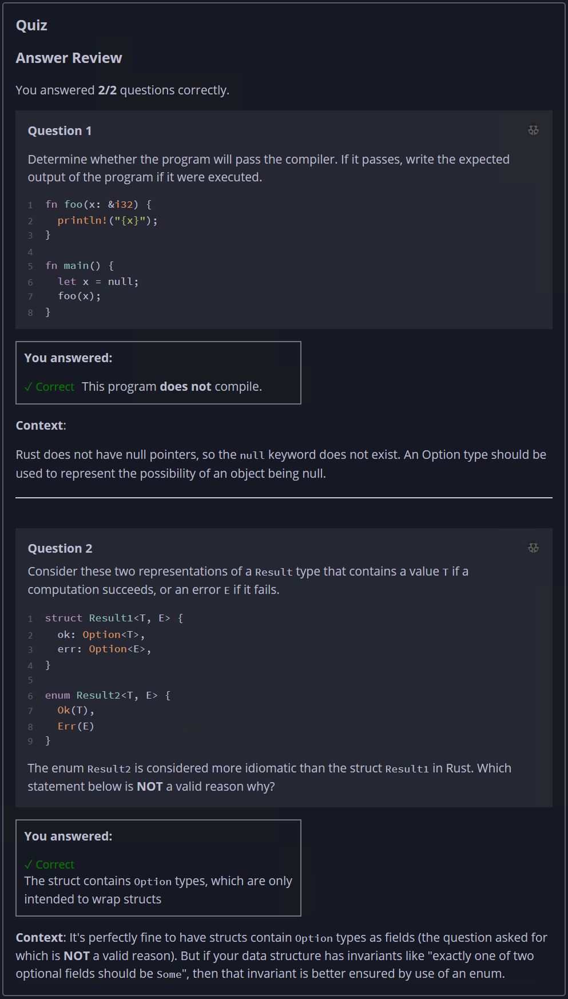

## Quiz - Chapter 6.1 ##

> ---
> **Question 1**<br>
> Determine whether the program will pass the compiler. If it 
> passes, write the expected output of the program if it were 
> executed.
>
> ```rust
> fn foo(x: &i32) { 
>     println!("{x}");
> }
> 
> fn main() {
>     let x = null;
>     foo(x);
> }
> ```
>
> > Response<br>
> > This program:<br>
> > ○ DOES compile<br>
> > ◉ Does NOT compile<br>
> > 
> ---
>
> **Question 2**<br>
> Consider these two representations of a ```Result``` type 
> that contains a value ```T``` if a computation succeeds, or 
> an error ```E``` if it fails.
>
> ```rust
> struct Result1<T, E> {
>     ok: Option<T>,
>     err: Option<E>,
> }
> 
> enum Result2<T, E> {
>     Ok(T),
>     Err(E)
> }
> ```
> 
> The enum ```Result2``` is considered more idiomatic than 
> the struct ```Result1``` in Rust. Which statement below is 
> NOT a valid reason why?
>
> > Response<br>
> > ○ The struct is more syntactically verbose to construct 
> > than the enum<br>
> > ○ The struct uses more space in memory at runtime than 
> > the enum<br>
> > ○ The struct could have ```ok``` and ```err``` both be 
> > ```None```, while the enum must have at least one of 
> > them<br>
> > ◉ The struct contains ```Option``` types, which are only 
> > intended to wrap structs<br>
> >
> ---
> 


