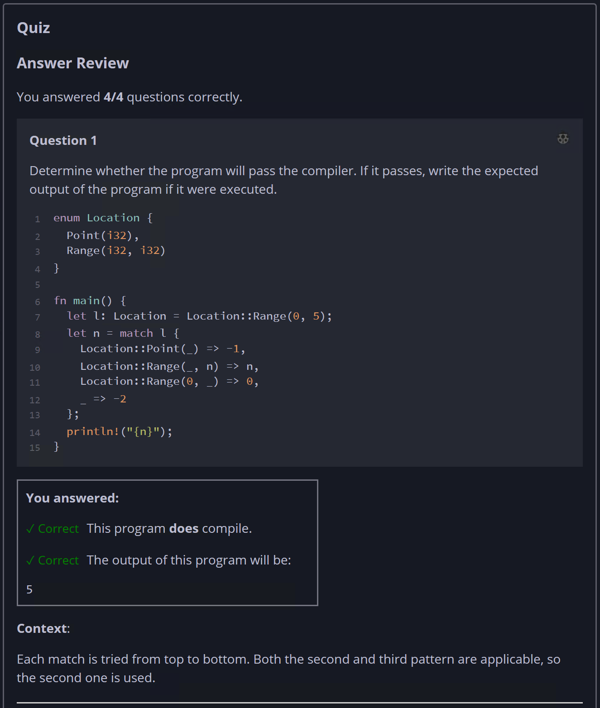
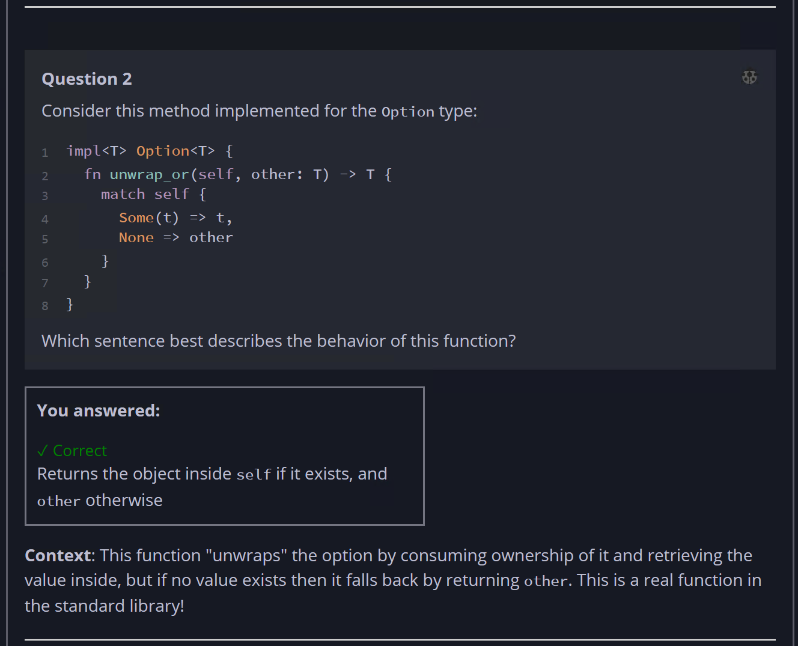
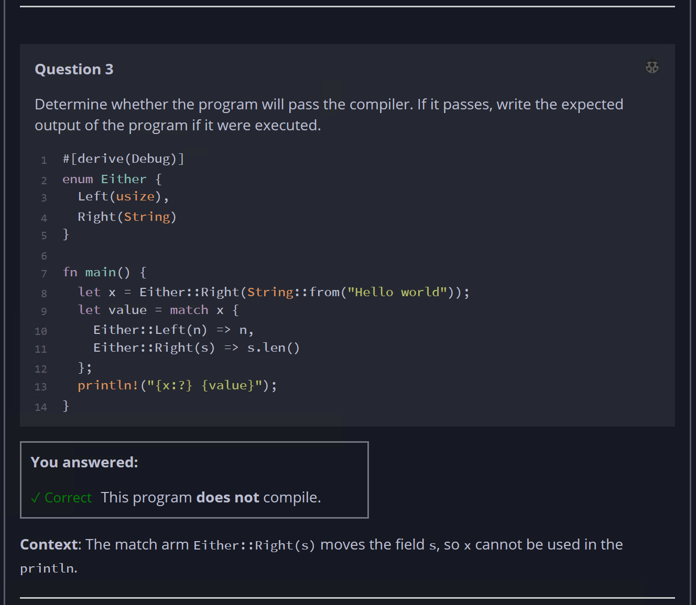
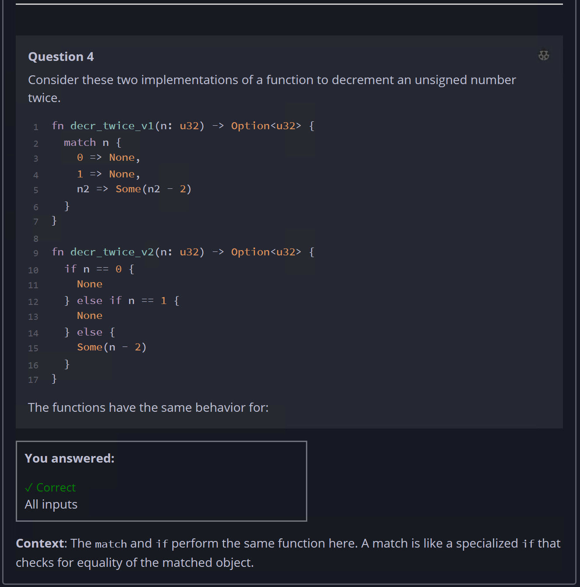

## Quiz - Chapter 6.2 ##

> ---
> **Question 1**<br>
> Determine whether the program will pass the compiler. If it 
> passes, write the expected output of the program if it were 
> executed.
> 
> ```rust
> enum Location {
>     Point(i32),
>     Range(i32, i32)
> }
> 
> fn main() {
>     let l: Location = Location::Range(0, 5);
>     let n = match l {
>         Location::Point(_) => -1,
>         Location::Range(_, n) => n,
>         Location::Range(0, _) => 0,
>         _ => -2
>     };
>     println!("{n}");
> }
> ```
>
> > Response<br>
> > This program:<br>
> > ◉ DOES compile<br>
> > ○ Does NOT compile<br>
> > 
> > The output of this program will be:<br>
> > [ ```5``` ]
> >
> ---
>
> **Question 2**<br>
> Consider this method implemented for the Option type:
> 
> ```rust
> impl<T> Option<T> {
>     fn unwrap_or(self, other: T) -> T {
>         match self {
>             Some(t) => t,
>             None => other
>         }
>     }
> }
> ```
> 
> Which sentence best describes the behavior of this function?
>
> > Response<br>
> > ○ Returns the object inside ```self``` if it exists, and 
> > ```other``` otherwise<br>
> > ○ Inserts ```other``` into ```self``` if ```self``` does 
> > not already contain a value<br>
> > ○ Returns a new option containing the object inside 
> > ```self```  if it exists, and ```other``` otherwise<br>
> > ○ Returns a reference to the object inside ```self``` if 
> > it exists, and ```other``` otherwise<br>
> >
> ---
>
> **Question 3**<br>
> Determine whether the program will pass the compiler. If it 
> passes, write the expected output of the program if it were 
> executed.
> 
> ```rust
> #[derive(Debug)]
> enum Either {
>     Left(usize),
>     Right(String)
> }
> 
> fn main() {
>     let x = Either::Right(String::from("Hello world"));
> 
>     let value = match x {
>         Either::Left(n) => n,
>         Either::Right(s) => s.len()
>     };
> 
>     println!("{x:?} {value}");
> }
> ```
>
> > Response<br>
> > This program:<br>
> > ○ DOES compile<br>
> > ◉ Does NOT compile<br>
> >
> ---
>
> **Question 4**<br>
> Consider these two implementations of a function to 
> decrement an unsigned number twice.
>
> ```rust
> fn decr_twice_v1(n: u32) -> Option<u32> {
>     match n {
>         0 => None,
>         1 => None,
>         n2 => Some(n2 - 2)
>     }
> }
> fn decr_twice_v2(n: u32) -> Option<u32> {
>     if n == 0 {
>         None
>     } else if n == 1 {
>         None
>     } else {
>         Some(n - 2)
>     }
> }
> ```
> 
> The functions have the same behavior for:
> 
> > Response<br>
> > ○ No inputs<br>
> > ◉ All inputs<br>
> > ○ Some, but not all inputs<br>
> > 
> ---
> 





