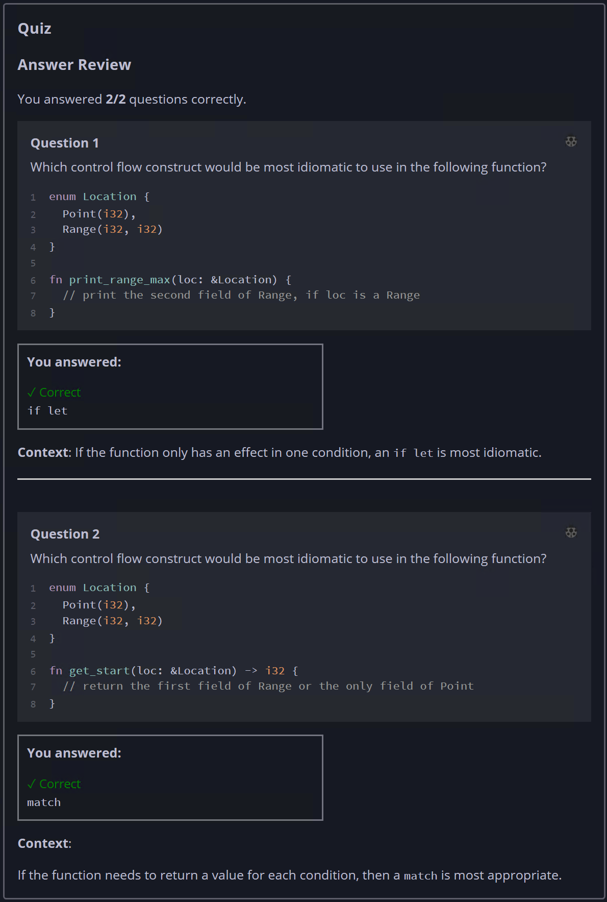

## Quiz - Chapter 6.3 ##

> ---
> **Question 1**<br>
> Which control flow construct would be most idiomatic to use 
> in the following function?
>
> ```rust
> enum Location {
>     Point(i32),
>     Range(i32, i32)
> }
> 
> fn print_range_max(loc: &Location) {  
>     // print the second field of Range, if loc is a Range
> }
> ```
> 
> > Response<br>
> > ○ ```match```<br>
> > ◉ ```if let```<br>
> >
> ---
> 
> **Question 2**<br>
> Which control flow construct would be most idiomatic to use 
> in the following function?
>
> ```rust
> enum Location {
>     Point(i32),
>     Range(i32, i32)
> }
> 
> fn print_range_max(loc: &Location) {  
>     // print the second field of Range or the only field of Point
> }
> ```
> 
> > Response<br>
> > ◉ ```match```<br>
> > ○ ```if let```<br>
> >
> ---
> 


