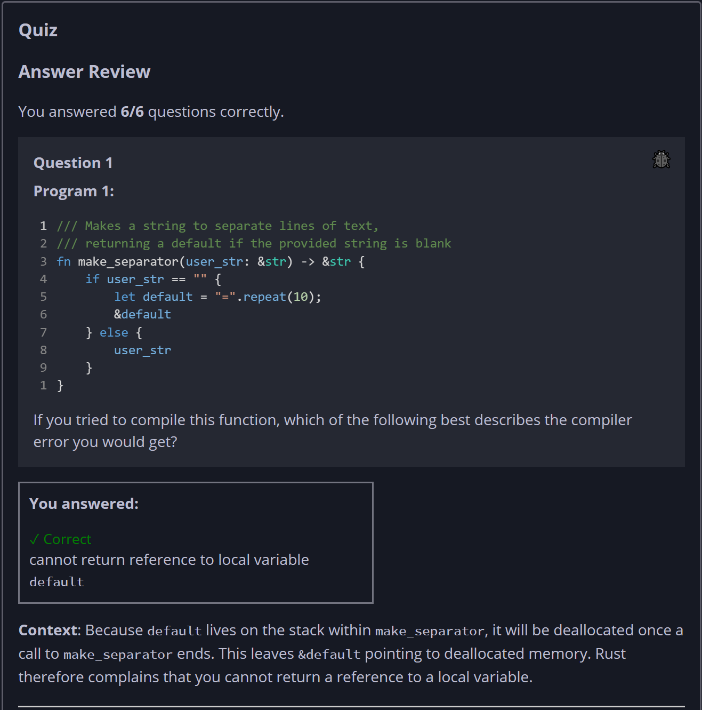
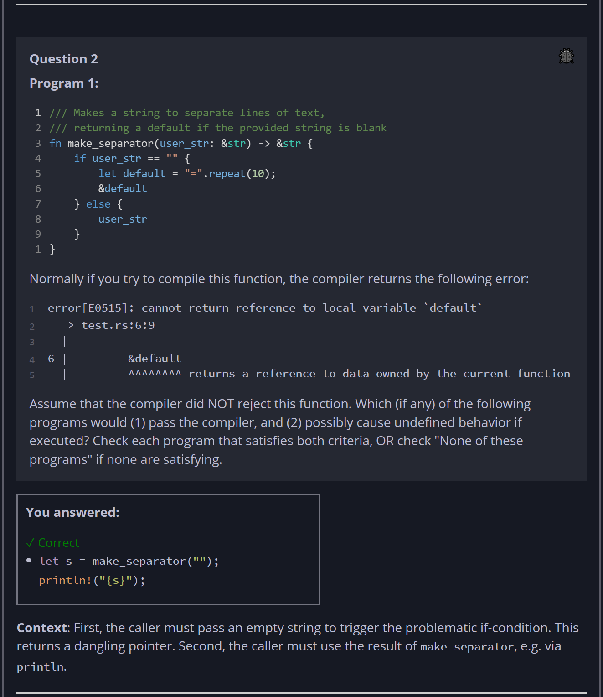
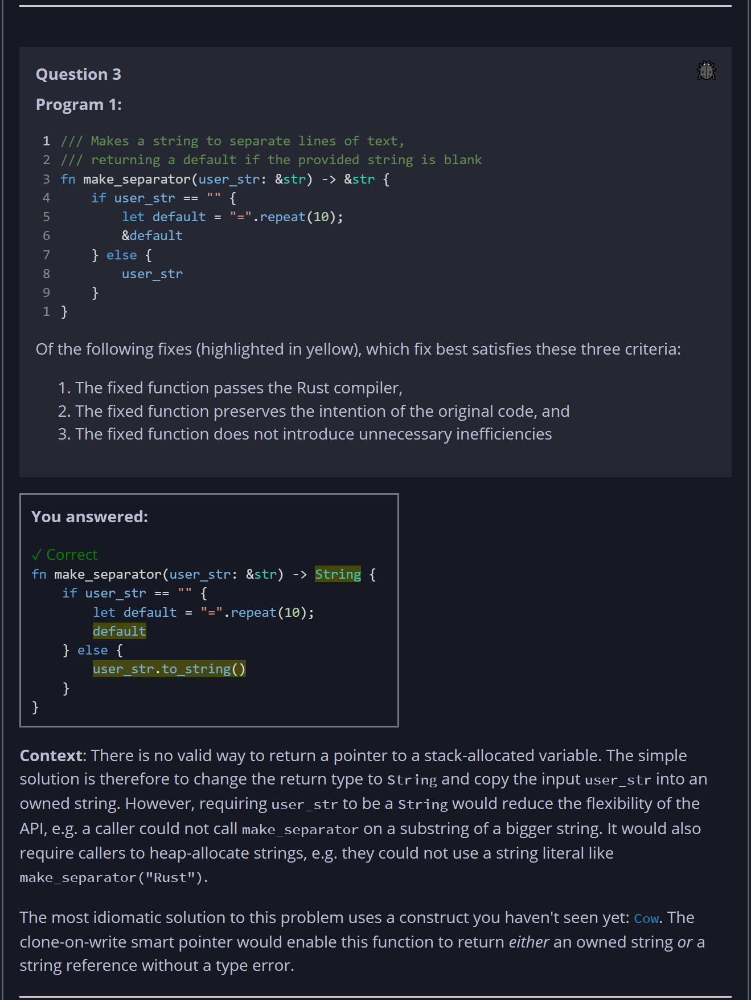
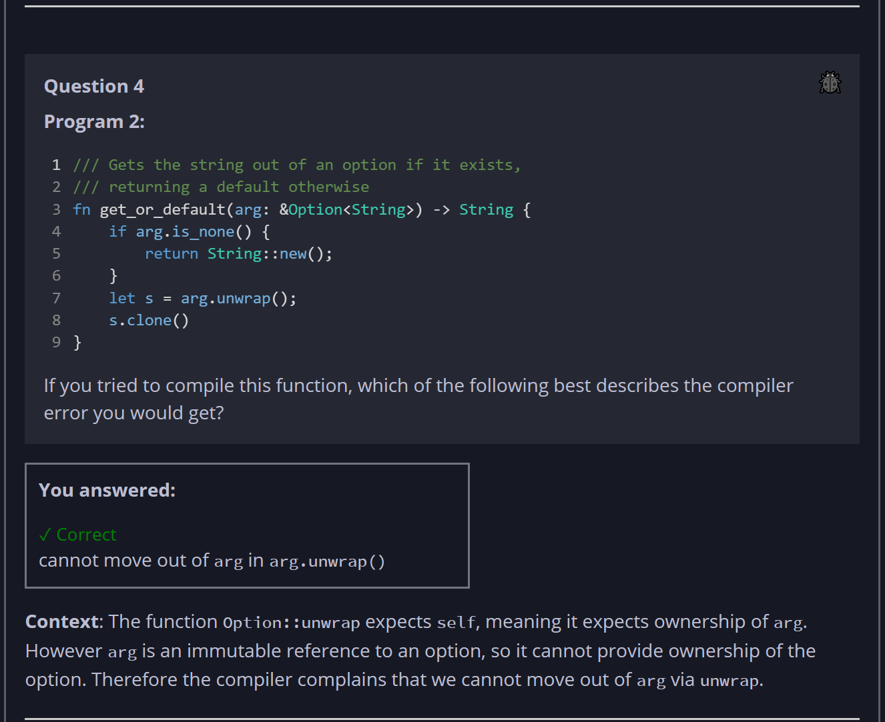
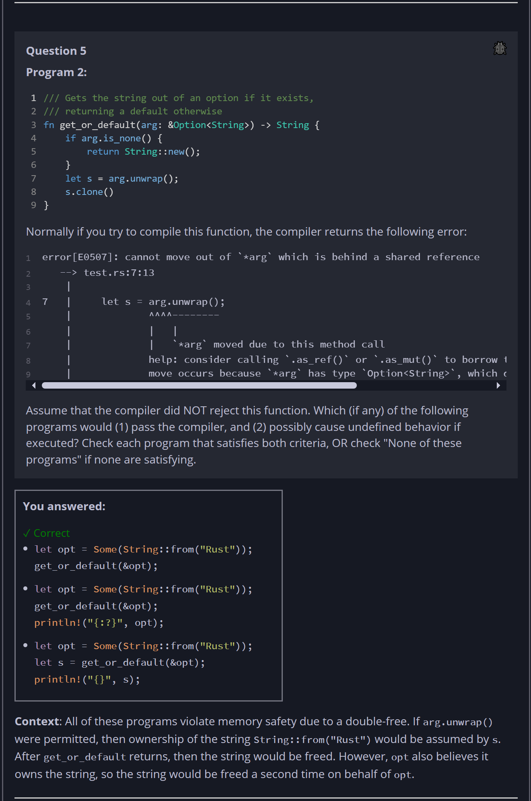
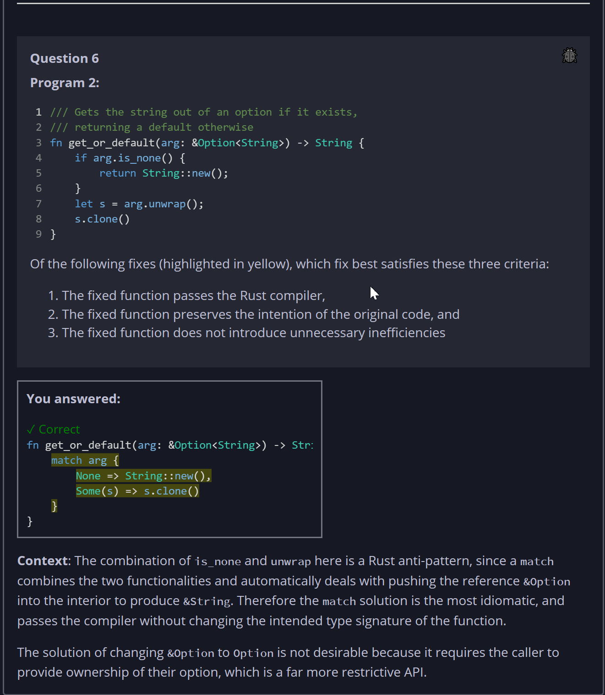

## Quiz - Chapter 6.4 ##

> ---
> **Question 1**<br>
> Program 1:
>
> ```rust
> /// Makes a string to separate lines of text, 
> /// returning a default if the provided string is blank
> fn make_separator(user_str: &str) -> &str {
>     if user_str == "" {
>         let default = "=".repeat(10);
>         &default
>     } else {
>         user_str
>     }
> }
> ```
> 
> If you tried to compile this function, which of the 
> following best describes the compiler error you would get?
> 
> > Response<br>
> > ○ function ```make_separator``` cannot return a reference 
> > of type ```&str```<br>
> > ◉ cannot return reference to local variable 
> > ```default```<br>
> > ○ ```user_str``` does not live long enough<br>
> > ○ function ```make_separator``` cannot return two 
> > different references<br>
> >
> ---
> 
> **Question 2**<br>
> Program 1:
>
> ```rust
> /// Makes a string to separate lines of text, 
> /// returning a default if the provided string is blank
> fn make_separator(user_str: &str) -> &str {
>     if user_str == "" {
>         let default = "=".repeat(10);
>         &default
>     } else {
>         user_str
>     }
> }
> ```
>
> Normally if you try to compile this function, the compiler 
> returns the following error:
>
> ```
> error[E0515]: cannot return reference to local variable `default`
>  --> test.rs:6:9
>   |
> 6 |         &default
>   |         ^^^^^^^^ returns a reference to data owned by the current function
> ```
>
> Assume that the compiler did NOT reject this function. 
> Which (if any) of the following programs would (1) pass the 
> compiler, and (2) possibly cause undefined behavior if 
> executed? Check each program that satisfies both criteria, 
> OR check "None of these programs" if none are satisfying.
> 
> > Response<br>
> > ☐ 
> > ```rust
> > println!("{}", make_separator("Hello world!"));
> > ```
> > ---
> > ☐
> > ```rust
> > let s = make_separator("");
> > ```
> > ---
> > ☑
> > ```rust
> > let s = make_separator("");
> > println!("{s}");
> > ```
> > ---
> > ☐ None of these programs
> > 
> > ---
> >
> ---
> 
> **Question 3**<br>
> Program 1:
>
> ```rust
> /// Makes a string to separate lines of text, 
> /// returning a default if the provided string is blank
> fn make_separator(user_str: &str) -> &str {
>     if user_str == "" {
>         let default = "=".repeat(10);
>         &default
>     } else {
>         user_str
>     }
> }
> ```
>
> Of the following fixes, which fix best satisfies these 
> three criteria:
>
> 1. The fixed function passes the Rust compiler,
> 2. The fixed function preserves the intention of the 
> original code, and
> 3. The fixed function does not introduce unnecessary 
> inefficiencies
>
> > Response<br>
> > ○
> > ```rust
> > fn make_separator(user_str: &str) -> &str {
> >     if user_str == "" {
> >         let default = "=".repeat(10);
> >         &default
> >     } else {
> >         &user_str // ** fix 1
> >     }
> > }
> > ```
> > ---
> > ○
> > ```rust
> > fn make_separator(user_str: String) -> String { // ** fix 2a
> >     if user_str == "" {
> >         let default = "=".repeat(10);
> >         default // ** fix 2b
> >     } else {
> >         user_str
> >     }
> > }
> > ```
> > ---
> > ◉
> > ```rust
> > fn make_separator(user_str: &str) -> String { // ** fix 3a
> >     if user_str == "" {
> >         let default = "=".repeat(10);
> >         default // ** fix 3b
> >     } else {
> >         user_str.to_string() // ** fix 3c
> >     }
> > }
> > ```
> > 
> ---
> 
> **Question 4**<br>
> Program 2:
>
> ```rust
> /// Gets the string out of an option if it exists,
> /// returning a default otherwise
> fn get_or_default(arg: &Option<String>) -> String {
>     if arg.is_none() {
>         return String::new();
>     }
>     let s = arg.unwrap();
>     s.clone()
> }
> ```
>
> If you tried to compile this function, which of the 
> following best describes the compiler error you would get?
>
> > Response<br>
> > ○ cannot call ```arg.is_none()``` without dereferencing 
> > ```arg```<br>
> > ◉ cannot move out of ```arg``` in ```arg.unwrap()```<br>
> > ○ cannot return ```s.clone()``` which does not live long 
> > enough<br>
> > ○ ```arg``` does not live long enough<br>
> >
> ---
> 
> **Question 5**<br>
> Program 2:
>
> ```rust
> /// Gets the string out of an option if it exists,
> /// returning a default otherwise
> fn get_or_default(arg: &Option<String>) -> String {
>     if arg.is_none() {
>         return String::new();
>     }
>     let s = arg.unwrap();
>     s.clone()
> }
> ```
>
> Normally if you try to compile this function, the compiler 
> returns the following error:
>
> ```
> error[E0507]: cannot move out of `*arg` which is behind a shared reference
>    --> test.rs:7:13
>     |
> 7   |     let s = arg.unwrap();
>     |             ^^^^--------
>     |             |   |
>     |             |   `*arg` moved due to this method call
>     |             help: consider calling `.as_ref()` or `.as_mut()` to borrow the type's contents
>     |             move occurs because `*arg` has type `Option<String>`, which does not implement the `Copy` trait
> ```
>
> Assume that the compiler did NOT reject this function. 
> Which (if any) of the following programs would (1) pass the 
> compiler, and (2) possibly cause undefined behavior if 
> executed? Check each program that satisfies both criteria, 
> OR check "None of these programs" if none are satisfying.
> 
> > Response<br>
> > ☑
> > ```rust
> > let opt = Some(String::from("Rust"));
> > get_or_default(&opt);
> > println!("{:?}", opt);
> > ```
> > ---
> > ☑
> > ```rust
> > let opt = Some(String::from("Rust"));
> > let s = get_or_default(&opt);
> > println!("{}", s);
> > ```
> > ---
> > ☑
> > ```rust
> > let opt = Some(String::from("Rust"));
> > get_or_default(&opt);
> > ```
> > ---
> > ☐ None of these programs
> > 
> > ---
> >
> ---
> >
> ---
> 
> **Question 6**<br>
> Program 2:
>
> ```rust
> /// Gets the string out of an option if it exists,
> /// returning a default otherwise
> fn get_or_default(arg: &Option<String>) -> String {
>     if arg.is_none() {
>         return String::new();
>     }
>     let s = arg.unwrap();
>     s.clone()
> }
> ```
>
> Of the following fixes, which fix best satisfies these 
> three criteria:
>
> 1. The fixed function passes the Rust compiler,
> 2. The fixed function preserves the intention of the 
> original code, and
> 3. The fixed function does not introduce unnecessary 
> inefficiencies
>
> > Response<br>
> > ◉
> > ```rust
> > fn get_or_default(arg: &Option<String>) -> String {
> >     match arg {
> >         None => String::new(),
> >         Some(s) => s.clone()
> >     }
> > }
> > ```
> > ---
> > ○
> > ```rust
> > fn get_or_default(arg: &Option<&str>) -> String {
> >     if arg.is_none() {
> >         return String::new();
> >     }
> >     let s = arg.unwrap();
> >     s.to_string()
> > }
> > ```
> > ---
> > ○
> > ```rust
> > fn get_or_default(arg: Option<String>) -> String {
> >     if arg.is_none() {
> >         return String::new();
> >     }
> >     let s = arg.unwrap();
> >     s.clone()
> > }
> > ```
> > ---
> > ○
> > ```rust
> > fn get_or_default(arg: &mut Option<String>) -> String {
> >     if arg.is_none() {
> >         return String::new();
> >     }
> >     let s = arg.as_mut().unwrap();
> >     s.clone()
> > }
> > ```
> > ---
> > 
> ---
>
>
> 







