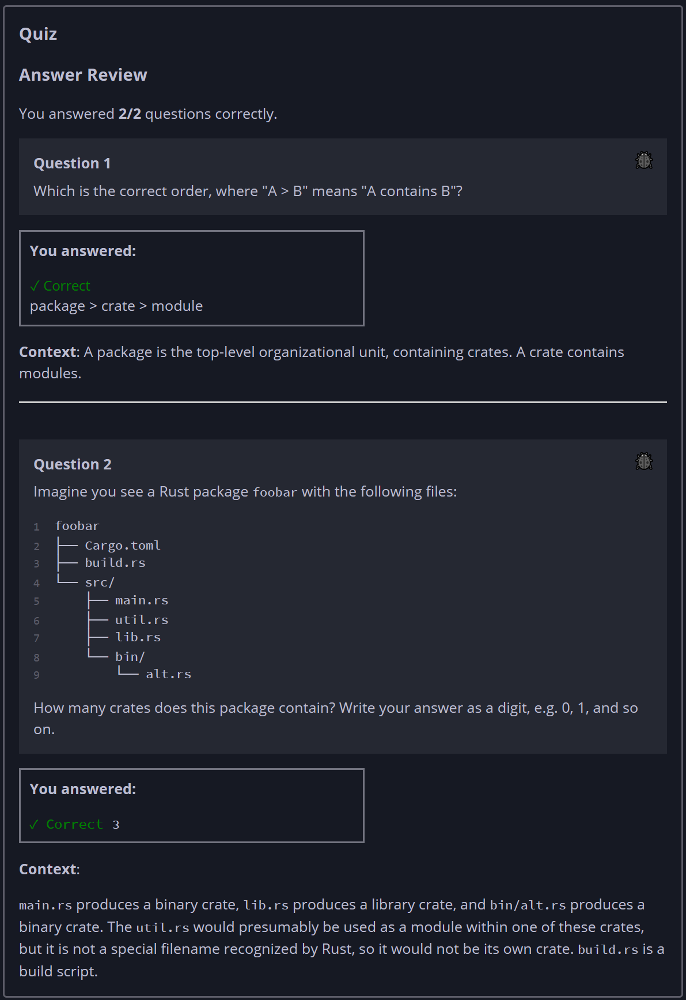

## Quiz - Chapter 7.1 ##

> ---
> **Question 1**<br>
> Which is the correct order, where "A > B" means "A contains 
> B"?
>
> > Response<br>
> > ○ crate > package > module<br>
> > ○ module > crate > package<br>
> > ◉ package > crate > module<br>
> > 
> ---
>
> **Question 2**<br>
> Imagine you see a Rust package foobar with the following 
> files:
>
> ```
> foobar
> ├── Cargo.toml
> ├── build.rs
> └── src/
>     ├── main.rs
>     ├── util.rs
>     ├── lib.rs
>     └── bin/
>         └── alt.rs
> ```
> 
> How many crates does this package contain? Write your
> answer as a digit, e.g. 0, 1, and so on.
>
> > Response<br>
> > [ ```3``` ]
> > 
> ---
> 


