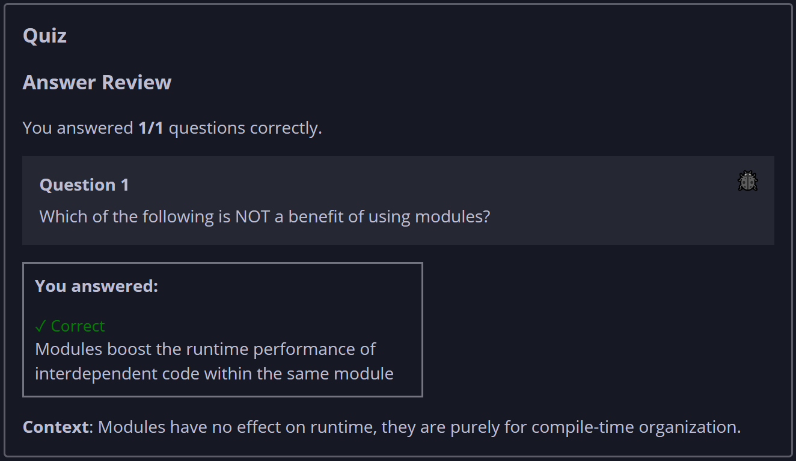

## Quiz - Chapter 7.2 ##

> ---
> **Question 1** 
> Which of the following is NOT a benefit of using modules?
>
> > Response 
> > ○ Modules encapsulate implementation details that 
> > shouldn't be used by external clients 
> > ○ Modules group related code so programmers can more 
> > easily work on a large codebase 
> > ◉ Modules boost the runtime performance of interdependent 
> > code within the same module 
> > ○ Modules provide a scope to avoid naming conflicts 
> > across parts of a codebase 
> >
> ---

