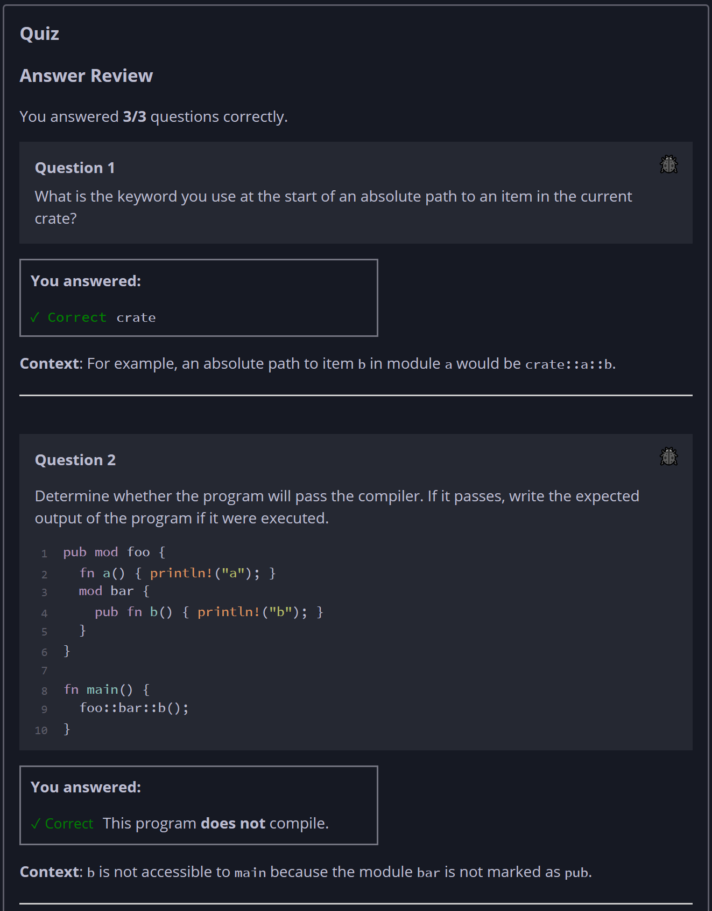

## Quiz - Chapter 7.3 a ##

> ---
> **Question 1**<br>
> What is the keyword you use at the start of an absolute
> path to an item in the current crate?
>
> > Response<br>
> > [ ```crate``` ]
> > 
> ---
>
> **Question 2**<br>
> Determine whether the program will pass the compiler. If it 
> passes, write the expected output of the program if it were 
> executed.
>
> ```rust
> pub mod foo {
>     fn a() { println!("a"); }
>     mod bar {
>         pub fn b() { println!("b"); }
>     }
> }
> fn main() {
>     foo::bar::b();
> }
> ```
>
> > Response<br>
> > This program:
> > ○ DOES compile<br>
> > ◉ does NOT compile<br>
> >
> ---
>
> **Question 3**<br>
> Determine whether the program will pass the compiler. If it 
> passes, write the expected output of the program if it were 
> executed.
>
> ```rust
> pub mod foo {
>     pub mod bar {
>         pub fn b() { println!("b");  }
>     }
>     pub fn a() { bar::b(); }
> }
> fn main() {
>     foo::a();
> }
> ```
>
> > Response<br>
> > This program:<br>
> > ◉ DOES compile<br>
> > ○ does NOT compile<br>
> >
> > The output of this program will be:<br>
> > [  ```b```]
> >
> ---



