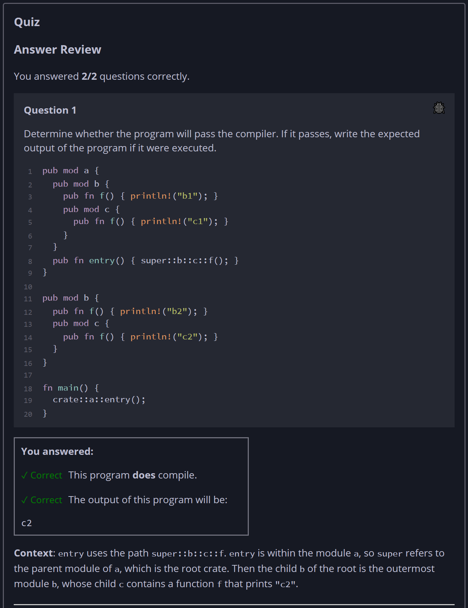
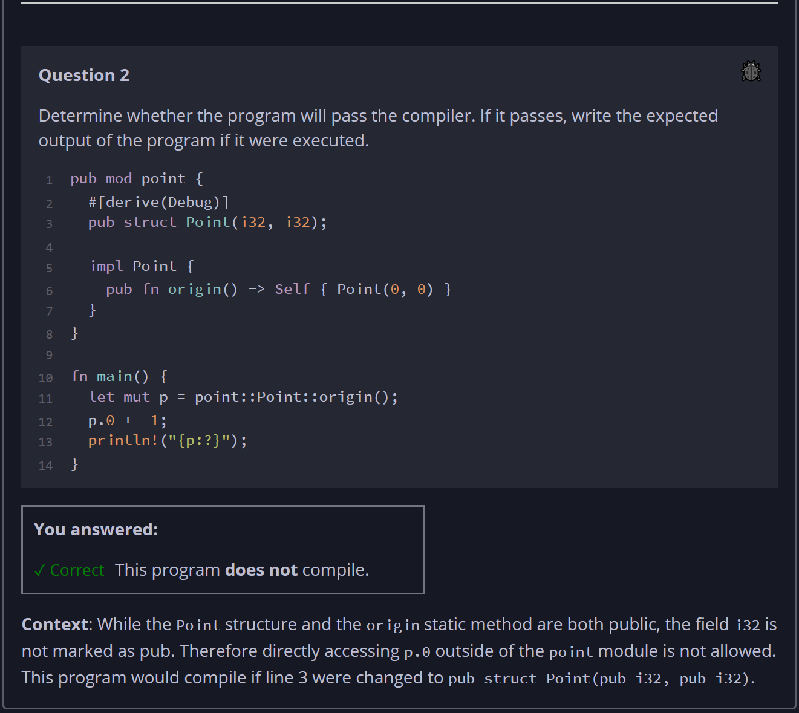

## Quiz - Chapter 7.3 a ##

> ---
> **Question 1**<br>
> Determine whether the program will pass the compiler. If it 
> passes, write the expected output of the program if it were 
> executed.
> 
> ```rust
> pub mod a {
>     pub mod b {
>         pub fn f() { println!("b1"); }
>         pub mod c {
>             pub fn f() { println!("c1"); }
>         }
>     }
>     pub fn entry() { super::b::c::f(); }
> }
> pub mod b {
>     pub fn f() { println!("b2"); }
>     pub mod c {
>         pub fn f() { println!("c2"); }
>     }
> }
> fn main() {
>     crate::a::entry();
> }
> ```
>
> > Response<br>
> > This program:
> > ◉ DOES compile<br>
> > ○ does NOT compile<br>
> > 
> > The output of this program will be:<br>
> > [ ```c2``` ]
> >
> ---
>
> **Question 2**<br>Determine whether the program will pass 
> the compiler. If it passes, write the expected output of 
> the program if it were executed.
>
> ```rust
> pub mod point {
>     #[derive(Debug)]
>     pub struct Point(i32, i32);
>     impl Point {
>         pub fn origin() -> Self { Point(0, 0) }
>     }
> }
> fn main() {
>     let mut p = point::Point::origin();
>     p.0 += 1;
>     println!("{p:?}");
> }
>```
>
> > Response<br>
> > This program:
> > ○ DOES compile<br>
> > ◉ does NOT compile<br>
> > 
> ---
>



