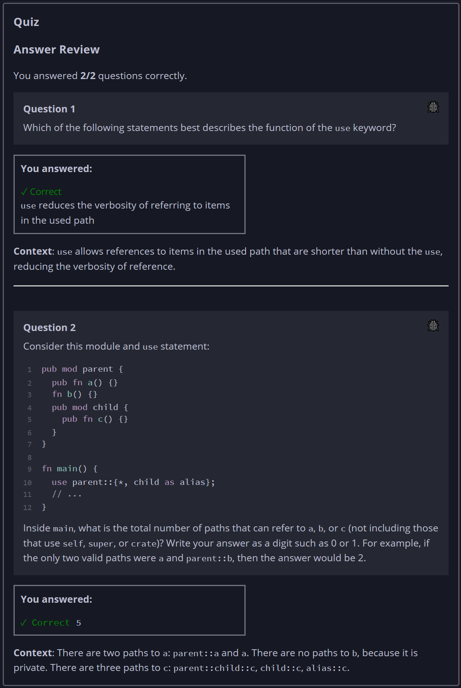

## Quiz - Chapter 7.4 ##

> ---
> **Question 1**<br>
> Which of the following statements best describes the
> function of the ```use``` keyword?
>
> > Response<br>
> > ○ ```use``` copies the contents of an item from one 
> > module to another<br>
> > ○ ```use``` allows access to items that circumvents 
> > normal privacy rules<br>
> > ○ ```use``` indicates to the compiler that an item will 
> > be used and should be optimized<br>
> > ◉ ```use``` reduces the verbosity of referring to items 
> > in the used path<br>
> >
> ---
> 
> **Question 2**<br>
> Consider this module and use statement:
> ```rust
> pub mod parent {
>     pub fn a() {}
>     fn b() {}
>     pub mod child {
>         pub fn c() {}
>     }
> }
> fn main() {
>     use parent::{*, child as alias};
>     // ...
> }
> ```
>
> Inside ```main```, what is the total number of paths that 
> can refer to ```a```, ```b```, or `c` (not including those 
> that use ```self```, ```super```, or ```crate```)? Write 
> your answer as a digit such as 0 or 1. For example, if the 
> only two valid paths were ```a``` and ```parent::b```, then 
> the answer would be 2.
>
> > Response<br>
> > [ ```5``` ]
>
> ---


