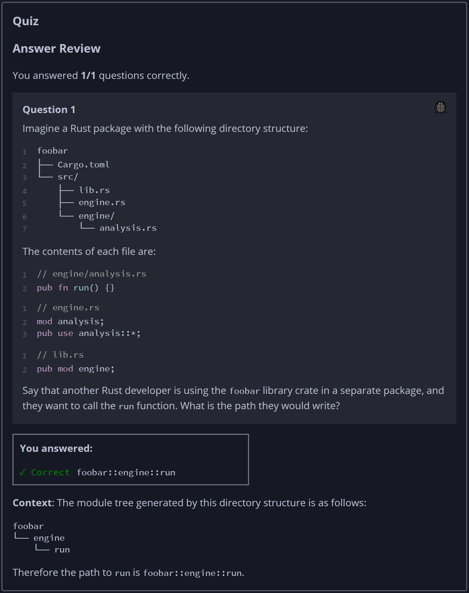

## Quiz - Chapter 7.4 ##

> ---
> **Question 1**<br>
> Imagine a Rust package with the following directory 
> structure:
>
> ```
> foobar
> ├── Cargo.toml
> └── src/
>     ├── lib.rs
>     ├── engine.rs
>     └── engine/
>         └── analysis.rs
> ```
>
> The contents of each file are:
>
> ```rust
> // engine/analysis.rs
> pub fn run() {}
> 
> // engine.rs
> mod analysis;
> pub use analysis::*;
> 
> // lib.rs
> pub mod engine;
> ```
> 
> Say that another Rust developer is using the ```foobar``` 
> library crate in a separate package, and they want to call 
> the ```run``` function. What is the path they would write?
>
> > Response<br>
> > [ ```foobar::engine::run``` ]
> >
> ---


