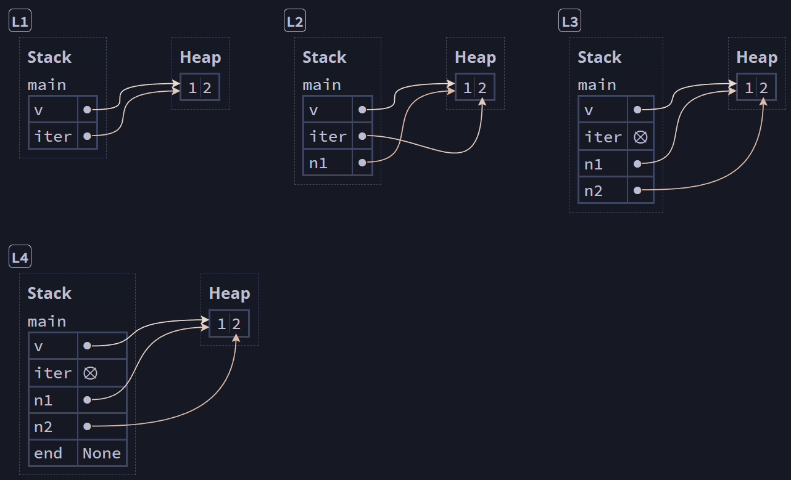
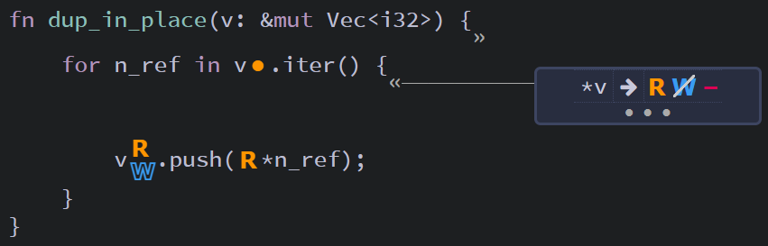
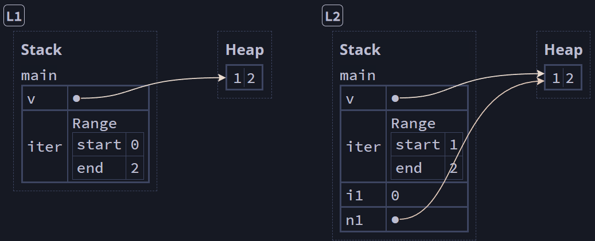

## Storing Lists of Values with Vectors ##

The vector type ```Vec<T>``` allows you to store more than one
value in a single data structure that puts all the values 
next to each other in memory (think of it like an expandable
array).

Vectors can only store one data type.

---

### Creating a New Vector ###

Empty Vector:
```rust
// Type annotation required, since the compiler doesn't
//   implicitly know what data type will be added
let v: Vec<i32> = Vec::new();
```

Initialized Vector:
```rust
// Note: We use the `vec!` macro to populate the vector
// Type annotation not required, since the values imply `i32`
let v = vec![1, 2, 3];
```

---

### Updating a Vector ###

With a mutable vector, we can use the ```push``` method to
add elements.

```rust
let mut v = Vec::new();
v.push(1);
v.push(2);
v.push(3);
```

---

### Read Vector Elements ###

We can read the elements of a vector using indices or using
the ```get``` method.

```rust
let v = vec![1, 2, 3, 4, 5];

// Read by index
let third: &i32 = &v[2];
println!("The third element is {third}");

// Read using `get`
let third: Option<&i32> = v.get(2);
match third {
    Some(third) => println!("The third element is {third}"),
    None => println!("There is no third element."),
}
```

#### Out of Range References ####

When you read by index, an out of range index will cause the
program to panic.

```rust
let v = vec![1, 2, 3, 4, 5];

let does_not_exist = &v[100]; // Panic here!
```

But when you use ```get```, the program will return ```None```
without panicking. This occurs because in returning an
```Option<T>``` value, get will provide either 
```Some(&element)``` or ```None```.

```rust
let v = vec![1, 2, 3, 4, 5];

let does_not_exist = v.get(100);
match does_not_exist {
    Some(value) => println!("{}", value),
    None => println!("I didn't panic!"), // No panic
}
```

---

#### Ownership and Mutating ####

You cannot mutate a vector while a variable is borrowing an
immutable reference:

```rust 
// Note: This code will not compile
let mut v = vec![1, 2, 3, 4, 5];

let first = &v[0]; // Immutable reference borrowed

v.push(6); // So this mutation is not allowed

println!("The first element is: {first}");
```

---

#### Removing an Element from a Vector ####

You can remove an element from a vector using the 
```remove``` method pointing to an index.

```rust
let mut v = vec![1, 2, 3]; // `v` contains [1, 2, 3]

v.remove(1); // `v` contains [1, 3]
```

If you want to remove the last element from a vector and
capture its value in a variable, you can use the ```pop```
method.

```rust
let mut v = vec![1, 2, 3]; // `v` contains [1, 2, 3]

let n = v.pop(); // `n` = 3 and `v` contains [1, 2]
```

---

#### Iterating over the Values in a Vector ####

Using ```for``` loops, we can easily iterate over the
elements stored in a vector.

```rust
let v = vec![100, 32, 57];

for n_ref in &v {
    // n_ref has type &i32
    let n_plus_one: i32 = *n_ref + 1;
    println!("{n_plus_one}");
}
```

And we can mutate values in a mutable array while iterating

```rust
let mut v = vec![100, 32, 57];

for n_ref in &mut v {
    // n_ref has type &i32
    *n_ref += 1;
}
```

---

### Safely Using Iterators ###

Iterators contain pointers to data in the vector.

Consider the following using ```Vec::iter``` and
```Iterator::next```:

```rust
let mut v: Vec<i32>         = vec![1, 2];
let mut iter: Iter<'_, i32> = v.iter(); // [L1]
let n1: &i32                = iter.next().unwrap(); // [L2]
let n2: &i32                = iter.next().unwrap(); // [L3]
let end: Option<&i32>       = iter.next(); // [L4]
```


<br><sup><sup>[Diagram from Brown University](https://rust-book.cs.brown.edu)</sup></sup>

We can see that the iterator ```iter``` is a pointer that
moves through each element of the vector. Pointers like this
are sometimes called *cursors*.

The ```next``` method moves the pointer to the next element in
the vector and returns either ```Some```, which we can unwrap
to get the value therein or ```None``` when we reach the end 
of the vector.

---

Calling ```iter``` removes the write permission from the 
vector.

Consider this naive approach to duplicating the vector
in-place (e.g.: ```[1, 2]``` becomes ```[1, 2, 1, 2]```):

```rust
// Note: This code will not compile
fn dup_in_place(v: &mut Vec<i32>) {
    for n_ref in v.iter() {
        v.push(*n_ref); // Error: No (W) permission
    }
}
```


<br><sup><sup>[Diagram from Brown University](https://rust-book.cs.brown.edu)</sup></sup>

Because ```iter``` has removed the write permission from
```v```, the call to ```v.push``` will result in this error.

```
error[E0502]: cannot borrow `*v` as mutable because it is also borrowed as immutable
 --> test.rs:3:9
  |
2 |     for n_ref in v.iter() {
  |                  --------
  |                  |
  |                  immutable borrow occurs here
  |                  immutable borrow later used here
3 |         v.push(*n_ref);
  |         ^^^^^^^^^^^^^^ mutable borrow occurs here
```

---

You can also iterate using a range of indices rather than a
```for ... in``` loop.

```rust
let mut v: Vec<i32>        = vec![1, 2];
let mut iter: Range<usize> = 0 .. v.len(); // [L1]
let i1: usize              = iter.next().unwrap();
let n1: &i32               = &v[i1]; // [L2]
```


<br><sup><sup>[Diagram from Brown University](https://rust-book.cs.brown.edu)</sup></sup>

---

### Using an Enum to Store Multiple Types ###

We can work around the limitation of only being able to store
a single data type in a vector by using an ```enum```'s
variants as differing types:

```rust
enum SpreadsheetCell {
    Int(i32),
    Float(f64),
    Text(String),
}

let row = vec![
    SpreadsheetCell::Int(3),
    SpreadsheetCell::Text(String::from("blue")),
    SpreadsheetCell::Float(10.12),
];
```

### Dropping a Vector Drops Its Elements ###

Like any other ```struct```, a vector is freed when it goes 
out of scope, as annotated below:

```rust
{
    let v = vec![1, 2, 3, 4];

    // do stuff with v
}   // <- v goes out of scope and is freed here
```

---

