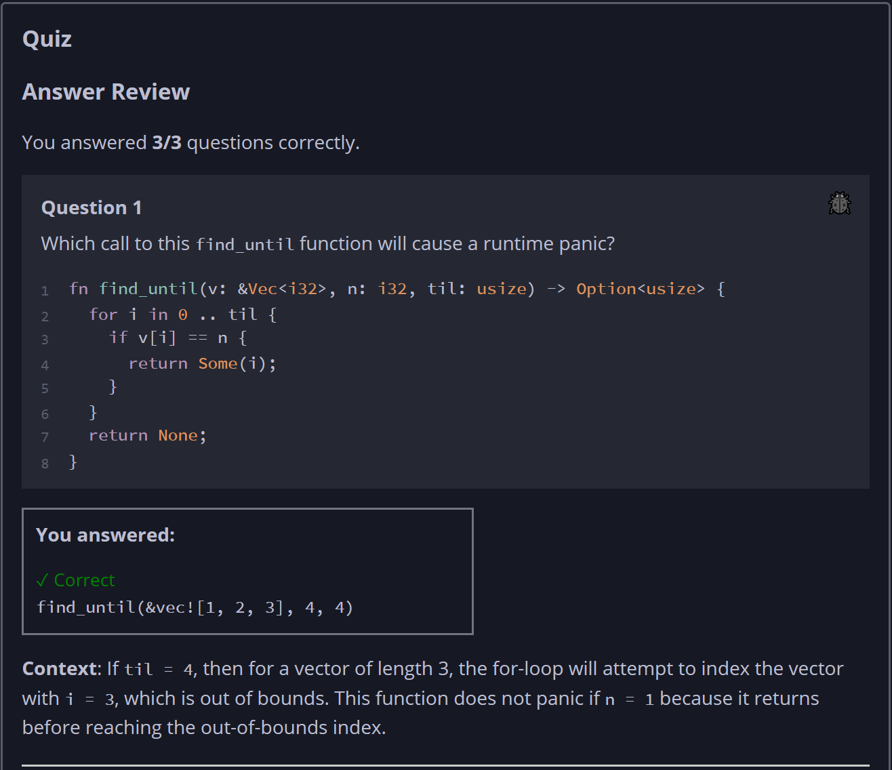
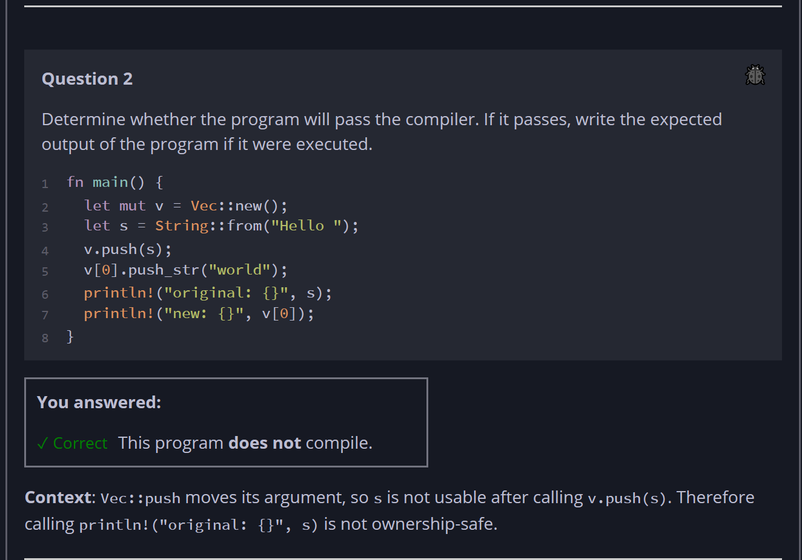
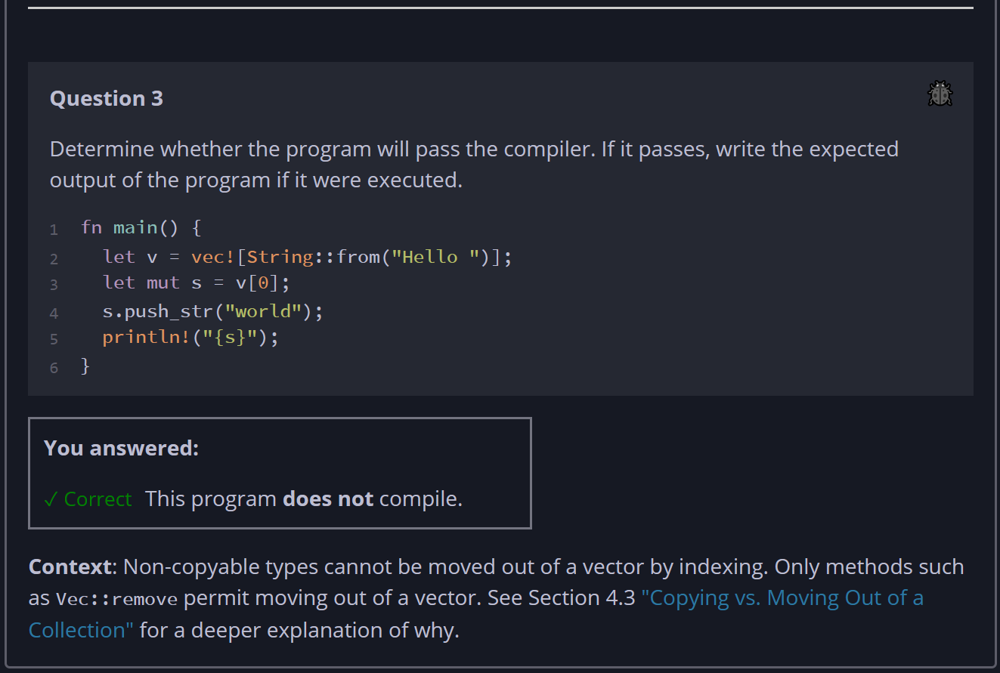

## Quiz - Chapter 8.1a ##

> ---
> **Question 1**<br>
> Which call to this find_until function will cause a runtime 
> panic?
> 
> ```rust
> fn find_until(v: &Vec<i32>, n: i32, til: usize) -> Option<usize> {
>     for i in 0 .. til {
>         if v[i] == n {
>             return Some(i);
>         }
>     }
>     return None;
> }
> ```
>
> > Response<br>
> > ◉ ```find_until(&vec![1, 2, 3], 4, 4)```<br>
> > ○ ```find_until(&vec![1, 2, 3], 3, 3)```<br>
> > ○ ```find_until(&vec![1, 2, 3], 0, 0)```<br>
> > ○ ```find_until(&vec![1, 2, 3], 1, 4)```<br>
> >
> ---
>
> **Question 2**<br>
> Determine whether the program will pass the compiler. If it 
> passes, write the expected output of the program if it were 
> executed.
>
> ```rust
> fn main() {
>     let mut v = Vec::new();
>     let s = String::from("Hello ");
>     v.push(s);
>     v[0].push_str("world");
>     println!("original: {}", s);
>     println!("new: {}", v[0]);
> }
> ```
>
> > Response<br>
> > This program:<br>
> > ○ DOES compile<br>
> > ◉ Does NOT compile<br>
> >
> ---
>
> **Question 2**<br>
> Determine whether the program will pass the compiler. If it 
> passes, write the expected output of the program if it were 
> executed.
>
> ```rust
> fn main() {
>     let v = vec![String::from("Hello ")];
>     let mut s = v[0];
>     s.push_str("world");
>     println!("{s}");
> }
> ```
>
> > Response<br>
> > This program:<br>
> > ○ DOES compile<br>
> > ◉ Does NOT compile<br>
> 




