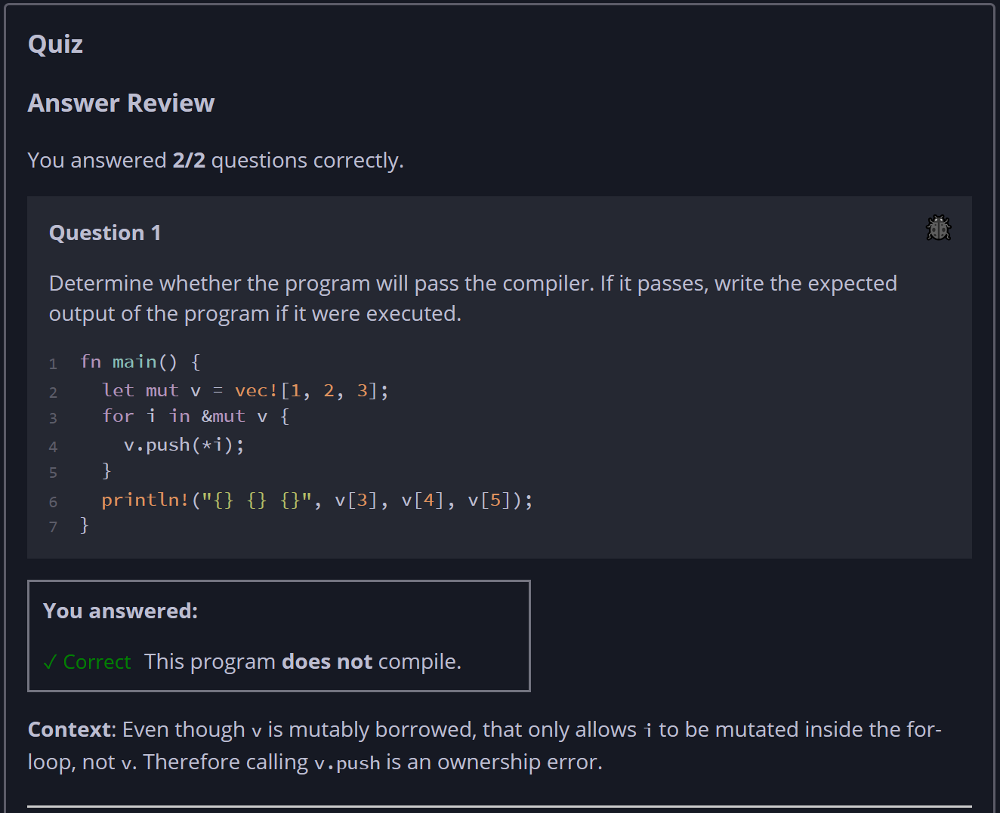
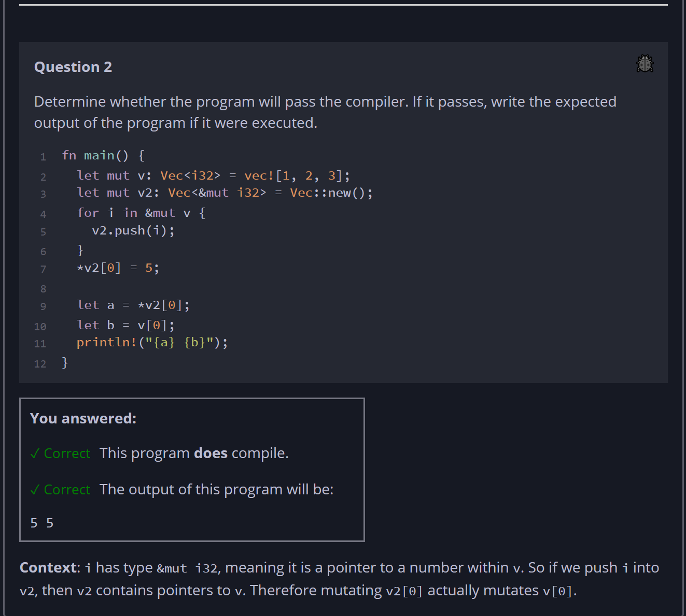

## Quiz - Chapter 8.1b ##

> ---
> **Question 1**<br>
> Determine whether the program will pass the compiler. If it 
> passes, write the expected output of the program if it were 
> executed.
> 
> ```rust
> fn main() {
>     let mut v = vec![1, 2, 3];
>     for i in &mut v {
>         v.push(*i);
>     }
>     println!("{} {} {}", v[3], v[4], v[5]);
> }
> ```
>
> > Response<br>
> > This program:<br>
> > ○ DOES compile<br>
> > ◉ Does NOT compile<br>
> > 
> ---
> 
> **Question 2**<br>
> Determine whether the program will pass the compiler. If it 
> passes, write the expected output of the program if it were 
> executed.
> 
> ```rust
> fn main() {
>     let mut v: Vec<i32> = vec![1, 2, 3];
>     let mut v2: Vec<&mut i32> = Vec::new();
>     for i in &mut v {
>         v2.push(i);
>     }
>     *v2[0] = 5;
>     let a = *v2[0];
>     let b = v[0];
>     println!("{a} {b}");
> }
> ```
>
> > Response<br>
> > This program:<br>
> > ◉ DOES compile<br>
> > ○ Does NOT compile<br>
> > 
> > The output of this program will be:<br>
> > [ ```5 5``` ]
> >
> ---



